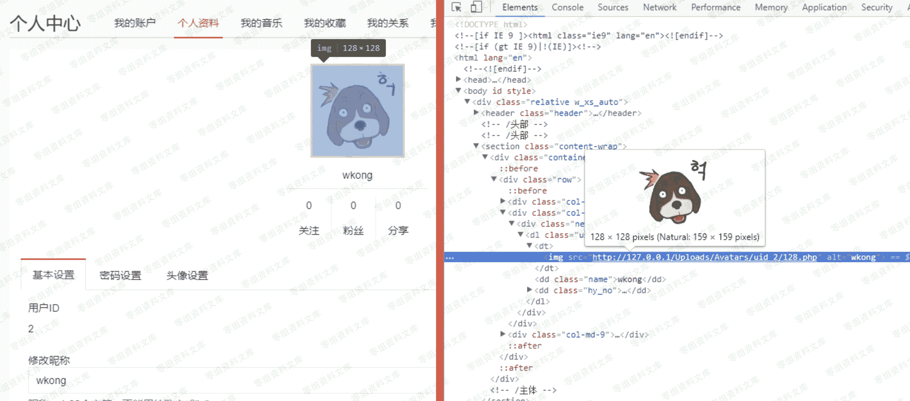
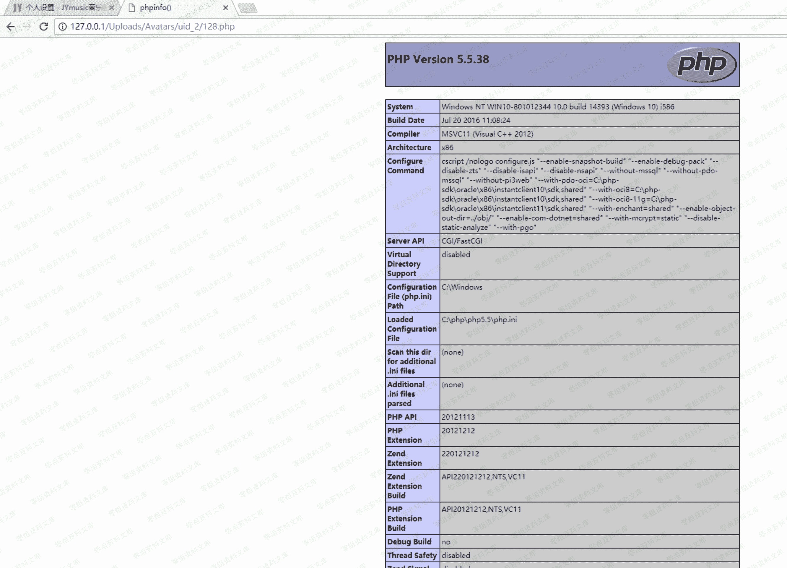

# JYmusic 1.x 版本 前台 getshell

> 原文：[http://book.iwonder.run/0day/JYmusic/3.html](http://book.iwonder.run/0day/JYmusic/3.html)

## 一、漏洞简介

## 二、漏洞影响

1.x 版本

## 三、复现过程

访问前台，注册一个用

注册成功后点击右上角设置，个人资料，头像设置

抓包，修改文件后缀为.php

上传成功后访问个人中心，这里头像已经换了，审查元素查看头像的文件路径

访问[http://0-sec.org/Uploads/Avatars/uid_2/128.php](http://0-sec.org/Uploads/Avatars/uid_2/128.php)

成功解析，通过这种办法上传一个 phpinfo

访问文件

## 四、参考链接

>

