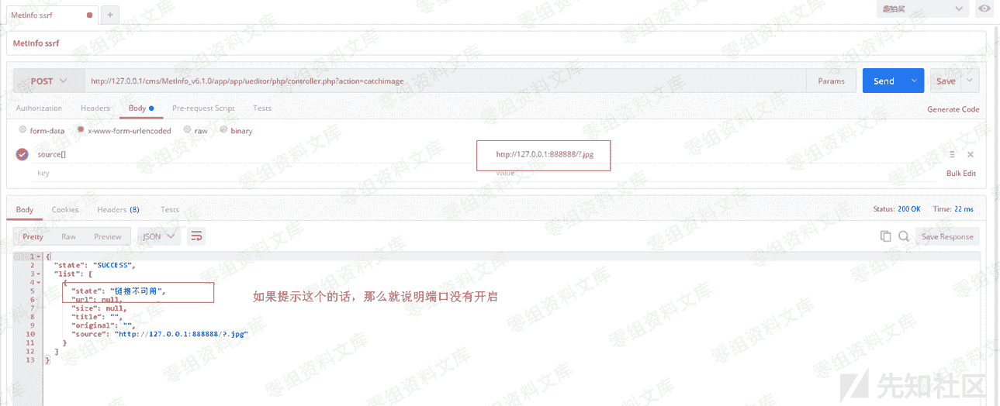
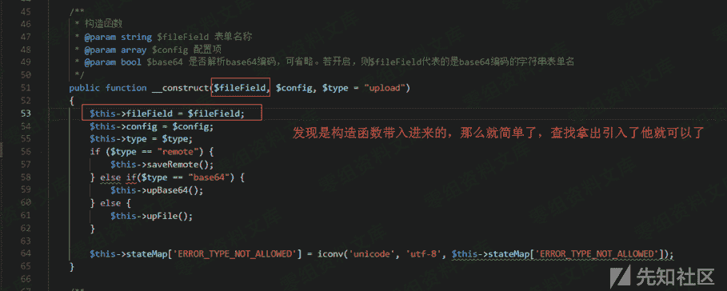
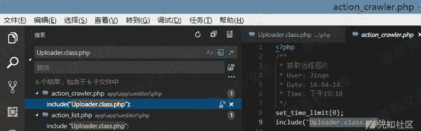
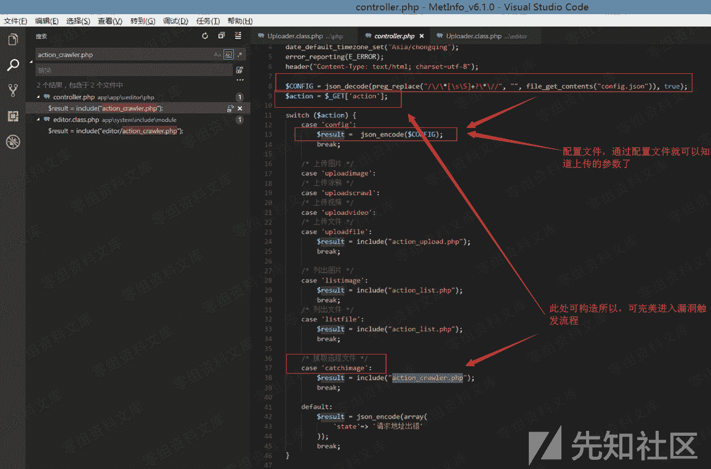

# MetInfo 系统中隐藏的一处旧插件导致的 ssrf

> 原文：[http://book.iwonder.run/0day/MetInfo/MetInfo 系统中一处旧插件导致的 ssrf.html](http://book.iwonder.run/0day/MetInfo/MetInfo 系统中一处旧插件导致的 ssrf.html)

## 一、漏洞简介

## 二、漏洞影响

## 三、复现过程

利用的话，ssrf 嘛你可以扫描扫描端口咯。 我这里的话，简单说明利用一下

### 分析过程

文件：MetInfo_v6.1.0\app\app\ueditor\php\Uploader.class.php

get_headers 这里是验证资源是否存在的，不存在就不走下面了，所以这里可以用来判断端口，例如 81 端口不存在那么他这里就会直接报错了 $this->stateInfo = $this->getStateInfo("ERROR_DEAD_LINK");

这个时候我还不清楚的$this->fileField 的值是向哪里获取的=-= 又搜索了一下。

需要注意的是：$type == "remote" 才能进入$this->saveRemote();流程引起漏洞触发。

搜索一下

打开文件：MetInfo_v6.1.0\app\app\ueditor\php\action_crawler.php 打开文件以后，虽然引入了 Uploader.class.php 但是没有引入$CONFIG 所以直接调用代码会报错，那么就继续找引入

搜索一下

打开文件：MetInfo_v6.1.0\app\app\ueditor\php\controller.php

