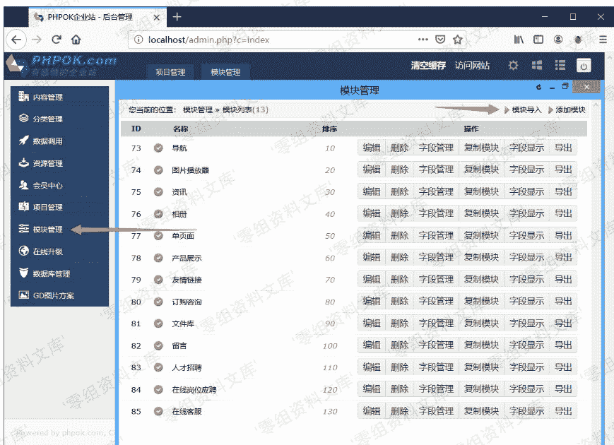
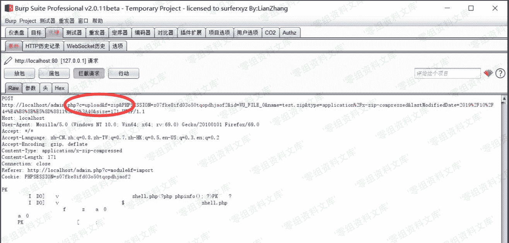

# （CVE-2019-16131）OKLite v1.2.25 任意文件上传漏洞

> 原文：[http://book.iwonder.run/0day/OKLite/CVE-2019-16131.html](http://book.iwonder.run/0day/OKLite/CVE-2019-16131.html)

## 一、漏洞简介

Ethan 发现 OKLite v1.2.25 存在任意文件上传漏洞（需要登录后台）

漏洞有两处，分别为：module_control.php；plugin_control.php

## 二、漏洞影响

OKLite v1.2.25

## 三、复现过程

### module_control.php

在模块管理管理处导入模块，这里只能上传 zip 文件。把恶意文件放在 zip 压缩包中上传：

(我这里是包含了一个 shell.php，内容是 phpinfo)





上传后又访问了另一个地址：


上传之后就可以在`data\cache`看到 shell.php 被解压出来了。


### plugin_control.php

和前一个 module_control 有所不同的是，这里的 zip 文件夹必须是包含一个文件夹，文件夹中再包含恶意文件。

插件中心：


验证方式同前一个，就不重复了。

上传完成之后会访问另一个地址：

```
http://localhost/admin.php?c=plugin&f=unzip&id=1196&_noCache=0.08112707662168439&_=1570257969464 
```

## 参考链接

> [https://xz.aliyun.com/t/6515#toc-6](https://xz.aliyun.com/t/6515#toc-6)

