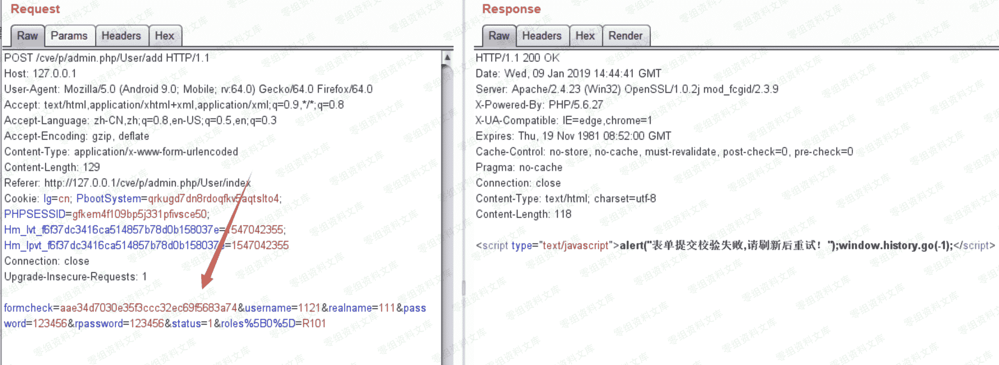
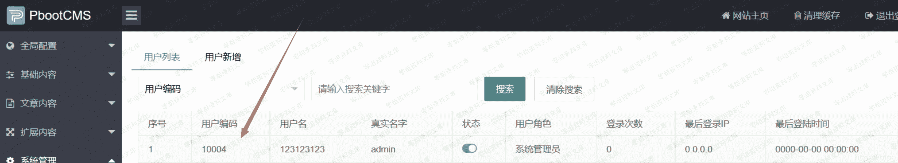
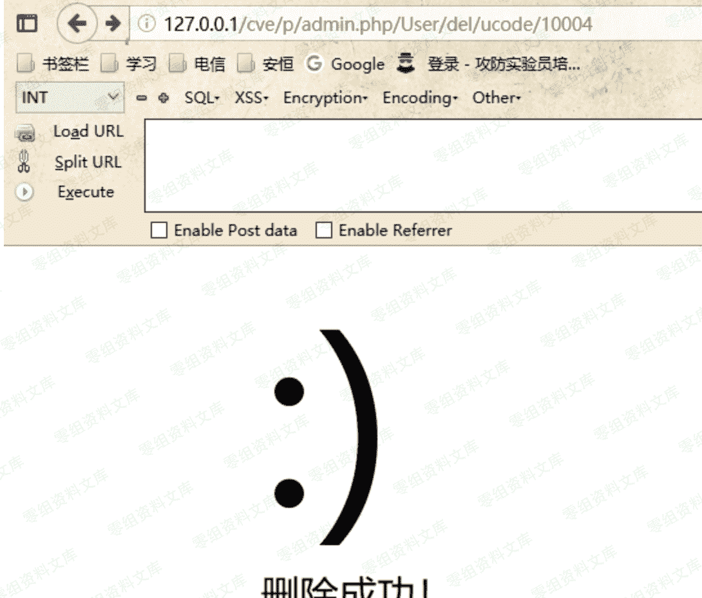

# PbootCMS csrf

> 原文：[http://book.iwonder.run/0day/PbootCMS/2.html](http://book.iwonder.run/0day/PbootCMS/2.html)

## 一、漏洞简介

## 二、漏洞影响

## 三、复现过程

我将网站建立在本地，本来想测试添加用户的操作，但是发现这里有 formcheck 验证，所以失败了

然后我想到了删除用户位置，首先我使用管理员账号登陆，在删除用户的操作时抓包。发现很简单。只有一个 id 来判断删除哪个用户

于是我直接构造一个新的 url，[http://127.0.0.1/cve/p/admin.php/User/del/ucode/10004（上面是 10003）](http://127.0.0.1/cve/p/admin.php/User/del/ucode/10004（上面是 10003）)

确认这个用户是存在的。然后访问[http://127.0.0.1/cve/p/admin.php/User/del/ucode/10004](http://127.0.0.1/cve/p/admin.php/User/del/ucode/10004)

删除成功

但是这样很容易被熟悉的管理员识别，我们可以利用段网站来进行攻击。

短网址生成网站[https://www.ft12.com/](https://www.ft12.com/)

[http://127.0.0.1/cve/p/admin.php/User/del/ucode/10004](http://127.0.0.1/cve/p/admin.php/User/del/ucode/10004)

可以缩短为[http://u6.gg/gPCcN](http://u6.gg/gPCcN)

访问这个短网址，也可以变为[http://127.0.0.1/cve/p/admin.php/User/del/ucode/10004 触发漏洞](http://127.0.0.1/cve/p/admin.php/User/del/ucode/10004 触发漏洞)

