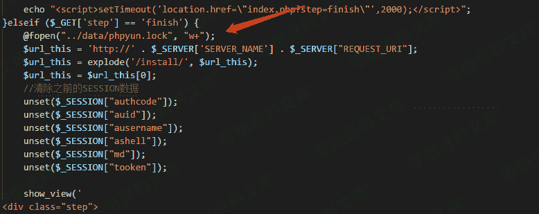
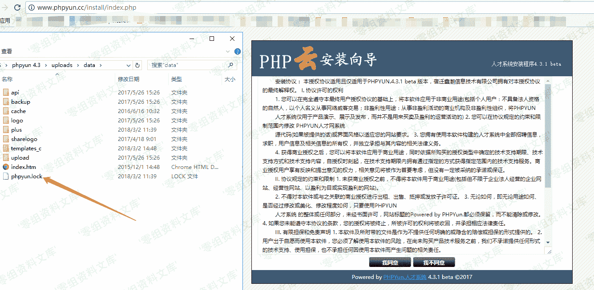
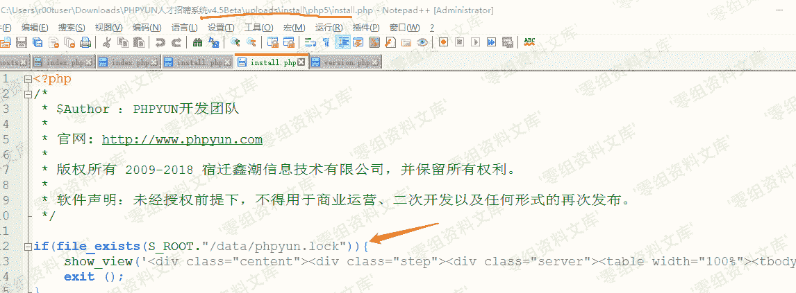
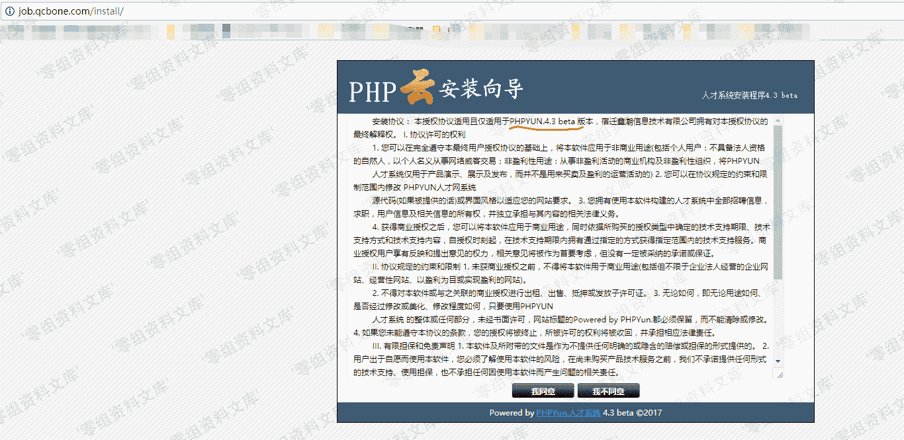

# Phpyun v4.2（部分） 4.3 4.5 系统重装漏洞

> 原文：[http://book.iwonder.run/0day/PhpYun/Phpyun 系统重装漏洞.html](http://book.iwonder.run/0day/PhpYun/Phpyun 系统重装漏洞.html)

## 一、漏洞简介

## 二、漏洞影响

经测试该漏洞影响从 4.3 到 4.5 所有版本，4.2 部分版本受影响，4.2 最终版本不受影响。具体情况请自行测试。

## 三、复现过程

### 漏洞分析

看到 install 文件夹里的 index.php，这里分 php5,php7 两种情况进行调用安装。

以 php5 为例。

文件 根目录/install/php5/install.php 代码中：

先判断了是否存在 lock 文件，存在即退出安装。

其中 S_ROOT 这个常量是在前面 index.php 文件中定义的。

取得是当前文件的绝对路径。拼接起来，检测的 lock 文件位置应该是 根目录/install/data/phpyun.lock。

这里没什么问题。

按照正常安装走完，看到最后一步

创建 lock 文件，这里用的是相对路径。install.php 是被 index.php 用 require 的模式调用的。

取得路径应该是 根目录/install/，按照上图的路径创造的 lock 文件应该是放至于 根目录/data/phpyun.lock。

**创建的 lock 文件路径是 根目录/data/phpyun.lock，检测的路径却是 根目录/install/data/phpyun.lock**

那么一个重装的安全隐患就埋下了。

当用户安装完成之后，是可以被无限重装的，因为这个路径错误问题。

以本地 phpyun4.3 已经安装完成系统为例，是可以被重装的。

最新版 phpyun 4.5 这里的代码和 4.3 是一样的。

phpyun 4.2 版本处理逻辑不一样，这个版本不受影响。

**经测试 phpyun 4.2 某些版本依旧是受影响的。**

### 版本测试

网上一些系统：

#### 官方测试站，版本 phpyun 4.2111：

#### 某招聘网，版本 phpyun 4.3

## 参考链接

> [https://www.cnblogs.com/r00tuser/p/8533517.html](https://www.cnblogs.com/r00tuser/p/8533517.html)

