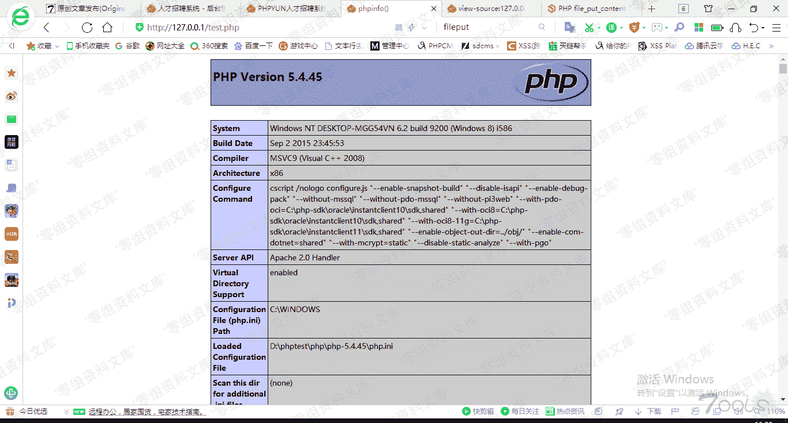

# Phpyun v5.0.1 后台 getshell

> 原文：[http://book.iwonder.run/0day/PhpYun/Phpyun v5.0.1 后台 getshell.html](http://book.iwonder.run/0day/PhpYun/Phpyun v5.0.1 后台 getshell.html)

## 一、漏洞简介

## 二、漏洞影响

Phpyun v5.0.1

## 三、复现过程

安装好本地环境,看了下系统功能,等等测试,最后查看前台 index.php 源码。


后台直接写入被过滤掉了。


又去翻了下后台功能,发下有个生成功能,并且没有后缀限制。


生存成功,但是发现()被大写,使用经典的 include 包含,随意找了一个模板下的 info.txt 文件,写入执行代码。

```
<?php include'app/template/info.txt';？> 
```



成功执行代码 代码分析：


对 post 的数据没有任何验证,直接代入


## 参考链接

> [https://www.t00ls.net/thread-55040-1-1.html](https://www.t00ls.net/thread-55040-1-1.html)

