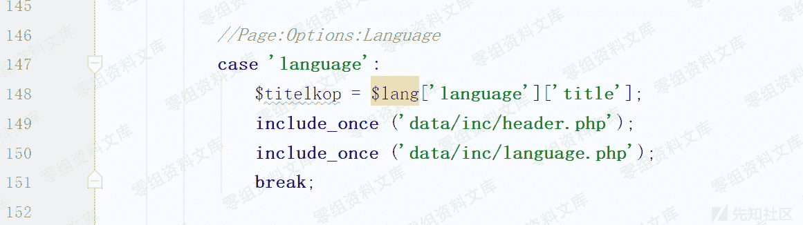
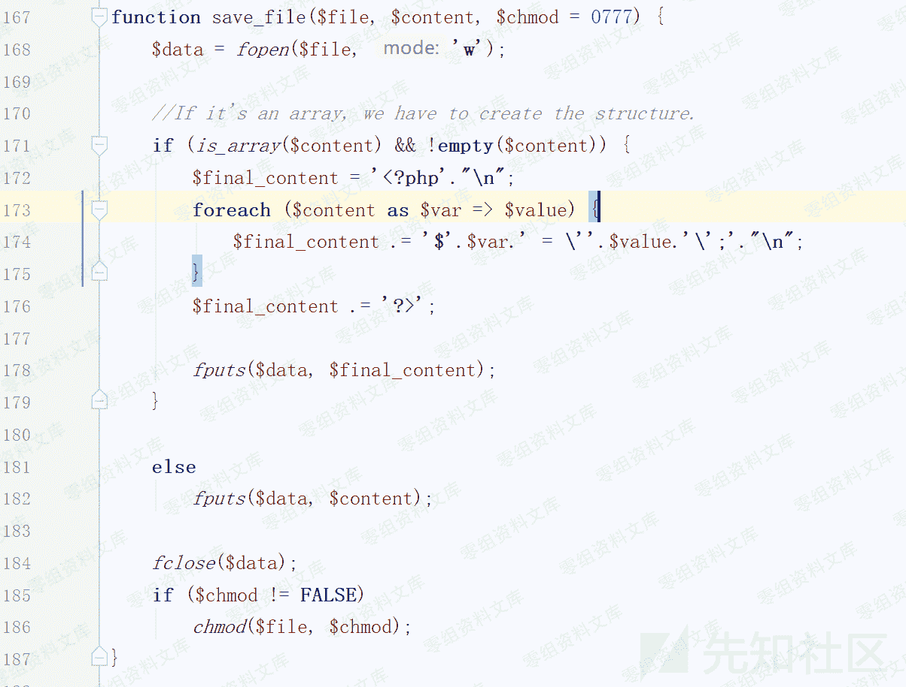
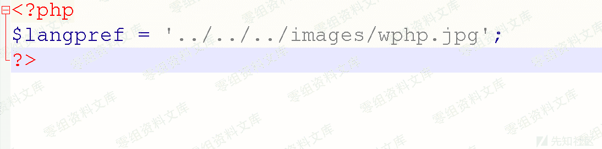

# Pluck CMS 4.7.10 后台 文件包含+文件上传导致 getshell

> 原文：[http://book.iwonder.run/0day/Pluck cms/2.html](http://book.iwonder.run/0day/Pluck cms/2.html)

## 一、漏洞简介

## 二、漏洞影响

Pluck CMS Pluck CMS <=4.7.10

## 三、复现过程

### 1、分析过程

目前最新版本为 4.7.10，个人测试 github 上最旧的 4.7.2 版本仍然存在该漏洞，框架本身语言选择模块数据注入导致的文件包含漏洞，官方更新版本并没有对这部分代码进行修改，可以认为是全版本通用的。该漏洞是在复现"我怎么这么帅"在先知发表的《Pluck CMS 4.7.10 远程代码执行漏洞分析》之余审计其他代码发现的，在此致谢。

v4.7.1 分析 从入口文件 admin.php 查看:

<center></center>

查看 language.php,满足指定的文件存在，并传入的 cont1 参数和原本设置的$langpref 参数不等，进入 save_language($cont1)。

<center></center>

调用 save_file 方法。

<center></center>

由于只有一个数据，直接 182 写入 php 文件。

<center></center>

至此，langpref 的值变成可控值，这个值对应的文件，用于控制网站的语言选择，会自动被全局 php 文件包含。可以包含上传功能点上传的图种文件解析其中的一句话导致 getshell。文件上传功能点使用白名单，但是没有进行重命名，所以路径可以简单猜解。

<center></center>

### 2、复现过程

文件上传一个可以写一句话木马的 php 图种。

<center></center>

<center></center>

上述参数保存于 php 文件：

```
\data\settings\langpref.php 
```

<center></center>

由于该参数是网站语言控制的 php 文件，访问任意网页，包含 langpref 对应的文件。

<center></center>

访问生成的 php 一句话木马。

<center></center>

