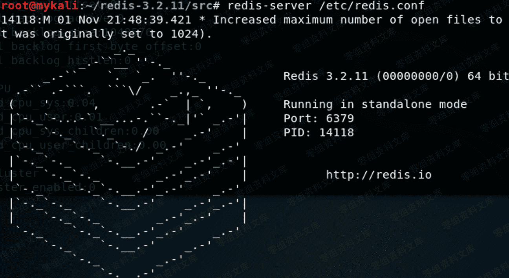

# redis 未授权访问漏洞

> 原文：[http://book.iwonder.run/0day/Redis/3.html](http://book.iwonder.run/0day/Redis/3.html)

## 一、漏洞简介

redis 未授权访问漏洞

## 二、影响范围

## 三、复现过程

##### 1.环境安装

```
从官网 wget 到本地
wget http://download.redis.io/releases/redis-3.2.11.tar.gz 
tar xzf redis-3.2.11.tar.gz 
将 redis.conf copy 到 /etc/下
启动时使用命令 redis-server /etc/redis.conf
测试时建议 vim /etc/redis.conf
去掉 ip 绑定，允许除本地外的主机远程登录 redis 服务
(1)bind 127.0.0.1 前面加上##号注释掉 或者更改成 0.0.0.0
(2)protected-mode 设为 no 
```

如图 


##### 2.攻击者常用命令

```
 （1）info                       查看信息     
    （2）flushall                 删除所有数据库内容：
    （3）flushdb                    刷新数据库
    （4）看所有键：KEYS *，使用 select num 可以查看键值数据。
    （5）set test "who am i"        设置变量
    （6）config set dir dirpath     设置路径等配置
    （7）config get dir/dbfilename  获取路径及数据配置信息
    （8）save                       保存
    （9）get                        变量，查看变量名称 
```

##### 3.msf 下利用模块

```
auxiliary/scanner/redis/file_upload 
auxiliary/scanner/redis/redis_login
auxiliary/scanner/redis/redis_server 
```

##### 4.nmap 获取信息

```
命令：nmap -A -p 6379 --script redis-info ipaddress 
```


##### 5.连接 Redis 服务器


