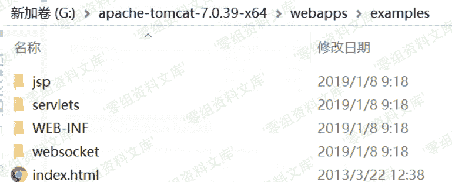
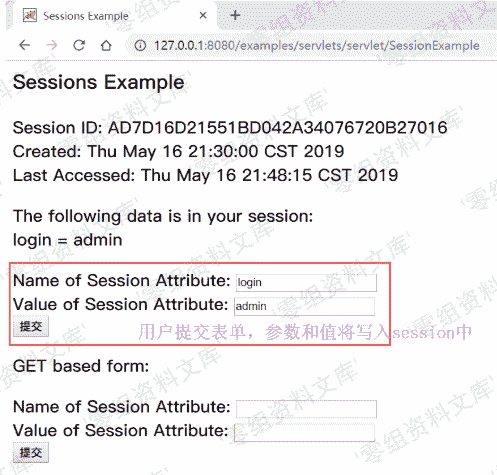
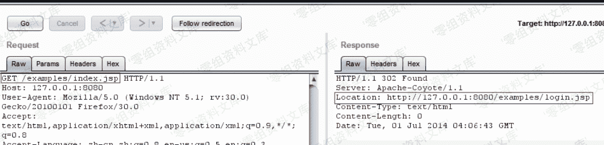
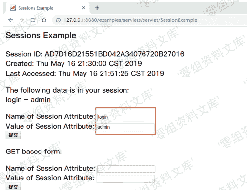

# Tomcat 样例目录 session 操纵漏洞

> 原文：[http://book.iwonder.run/0day/Tomcat/Apache Tomcat 样例目录 session 操纵漏洞.html](http://book.iwonder.run/0day/Tomcat/Apache Tomcat 样例目录 session 操纵漏洞.html)

## 一、漏洞简介

在 Apache tomcat 中，有一个默认的 example 示例目录，该 example 目录中存着众多的样例，其中/examples/servlets/servlet/SessionExample 允许用户对 Session 进行操作。由于 Session 是存储在服务器端的用于验证用户身份的东西。所以，理论上，只要我们可以操控 Session，就可以伪造任意用户身份信息。

## 二、漏洞影响

## 三、复现过程

如图，是 Apache tomcat 网站根目录下的文件夹，默认是有一个 examples 目录的


这是 examples 目录下的文件



我们访问该 SessionExample 页面，该页面可以对 Session 进行操控，本来该页面是 Apache tomcat 用来给开发者操纵 Session 示例的页面。但是，如果实际生产环境中不删除该页面的话，可能存在伪造任意用户身份的漏洞。

[http://127.0.0.1:8080/examples/servlets/servlet/SessionExample](http://127.0.0.1:8080/examples/servlets/servlet/SessionExample)


那么我们来看看 SessionExample 页面是如何通过接收用户输入的值，来对 Session 进行控制的。

表单部分代码，接收用户输入的 Name 和 Value 值。

```
out.println("<P>");
out.print("<form action=\"");
out.print(response.encodeURL("SessionExample"));
out.print("\" ");
out.println("method=POST>");
out.println(rb.getString("sessions.dataname"));
out.println("<input type=text size=20 name=dataname>");
out.println("<br>");
out.println(rb.getString("sessions.datavalue"));
out.println("<input type=text size=20 name=datavalue>");
out.println("<br>");
out.println("<input type=submit>");
out.println("</form>"); 
```

核心代码，将接收的用户输入的 Name 和 Value 值写入到 Session 中

```
HttpSession session = request.getSession(true);
out.println(rb.getString("sessions.id") + " " +session.getId());
out.println("<br>");
out.println(rb.getString("sessions.created") + " ");
out.println(new Date(session.getCreationTime()) +"<br>");
out.println(rb.getString("sessions.lastaccessed") + "");
out.println(new Date(session.getLastAccessedTime()));
String dataName = request.getParameter("dataname");//获取 dataname 参数的值
String dataValue = request.getParameter("datavalue");//获取 datavalue 参数的值
if (dataName != null && dataValue != null) {
    session.setAttribute(dataName, dataValue);//将 dataname 和 datavalue 写入 session
} 
```

也就是说，用户通过表单提交 Name 和 Value 参数，然后通过 request.getParameter（）函数获取这两个参数的值，再通过 session.setAttribute() 函数将 Name 和 Value 的值写入 Session 中。



### 漏洞示例

我们先来编写 login.jsp 、login_check.jsp 、 index.jsp 这三个页面，通过这三个页面来模拟一般网站身份验证的过程。

login.jsp

```
<form action=login_check.jsp method="POST" >  
    用户名: <input type="text"name="username"><br> 
    密码: <input type="text" name="password"><br> 
    <inputtype="submit" value="登录"><br> 
<form> 
```

login_check.jsp

```
<% 
      if(request.getParameter("username") != null && 
      request.getParameter("password")!= null) {  
      String username =request.getParameter("username"); 
      String password =request.getParameter("password"); 
      //验证身份 
      if (username.equals("admin")&& password.equals("admin")) {  
        session.setAttribute("login","admin"); 
        response.sendRedirect("index.jsp"); 
        }else { 
           response.sendRedirect("login.jsp"); 
        }  
      } 
%> 
```

index.jsp

```
 <% 
     if(session.getAttribute("login")!= null &&
     ((String)session.getAttribute("login")).equals("admin")){ 
        out.println("Login"); 
      } else{
       response.sendRedirect("login.jsp");
       }
%> 
```

我们直接打开网站后台，即 index.jsp

[http://127.0.0.1:8080/examples/index.jsp](http://127.0.0.1:8080/examples/index.jsp)



发现被重定向到 login.jsp 了。因为我们没有登录，所以被重定向到了登录页面

打开 SessionExample

[http://127.0.0.1:8080/examples/servlets/servlet/SessionExample](http://127.0.0.1:8080/examples/servlets/servlet/SessionExample)

在 Name of Session Attribute: 里输入 login

在 Value of Session Attribute:里输入 admin 

提交后显示 login=admin 已经写入 session


再次打开 index.jsp，显示成功登录


> 注：但是在现实生产环境中，我们很难知道服务器后端的 Session 中是通过什么参数(Name)和值(Value)来判断用户登录状态的。所以就是我们根本很难利用该页面来进行任意用户伪造，只是说理论上是可行的。

