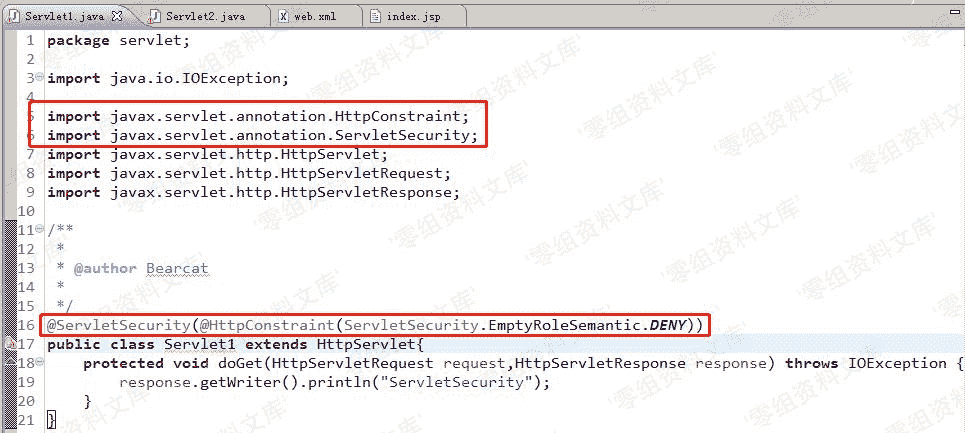
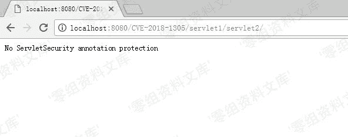
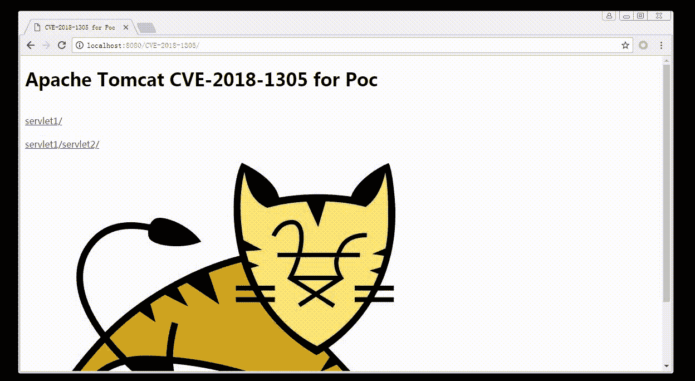

# （CVE-2018-1305）Tomcat 安全绕过漏洞

> 原文：[http://book.iwonder.run/0day/Tomcat/CVE-2018-1305.html](http://book.iwonder.run/0day/Tomcat/CVE-2018-1305.html)

## 一、漏洞简介

近日，Apache 发布安全公告称 Apache Tomcat 7、8、9 多个版本存在安全绕过漏洞。攻击者可以利用这个问题，绕过某些安全限制来执行未经授权的操作，这可能有助于进一步攻击。

Apache Tomcat servlet 注释定义的安全约束，只在 servlet 加载后才应用一次。由于以这种方式定义的安全约束，应用于 URL 模式及该点下任何 URL，很可能取决于 servlet 加载的次序，这可能会将资源暴露给未经授权访问它们的用户。

## 二、漏洞影响

Apache Tomcat < 9.0.5

Apache Tomcat < 8.5.28

Apache Tomcat < 8.0.50

Apache Tomcat < 7.0.85

## 三、复现过程

Java EE 提供了类似 ACL 权限检查的 ServletSecurity 注解，可以用于修饰 Servlet 对其进行保护，如果有两个 servlet，Servlet1，访问路径为“/servlet1/*”并且添加了 ServletSecurity 注解，Servlet2，访问路径为“/servlet1/servlet2/*”但没有 ServletSecurity 注解，首次访问 servlet1/servlet2，servlet1 的 ServletSecurity 注解并不会生效，无法保护“/servlet1/servlet2”路径，因此可能会导致未授权访问。

如果在访问“/servlet1/servlet2”之前先访问过“/servlet1”，Tomcat 会加载 ACL 并启动对“/servlet1/servlet2”的保护，则漏洞不会触发。

在 Servlet1 前加上 ServletSecurity 注解，Servlet2 无此注解。

将 web.xml 文件中 servlet 相对应的 url-pattern 修改为如下图所示后。

运行该项目。首次访问 servlet2 的 URL，发现可以未授权访问，针对 servlet1 的 ACL 并未生效。

[http://localhost:8080/CVE-2018-1305/servlet1/servlet2/](http://localhost:8080/CVE-2018-1305/servlet1/servlet2/)

第二次访问 servlet1 的 URL，访问被禁止，此时 ACL 生效。

[http://localhost:8080/CVE-2018-1305/servlet1/](http://localhost:8080/CVE-2018-1305/servlet1/)

再次访问 servlet2 的 URL，发现访问被禁止，如果 ACL 对 servlet2 生效，必须建立在 servlet1 被访问过的前提下。

[http://localhost:8080/CVE-2018-1305/servlet1/servlet2/](http://localhost:8080/CVE-2018-1305/servlet1/servlet2/)

### 漏洞演示

因此漏洞的复现仅限于 Tomcat 启动后，在访问“/servlet1/*”之前先访问了“/servlet1/servlet2/*”页面，若之前存在任何人访问“/servlet1/*”页面，则漏洞不会触发。漏洞危害较高，但是利用条件困难，因此影响范围并不大。

## 参考链接

> [http://cve.mitre.org/cgi-bin/cvename.cgi?name=CVE-2018-1305](http://cve.mitre.org/cgi-bin/cvename.cgi?name=CVE-2018-1305)
> 
> [http://blog.nsfocus.net/cve-2018-130-handling/](http://blog.nsfocus.net/cve-2018-130-handling/)
> 
> [https://www.anquanke.com/post/id/99213](https://www.anquanke.com/post/id/99213)

