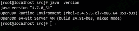
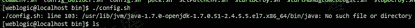
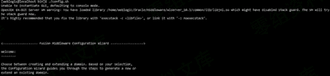
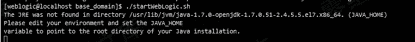
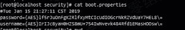
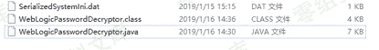
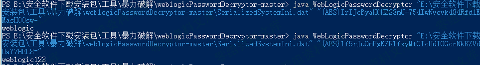

# weblogic 爆破

> 原文：[http://book.iwonder.run/0day/Weblogic/weblogic 爆破.html](http://book.iwonder.run/0day/Weblogic/weblogic 爆破.html)

## 一、部署 weblogic

现有的 redhat 环境 7.0,jdk 版本 1.7。

## 二、weblogic 下载

操作系统：RedHat7

weblogic 版本：10.3.6

## 三、安装 weblogic

### 1、weblogic 安装

创建一个用户

useradd weblogic

passwd weblogic

chmod a+x wls1036_generic.jar

su weblogic

java -jar wls1036_generic.jar -mode=console

出现问题

提示空间内存大小不够，清理空间再下一步。

[root@localhostsrc]# cd /usr/lib/jvm/java-1.7.0-openjdk-1.7.0.51-2.4.5.5.el7.x86_64

修改 commEnv.sh 文件

JAVA_HOME="/usr/lib/jvm/java-1.7.0-openjdk-1.7.0.9.x86_64/ jre"

### 2、启动 weblogic

[weblogic@localhostroot]$cd /home/weblogic/Oracle/Middleware/user_projects/domains/base_domain/ [weblogic@localhost base_domain]$ ./startWebLogic.sh

在目录/usr/lib/jvm/java-1.7.0-openjdk-1.7.0.79.x86_64 中找不到 JRE

编辑 setDomainEnv.sh

重新启动 weblogic 服务

## 四、破解 weblogic 控制台密码

### 第一步 将用户名和密码保存到 boot.properties 文件中

[root@localhost security]# pwd

/home/weblogic/Oracle/Middleware/user_projects/domains/base_domain/servers/AdminServer/security

在 adminserver 目录下创建 security 目录，并创建文件 boot.properties

Username=weblogic

Password=weblogic123

### 第二步 重新启动 WebLogic 服务

[root@localhost bin]# ./startWebLogic.sh&

已经加密

### 第三步 暴力破解

#### 1.java 和 javac 的版本一致

#### 2.编译 WebLogicPasswordDecryptor.java

3.破解密码

