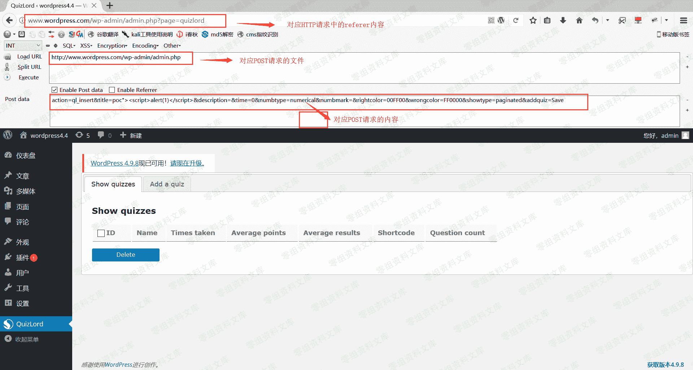
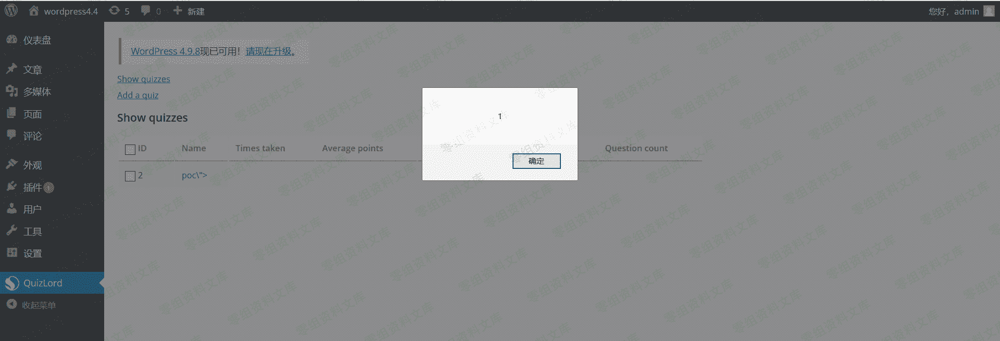
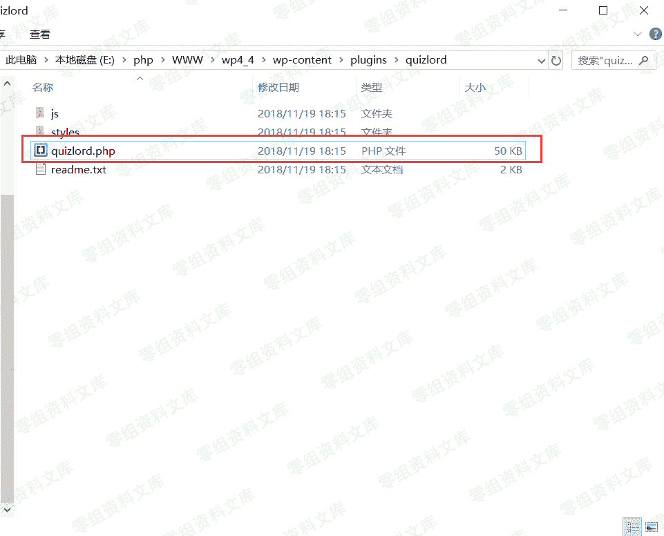

# WordPress Plugin - Quizlord 2.0 XSS

> 原文：[http://book.iwonder.run/0day/Wordpress/23.html](http://book.iwonder.run/0day/Wordpress/23.html)

## 一、漏洞简介

## 二、漏洞影响

## 三、复现过程

首先搭建 worepress，我的版本是 4.4。然后进入后台下载插件 Quizlord，版本是 2.0。


下载、安装完成后，需要点击启用插件。


根据 exploit-db 给出的漏洞详情，找到触发漏洞的位置。


进入后台选择 Quizlord 插件


此时浏览器的地址栏正好对应 poc 中的 referer 内容，现在只要使用火狐插件 hackbar 并根据 POC 构造 POST 请求



点击 execute 即可发送该 POST 请求。


请求成功后，返回是一个空白页。


返回上一页并刷新即可触发该漏洞。



通过复现这个漏洞，我们可以知道它属于后台存储型 XSS，且它的危害其实并不是很大。

需要进入后台，因此必须得知道后台用户的账号和密码。

下面我们来简单分析一下漏洞的成因。

### 漏洞成因分析

WordPress 插件源码位置：

```
\wp4_4\wp-content\plugins\ 
```

进入 Quizlord 插件目录，找到 quizlord.php 文件。



下图是 quizlord.php 文件的内容


根据 POC 快速定位到函数。发现 POST 传入的数据并没有被程序过滤就写入了数据库中。


## 四、参考链接

> [https://www.freebuf.com/vuls/189814.html](https://www.freebuf.com/vuls/189814.html)
> 
> [https://www.exploit-db.com/exploits/45307/](https://www.exploit-db.com/exploits/45307/)

