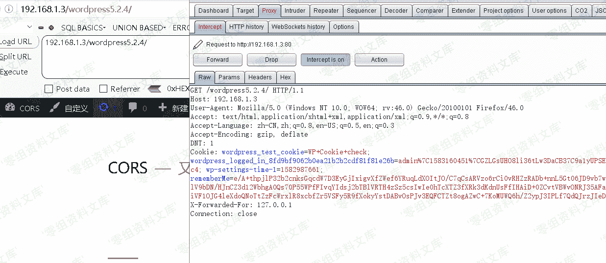
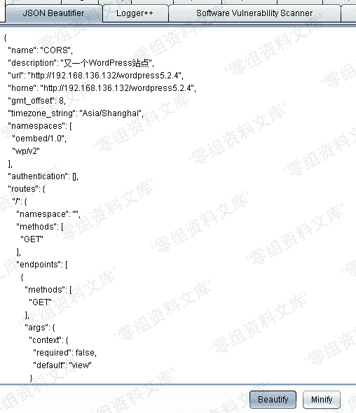
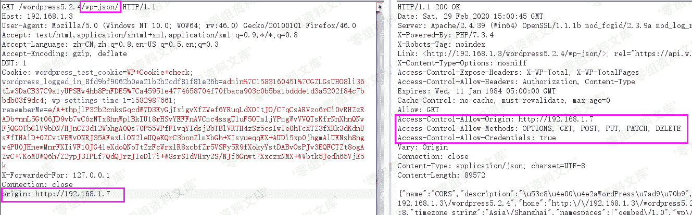

# Wordpress 5.2.4 cors 跨域劫持漏洞

> 原文：[http://book.iwonder.run/0day/Wordpress/27.html](http://book.iwonder.run/0day/Wordpress/27.html)

## 一、漏洞简介

CORS 是一个 W3C 标准，全称是”跨域资源共享”（Cross-origin resource sharing）。通过该标准，可以允许浏览器向跨源服务器发出 XMLHttpRequest 请求，从而克服了 AJAX 只能同源使用的限制，进而读取跨域的资源。CORS 允许 Web 服务器通知 Web 浏览器应该允许哪些其他来源从该 Web 服务器的回复中访问内容

漏洞产生原因：在 Access-Control-Allow-Origin 中反射请求的 Origin 值。该配置可导致任意攻击者网站可以直接跨域读取其资源内容。

## 二、漏洞影响

Wordpress 5.2.4

## 三、复现过程

1、影响版本 wordpress5.2.4，首先访问首页，利用 burp 抓包

2、然后发送到 reapeter，日常 go 一下，看到返回包内容，返回了/wp-json

3、我们将请求包中的 url 补上/wp-json，再次发包，发现出现了一堆 json 数据，我们将其复制到 jsonbeautiful 进行格式化，说明漏洞出现在：[http://www.0-sec.org/wp-json，](http://www.0-sec.org/wp-json，)

4、我们在请求包中，加入 orgin 头[http://192.168.1.7（实战中为你的 vps），再次发送，](http://192.168.1.7（实战中为你的 vps），再次发送，) 发现响应头内的

Access-Control-Allow-Origin:已经变成[http://192.168.1.7，并且且 Access-Control-Allow-Credentials:的值为 true。](http://192.168.1.7，并且且 Access-Control-Allow-Credentials:的值为 true。)

从而证明是存在 cors 漏洞的，我们可以进行 cors 跨域劫持

5、然后我们利用 pocbox 构造 payload，输入漏洞链接(记住！！记住！！！加上[http://)，选择 http 请求方法即可](http://)，选择 http 请求方法即可)

6、然后将生成的 html 内容，放到你的 vps 下，命名为 wp-cors.html

7、然后诱骗受害者点击，就会把 json 数据传到你的服务器，从而获取对方敏感信息，攻击成功

