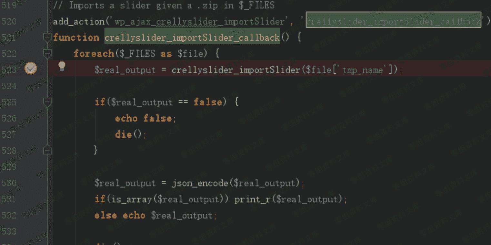
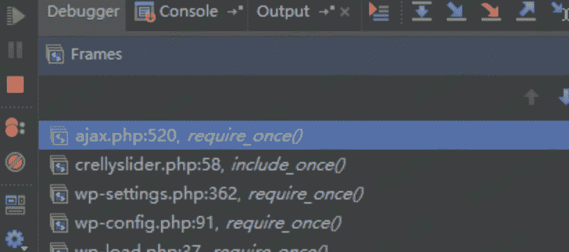
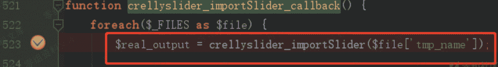
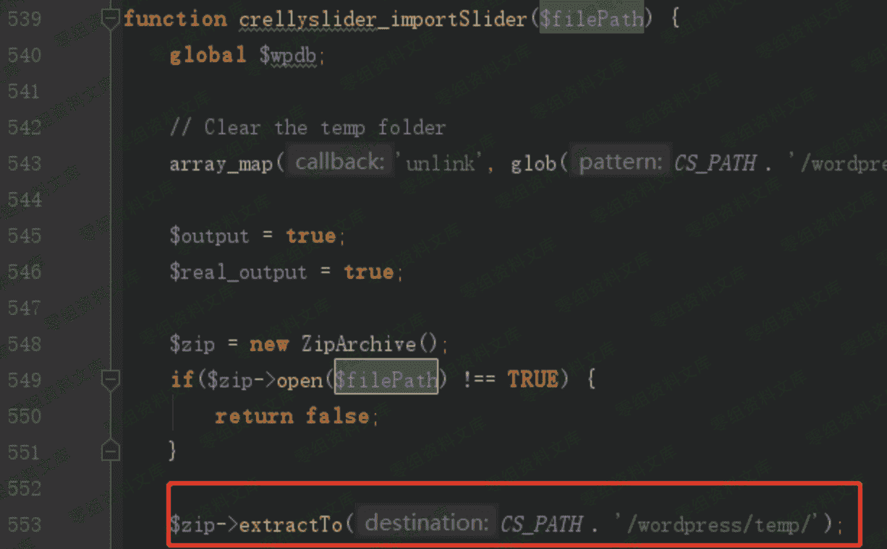
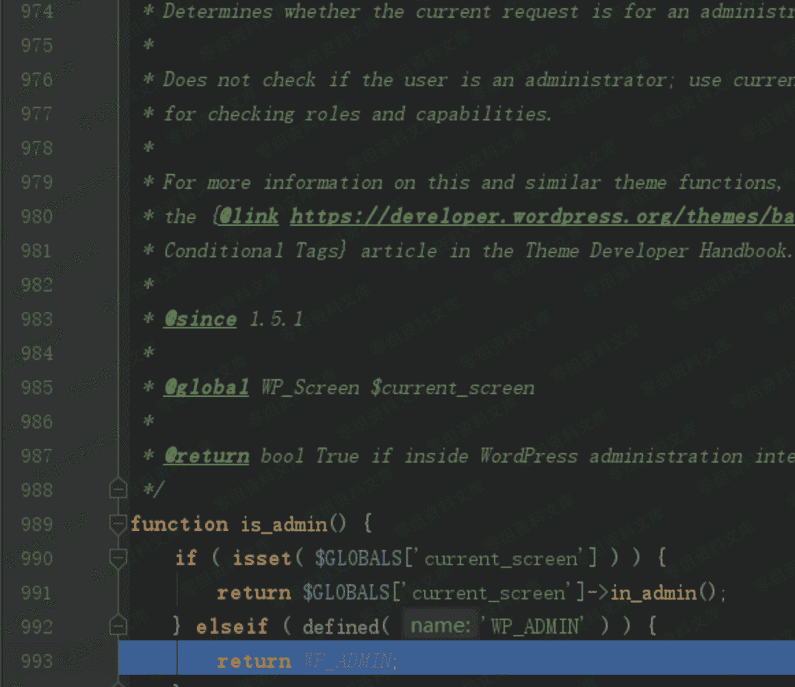
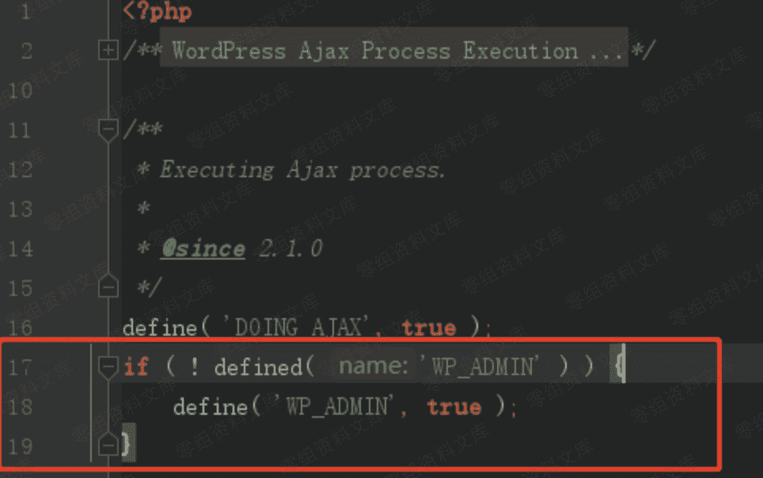
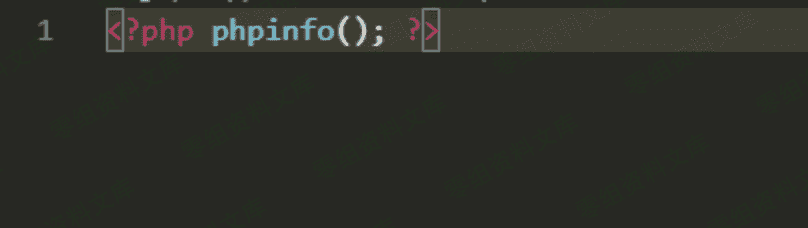
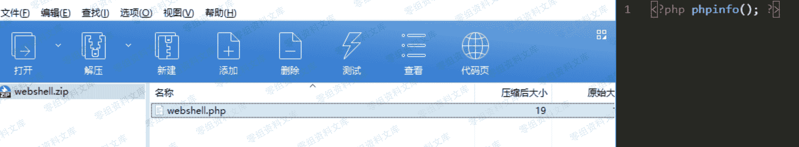

# （CVE-2019-15866）WordPress Plugin - Crelly Slider 任意文件上传&RCE 漏洞

> 原文：[http://book.iwonder.run/0day/Wordpress/12.html](http://book.iwonder.run/0day/Wordpress/12.html)

## 一、漏洞简介

WordPress Crelly Slider 是一个开源的幻灯片插件。用户可以使用强大的拖放生成器来添加文本、图像、youtube/vimeo 视频，并为每个视频制作动画。

WordPress Crelly Slider 插件具有 20,000 多个活动安装。该插件在 1.3.4 及更低版本中出现任意文件上传漏洞。任意经过身份验证的用户（例如订阅者身份）可通过向 wp_ajax_crellyslider_importSlider 发送带有恶意 PHP 文件的 ZIP 压缩文件来利用该漏洞上传文件并将恶意 PHP 文件解压到插件目录中。

## 二、漏洞影响

## 三、复现过程

### 漏洞分析

在 crelly-slider\crellyslider.php 文件中，存在如下代码


位于上图 45 行处可见，插件使用 if(is_admin())进行判断，满足条件则可以进入上图 if 分支，并且在 58 行处将 wordpress/ajax.php 文件包含进来

接着来分析下 ajax.php 文件

在 crelly-slider/wordpress/ajax.php 中存在如下代码



可见上图 520 行处注册了一个名为 wp_ajax_crellyslider_importSlider 的 ajax action 并指向 ajax.php 中的 crellyslider_importSlider_callback 方法。

在 wordpress 插件调用机制里，crellyslider_importSlider_callback 方法可以通过构造

```
http://0-sec.org/wordpress/wp-admin/admin-ajax.php?action=crellyslider_importSlider 
```

这样的 url 来访问

具体调用链如下



在搞清楚 crellyslider_importSlider_callback 方法是如何通过 url 调用后，继续分析 crellyslider_importSlider_callback 方法

在 crellyslider_importSlider_callback 方法中 523 行处使用 crellyslider_importSlider 方法来处理上传文件，如下图



接着来看下 crellyslider_importSlider 方法



crellyslider_importSlider 方法将上传 zip 文件解压，并将解压后的文件存储于/wordpress/temp/路径中，如上图 553 行红框处

现在梳理一下上文介绍的流程：

crelly-slider 插件将使用 is_admin()方法验证用户是否有使用 crellyslider_importSlider_callback 方法的使用权限。通过 is_admin()方法验证的用户则可以使用 crellyslider_importSlider_callback 方法上传任意 zip 压缩包，程序将上传的压缩包中的文件解压至/wordpress/temp/路径。

能使整个流程执行的前提是通过 is_admin()的校验。但是 is_admin()方法具体是做什么的呢？它是否像字面上看起来的那样：判断用户是否是管理员身份吗？——答案是否定的。

is_admin 方法只是用来确定当前请求是否是针对管理界面页面。使用 if(is_admin())只是为了确保 if 条件中的代码在后端管理界面加载，而不会再前台管理界面加载

is_admin 方法并没有核实用户是否是管理员身份的能力，其代码如下图:



因此 crelly-slider 插件开发者误用了 is_admin 方法，错误的将其用来判断当前操作的用户身份是否为管理员身份。

事实上，只要是是后台文件，都会定义 WP_ADMIN 常量为 true，例如本次漏洞的入口：wp-admin/admin-ajax.php 文件，如下图



可见上图 17-19 行，使用常量 WP_ADMIN 来标识这是一个后台文件

这就导致了无论什么身份的用户，只要访问后台文件，is_admin 方法都会返回 true

我们新建一个名为 subscriber 的用户，其权限为订阅者权限(subscriber)


在 wordpress 中，订阅者权限具有极低的权限：

“具有订阅者用户角色的用户可以登录 WordPress 站点并更新自己的配置。他们可以根据需要更改密码。订阅者用户角色无法在 WordPress 管理后台内撰写文章，查看评论或执行任何其他操作。订阅者用户角色无权访问设置，插件或主题，因此无法更改网站上的任何设置”

订阅者 wordpress 管理页面如下


crelly-slider 插件开发者的本意是希望”is_admin”用户拥有调用 crellyslider_importSlider ajax 接口的权限，但实际上，subscriber 身份的用户仍有权限使用 crellyslider_importSlider ajax 接口上传压缩包并将其中内容解压到/wordpress/temp/路径中

在我们构造的 webshell.php 文件中写入如下代码



并将其压缩至 webshell.zip 中



使用 subscriber 身份的用户的 cookie，发送如下 POST 请求


webshell.zip 中的 webshell.php 将会被解压到 wordpress\temp 目录下，如下图


通过访问这个地址，webshell.php 中的内容将会被执行

## 四、参考链接

> [https://xz.aliyun.com/t/6841](https://xz.aliyun.com/t/6841)

