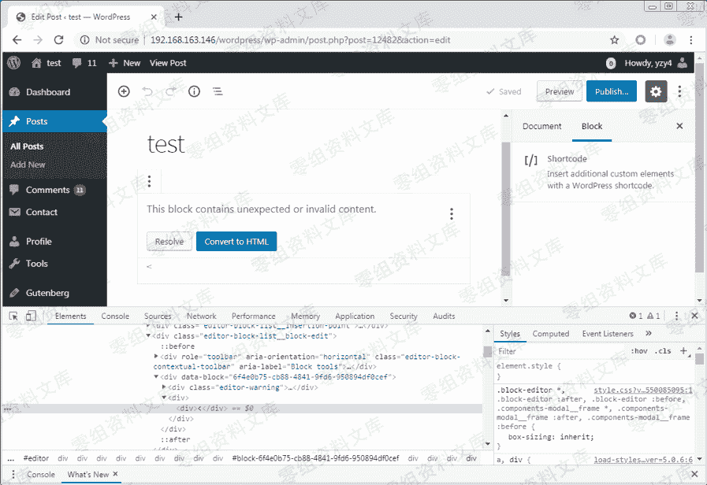
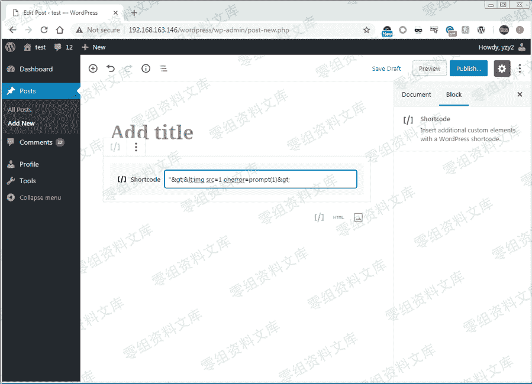
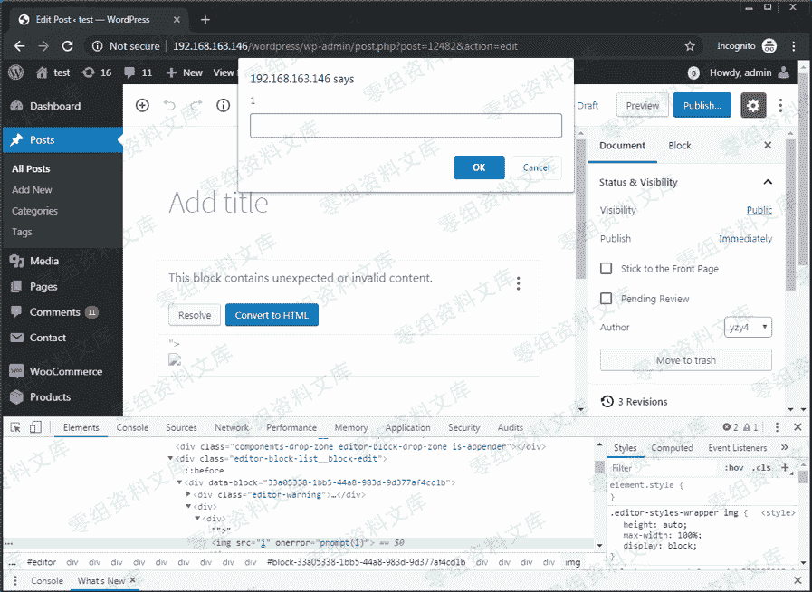

# （CVE-2019-16219）内置编辑器 Gutenberg 储存型 xss

> 原文：[http://book.iwonder.run/0day/Wordpress/6.html](http://book.iwonder.run/0day/Wordpress/6.html)

## 一、漏洞简介

Gutenberg 编辑器无法过滤“简码”错误消息中的 JavaScript / HTML 代码，导致可执行任意 JavaScript / HTML 代码

## 二、漏洞影响

wordpress 5.0 到 5.0.4、5.1 和 5.1.1

## 三、复现过程

在 WordPress 5.0 中，用户可以在帖子中添加 Shortcode 块。当在 Shortcode 块中添加某些 HTML 编码字符（例如“＆lt;”），然后重新打开该帖子时，它将显示错误消息，并通过将“＆lt;”解码为“ <”来预览它。

图 1.将 HTML 编码的字符插入 Shortcode 块


图 2.带有预览的 Shortcode 错误消息



可以通过 PoC

```
"&gt;&lt;img src=1 onerror=prompt(1)&gt; 
```

轻松绕过此预览中的 XSS 过滤器。

图 3.将 PoC 代码插入 Shortcode 块



当任何受害者查看此帖子时，XSS 代码将在其浏览器中执行。



如果受害者恰巧具有管理员权限，则攻击者可以利用此漏洞来控制管理员的帐户，将 WordPress 内置功能用于 GetShell，然后控制服务器。

