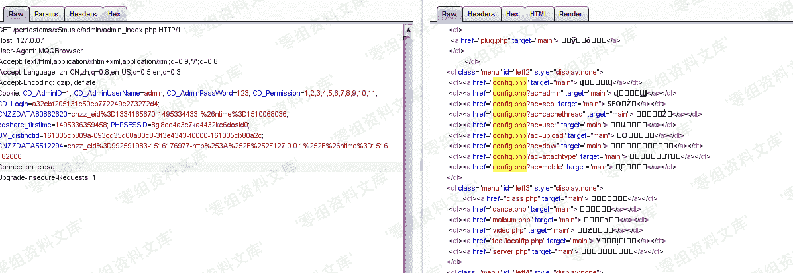
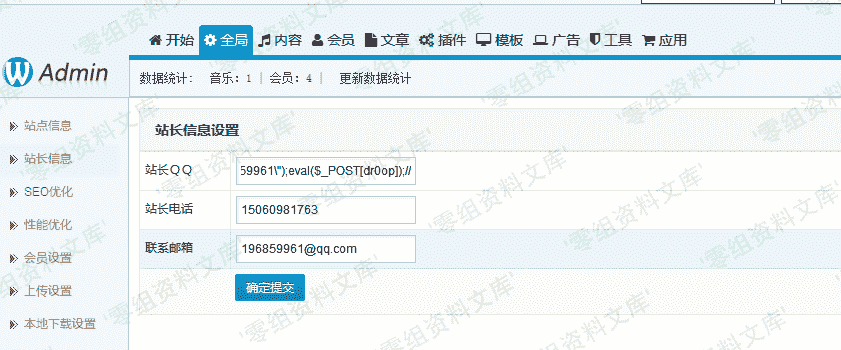
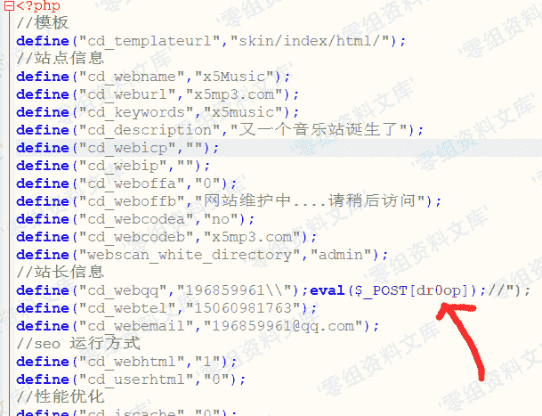
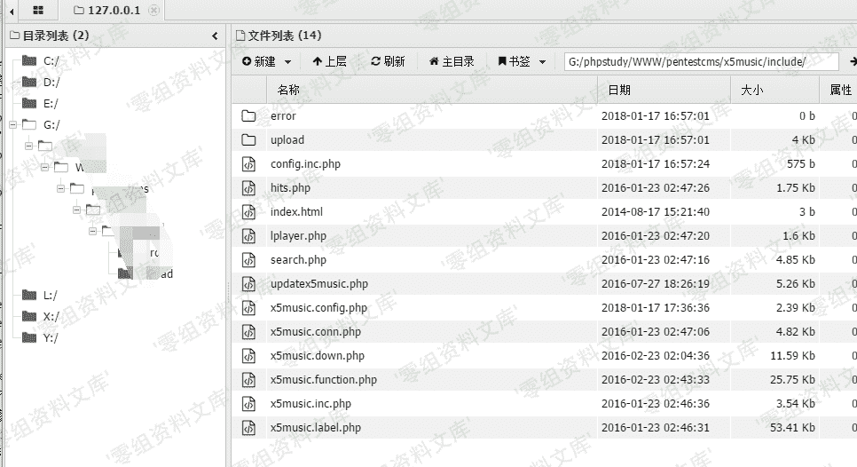

# X5music 后台登陆绕过+后台 getshell

> 原文：[http://book.iwonder.run/0day/X5music/1.html](http://book.iwonder.run/0day/X5music/1.html)

## 一、漏洞简介

## 二、漏洞影响

## 三、复现过程

### 登录绕过

后台登陆验证逻辑存在问题 在/admin/admin_login.php 中

```
if($action=="login") {
    $CD_Name=SafeRequest("CD_AdminUserName", "post");
    $CD_Pass=md5(SafeRequest("CD_AdminPassWord", "post"));
    $CD_Code=SafeRequest("CD_CheckCode", "post");
    $logtime=date('Y-m-d H:i:s');
    global $db;
    if(cd_webcodea=='yes') {
        if($CD_Code!=cd_webcodeb) {
            showmessage("登录失败,认证码错误！", "admin_login.php", 0);
        }
    }
    $sql="Select CD_ID from " . tname('admin') . " where CD_AdminUserName='" . $CD_Name . "' and CD_AdminPassWord='" . $CD_Pass . "' and CD_IsLock=0";
    $CD_ID=$db->Getone($sql); //从数据库中返回 1
    if($CD_ID) {
        $db->query("update " . tname('admin') . " set CD_LoginNum =CD_LoginNum +1,CD_LoginIP='" . $_SERVER['SERVER_ADDR'] . "',CD_LastLogin ='" . $logtime . "' where CD_ID='" . $CD_ID . "'");
        $row=$db->Getrow("Select * from " . tname('admin') . " where CD_ID='" . $CD_ID . "' ");
        setcookie("CD_AdminID", $row['CD_ID']);
        setcookie("CD_AdminUserName", $row['CD_AdminUserName']);
        setcookie("CD_AdminPassWord", md5($row['CD_AdminPassWord']));
        setcookie("CD_Permission", $row['CD_Permission']);
        setcookie("CD_Login", md5($row['CD_ID'] . $row['CD_AdminUserName'] . md5($row['CD_AdminPassWord']) . $row['CD_Permission']));
        //showmessage("成功登录，正在转向后台管理主页！", "admin_index.php", 0);
        echo'<script language="javascript">window.parent.location.href="admin_index.php";</script>';
    } else {
        showmessage("登录失败请确认输入的是正确信息以及帐号是否开启!", "admin_login.php", 0);
    }
} 
```

在登陆成功后设置 cookies，没有任何 session 等服务端验证存储方式。 然后再看登录后验证是否登陆的逻辑。跟入 admin_index.php


验证是否登陆的为 admincheck()这个函数。 跟进/function_common.php 查看

```
function admincheck($value) {
    if(empty($_COOKIE['CD_AdminID']) || empty($_COOKIE['CD_Login']) || $_COOKIE['CD_Login']!==md5($_COOKIE['CD_AdminID'] . $_COOKIE['CD_AdminUserName'] . $_COOKIE['CD_AdminPassWord'] . $_COOKIE['CD_Permission'])) {
        showmessage("出错了，登录已过期，请重新登录！", "admin_login.php", 0);
    }
    if(!empty($_COOKIE['CD_Permission'])) {
        $array=explode(",", $_COOKIE['CD_Permission']);
        $adminlogined=false;
        for($i=0; $i<count($array); $i++) {
            if($array[$i]==$value) {
                $adminlogined=true;
            }
        }
        if(!$adminlogined) {
            showmessage("出错了，您没有进入本页面的权限！", "", 2);
        }
    } else {
        showmessage("出错了，您没有进入本页面的权限！", "", 2);
    }
} 
```

其中`if(empty($_COOKIE['CD_AdminID']) || empty($_COOKIE['CD_Login']) || $_COOKIE['CD_Login']!==md5($_COOKIE['CD_AdminID'] . $_COOKIE['CD_AdminUserName'] . $_COOKIE['CD_AdminPassWord'] . $_COOKIE['CD_Permission']))`判断 cookies：CD_Admin,CD_Login 是否存在。然后拼接 cookies：CD_AdminID，CD_AdminUserName，CD_AdminPassWord，CD_Permission 后对其组成的字符串进行 md5 后和 CD_Login 的值进行比对。 由于服务端没有任何 session 验证，所有的数据来自客户端,修改客户端 cookies 符合它的逻辑即可绕过。




### 修改配置文件 getshell

在 admin/config.php 中

```
elseif($action=="admin") { //站长信息
    $cd_webqq=SafeRequest("cd_webqq", "post");
    $cd_webtel=SafeRequest("cd_webtel", "post");
    $cd_webemail=SafeRequest("cd_webemail", "post");
    //保存数据
    $str=file_get_contents("../include/x5music.config.php");
    $str=preg_replace('/"cd_webqq","(.*?)"/', '"cd_webqq","' . $cd_webqq . '"', $str);
    $str=preg_replace('/"cd_webtel","(.*?)"/', '"cd_webtel","' . $cd_webtel . '"', $str);
    $str=preg_replace('/"cd_webemail","(.*?)"/', '"cd_webemail","' . $cd_webemail . '"', $str);
    if(!$fp=fopen('../include/x5music.config.php', 'w')) {
        showmessage("出错了，文件 ../include/x5music.config.php 没有写入权限！", $_SERVER['HTTP_REFERER'], 0);
    }
    $ifile=new iFile('../include/x5music.config.php', 'w');
    $ifile->WriteFile($str, 3);
    showmessage("恭喜您，保存设置成功！", $_SERVER['HTTP_REFERER'], 0); 
```

对变量$str 进行粗糙的过滤后直接写入了配置文件`x5music.config.php` 而过滤仅仅过滤了'"'号。过滤方式是对其转义。 在后台配置文件修改插入如下代码



这里由于`"`被转义，再给它添加一个`\`二次转义即可逃逸`"`包裹.





## 参考链接

> [https://drops.org.cn/Code-Audit/x5music.html](https://drops.org.cn/Code-Audit/x5music.html)

