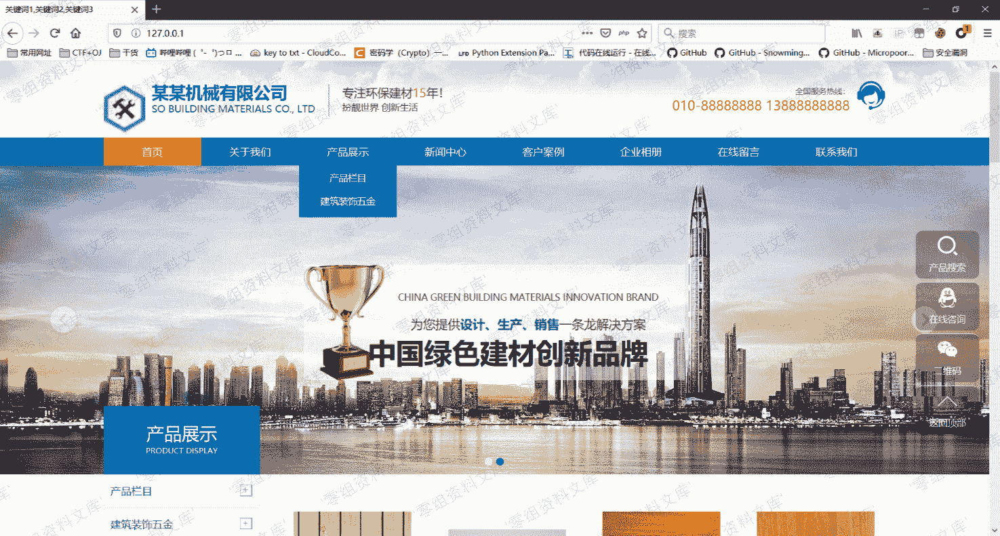
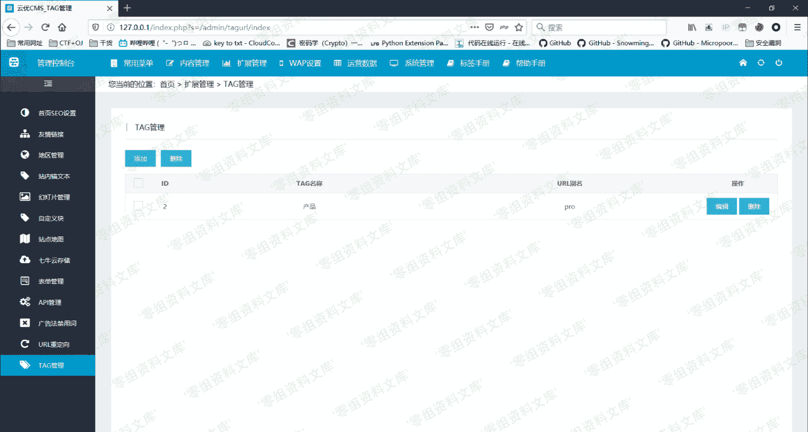
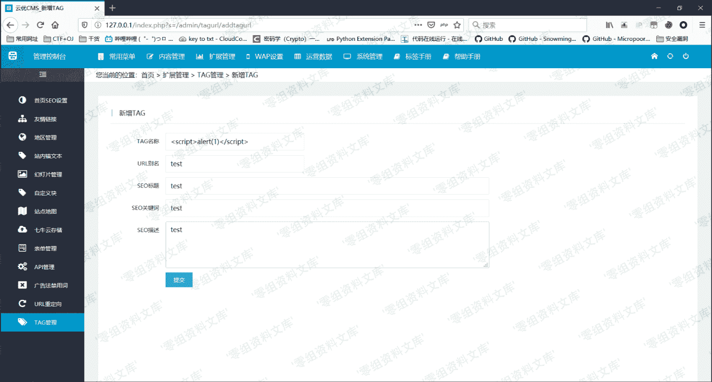
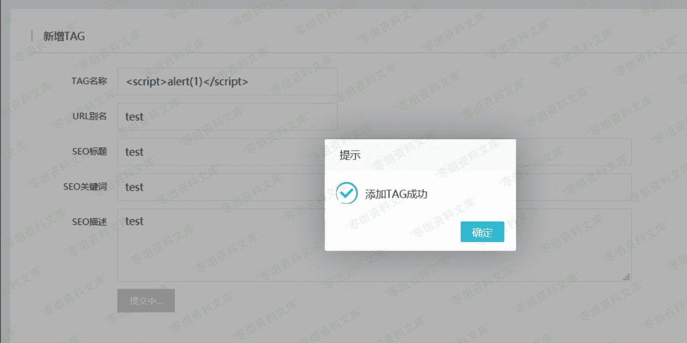
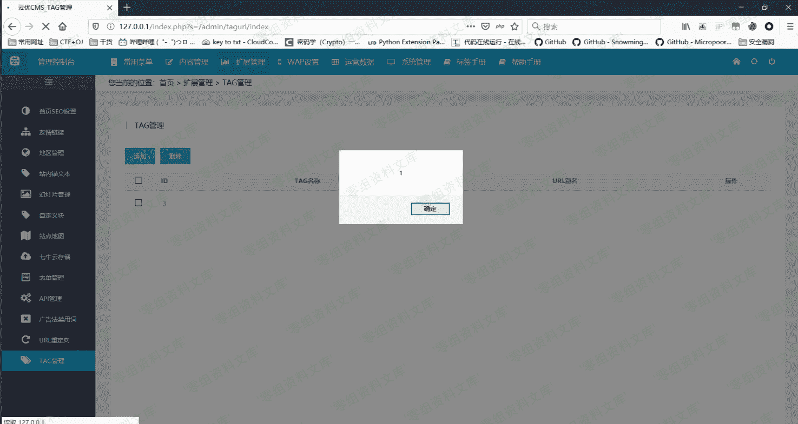
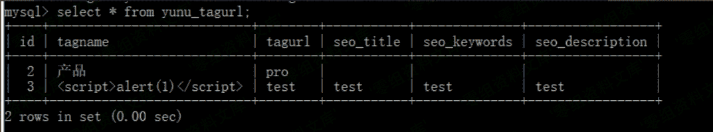

# Yunucms v2.0.7 后台 xss

> 原文：[http://book.iwonder.run/0day/Yunucms/1.html](http://book.iwonder.run/0day/Yunucms/1.html)

## 一、漏洞简介

云优 CMS 是一款基于 TP5.0 框架为核心开发的一套免费+开源的城市分站内容管理系统。云优 CMS 前身为远航 CMS。云优 CMS 于 2017 年 9 月上线全新版本，二级域名分站，内容分站独立，七牛云存储，自定义字段，自定义表单，自定义栏目权限，自定义管理权限等众多功能深受用户青睐。

## 二、漏洞影响

Yunucms v2.0.7

## 三、复现过程

### 环境搭建

从[官网](https://xz.aliyun.com/t/www.yunucms.com/Buy/program.html)下载源码并进行过安装

需要注意的是需要填云账号，我去官网注册了一个随便填上了，账号 testqwe，密码 123456，手机号利用的在线短信注册的


填上 MySQL 密码即可


前台界面



### 漏洞分析

```
http://www.0-sec.org/index.php?s=/admin/tagurl/addtagurl 
```

该 cms 路由为`目录/文件/方法`，直接查看方法

```
public function addTagurl()
    {
        if(request()->isAjax()){ # 判断是否是 ajax 请求
            $param = input('post.'); # 获取参数
            $tagurl = new TagurlModel();
            $flag = $tagurl->insertTagurl($param); # 将结果进行保存并返回响应
            return json(['code' => $flag['code'], 'data' => $flag['data'], 'msg' => $flag['msg']]);
        }
        return $this->fetch();
    } 
```

跟进 insertTagurl 方法

```
public function insertTagurl($param)
    {
        try{
            $result = $this->allowField(true)->save($param); # 保存当前数据对象
            if(false === $result){            
                return ['code' => -1, 'data' => '', 'msg' => $this->getError()];
            }else{
                return ['code' => 1, 'data' => '', 'msg' => '添加 TAG 成功'];
            }
        }catch( PDOException $e){
            return ['code' => -2, 'data' => '', 'msg' => $e->getMessage()];
        }
    } 
```

继续跟进 save 方法

```
if (!empty($data)) {
            // 数据自动验证
            if (!$this->validateData($data)) { # 验证集为空，直接返回 true
                return false;
            }
            // 数据对象赋值
            foreach ($data as $key => $value) {
                $this->setAttr($key, $value, $data); # 将参数赋值给$this->data 数组
            }
            if (!empty($where)) {
                $this->isUpdate = true;
            }
        }

......        

$result = $this->getQuery()->insert($this->data);

......
`` 
```

validateData 方法需要验证集，而本身没有传入

```
protected function validateData($data, $rule = null, $batch = null)
    {
        $info = is_null($rule) ? $this->validate : $rule;

        if (!empty($info)) {
            ......
        }
        return true;
    } 
```

且`$this->validate`参数为空，因此直接返回 true

跟进 insert 方法

```
.....
        // 生成 SQL 语句
        $sql = $this->builder->insert($data, $options, $replace);
        $bind = $this->getBind();
        if ($options['fetch_sql']) {
            // 获取实际执行的 SQL 语句
            return $this->connection->getRealSql($sql, $bind);
        }

        // 执行操作
        $result = $this->execute($sql, $bind); 
```

fetch_sql 变量为 false，跟进 execute 方法

```
......
    if ($procedure) { # false
                $this->bindParam($bind);
            } else {
                $this->bindValue($bind);
            }
...... 
```

最后跟进参数绑定方法

```
protected function bindValue(array $bind = [])
    {
        foreach ($bind as $key => $val) {
            // 占位符
            $param = is_numeric($key) ? $key + 1 : ':' . $key;
            if (is_array($val)) {
                if (PDO::PARAM_INT == $val[1] && '' === $val[0]) {
                    $val[0] = 0;
                }
                $result = $this->PDOStatement->bindValue($param, $val[0], $val[1]);
            } else {
                $result = $this->PDOStatement->bindValue($param, $val);
            }
            if (!$result) {
                throw new BindParamException(
                    "Error occurred  when binding parameters '{$param}'",
                    $this->config,
                    $this->getLastsql(),
                    $bind
                );
            }
        }
    } 
```

可以看到最后是调用 PDO 对象对参数进行的绑定，除此之外并没有任何过滤，因此 XSS 代码可插入并执行

### 漏洞复现

后台 TAG 管理模块



进行添加 TAG



在名称处填入 XSS 代码并提交



返回模块即可看到效果



查看源码，发现已经插入


查看数据库



