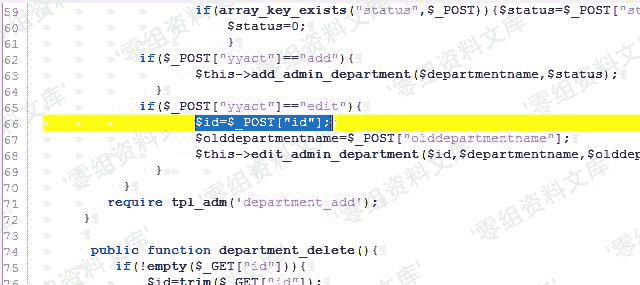
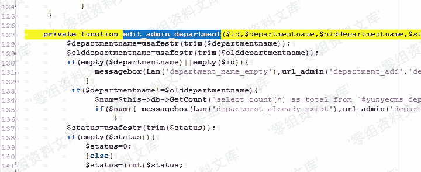
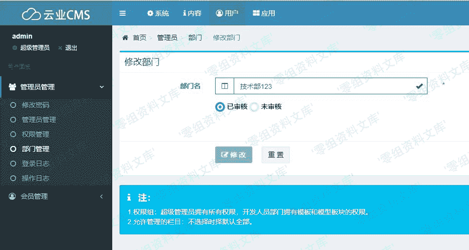

# Yunyecms V2.0.2 后台注入漏洞

> 原文：[http://book.iwonder.run/0day/Yunyecms/Yunyecms V2.0.2 后台注入漏洞.html](http://book.iwonder.run/0day/Yunyecms/Yunyecms V2.0.2 后台注入漏洞.html)

## 一、漏洞简介

云业 CMS 内容管理系统是由云业信息科技开发的一款专门用于中小企业网站建设的 PHP 开源 CMS，可用来快速建设一个品牌官网(PC，手机，微信都能访问)，后台功能强大，安全稳定，操作简单。

## 二、漏洞影响

yunyecms 2.0.2

## 三、复现过程

### 漏洞分析

废话不多说，又经过一番寻找与“提示”，发现 core/admin/deparment.php 文件，其中 id 值是通过 post 直接获取的，然后被 edit_admin_department()调用。



去到 edit_admin_department()函数定义处，发现过滤语句。



但是仔细一看，发现代码只是过滤了 departmentname 和 olddepartmentname 两个变量，放过了我们的 id 变量，只是判断 id 值是否为空。

```
if($departmentname!=$olddepartmentname){
        $num=$this->db->GetCount("select count(*) as total from `#yunyecms_department` where departmentname='$departmentname' and departmentid<>$id limit 1");
        if($num){ messagebox(Lan('department_already_exist'),url_admin('department_add','','',$this->hashurl['usvg']),"warn");    }
} 
```

从代码可以看出，如果 departmentname 的值不等于 olddepartmentname，就执行 sql 语句，我们的 id 值没有任何过滤出现在 sql 语句中，应该有注入无疑了。

### 漏洞复现

来到 core/admin/deparment.php 所在的页面，即后台的部门管理处。



修改部门名字，只要前后名字不一致即可，使用 burp 抓包。


发送到 Repeater 模块，构造参数，可以看到 sql 报错。


不想动手，就扔到 sqlmap 去跑就完事了。

```
sqlmap.py -r C:\Users\Administrator\Desktop\yunye.txt --batch 
```


## 参考链接

> [http://www.freesion.com/article/9029315473/](http://www.freesion.com/article/9029315473/)

