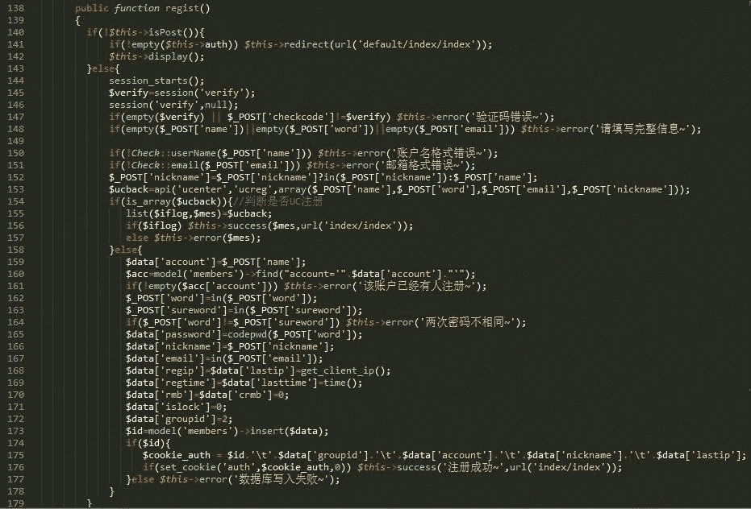
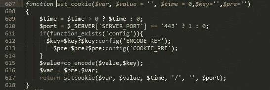
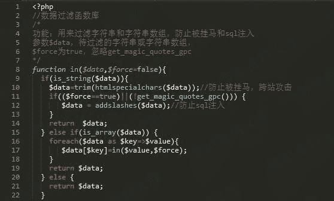
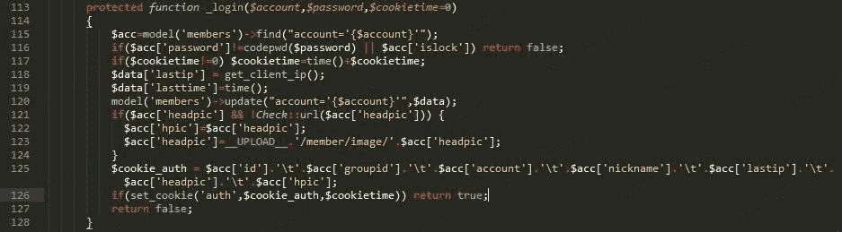
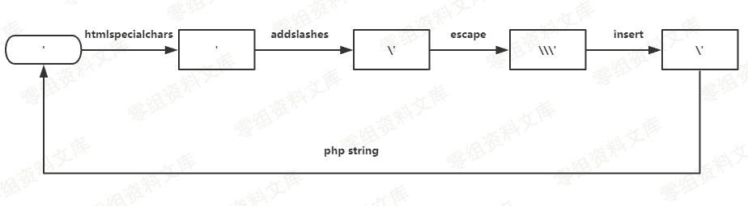
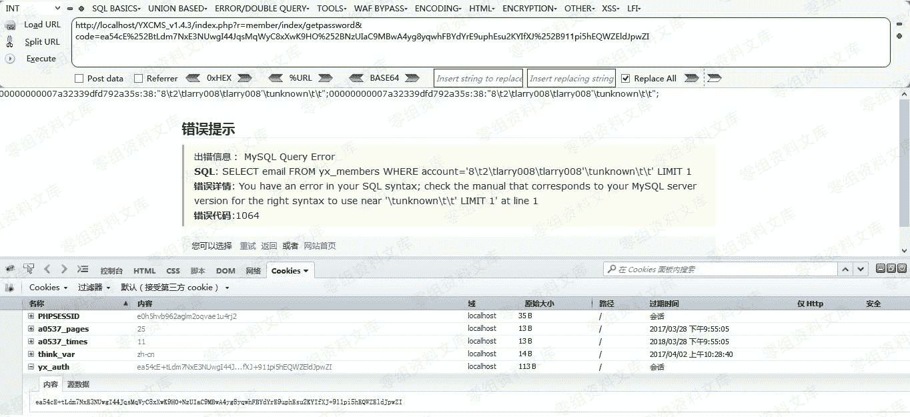
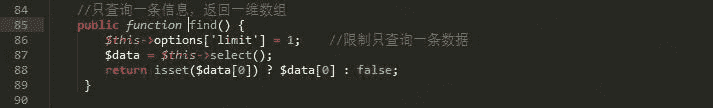
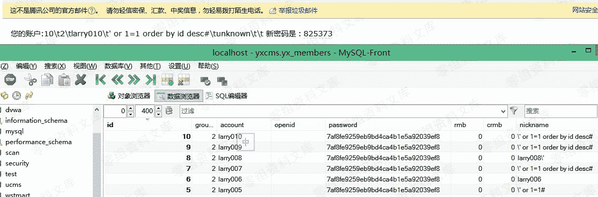

# YXcms 1.4.3 任意用户密码重置漏洞

> 原文：[http://book.iwonder.run/0day/YXcms/2.html](http://book.iwonder.run/0day/YXcms/2.html)

## 一、漏洞简介

## 二、漏洞影响

2017-03-26 YXcmsApp 1.4.3

## 三、复现过程

### 漏洞原理

从框架上（基于 CanPHP 的二次开发）看不出来什么缺陷，那就来看看代码逻辑上有什么披露。来到 protected/apps/member/controller/indexController.php 中是一些关于会员账号的逻辑，其中的 getpassword 函数是找回密码的功能，其中分为两步：第一步根据用户名或者邮箱向注册的邮件发送重置密码链接；第二步根据重置密码的链接重置用户密码，然后再将新密码发送到对应邮箱。第二步代码如下：


这里的 ENCODE_KEY 是在安装时生成的 6 位密钥，想通过构造$_GET['code']来重置其他用户的密码初步是不现实的。

但之后又看到在 regist 功能中，第 176 行调用了自定义的 set_cookie 函数，如下：



跟进 set_cookie 函数，是在 protected/include/lib/common.function.php 中 607 行定义，如下：



这里是用 ENCODE_KEY 对原值进行加密再设置 cookie。所以萌生了一个想法，将注册后对应设置的 auth cookie 作为 getpassword 的 code，就可以正确地进行解密，解密后的内容即为 regist 函数中第 175 行拼接的字符串：

```
$cookie_auth = $id.'\t'.$data['groupid'].'\t'.$data['account'].'\t'.$data['nickname'].'\t'.$data['lastip']; 
```

其中会对 account 的格式进行校验，ip 也是正则匹配的结果无法伪造，那么可控的就只有 nickname 了，我们可以跟踪一下 nickname 的过滤过程，首先是进入 common.function.php 的 in 函数：



接着就直接连接成字符串，虽然 htmlspecialchars 函数默认不会对单引号编码，但是 addslashes 函数会对单引号转义，这里的 nickname 就无法利用了。

可是再往上看 login 逻辑时，发现在登陆成功后就会从数据库中取出账号信息，拼接成字符串设置为对应的 auth cookie，如下：



我们可以考虑考虑二次注入的可能性，但还是需要跟踪一下在 regist 时 insert 数据是如何过滤的，最后可以跟到在 protected/include/core/db/cpMysql.class.php 中 escape 函数对数据进行了过滤：


因为在登陆成功后是直接拼接字符串就加密，所以单引号还是能够还原出来的，单引号的整个输入输出过程如下：



所以我们可以注册个带单引号 nickname 的账号，注册成功后退出重新登陆，使用 auth cookie 来作为重置密码的 code，就会产生报错，如下（因为在解密的时候会把 code 进行 urldecode，所以需要把 cookie 中的+改为%252B，/改为%252F）：



### 漏洞证明

漏洞的本质是二次注入 ，但是我们在数据库中可以看到 nickname 限制为 30 个字符，而且在这里我们可控的也只有 nickname，所以进行报错注入几乎是不可能了。

既然是在找回密码处的二次注入，就看看能不能重置任意用户名的密码。还是再来看看 getpassword 函数的逻辑：


假如说我们的 payload 改为' or 1=1# 那么肯定是可以将所有用户的密码都 update 为同一个 newpass，这个 newpass 还是会发给 info['email']这个邮箱的，跟进 187 行看看 find 函数的结果是否是我们可控的，在 protected/include/core/cpModel.calss.php 中：



find 函数虽然加了一个 limit 1 的条件，但返回的也还是结果中的第一个值，所以如果我们能把自己邮箱排到查询结果中的首位就可以从邮件中知晓所有账号的新密码了。

因为是利用新注册的账号来产生 payload，很容易就可以想到 payload 为' or 1=1 order by id desc#

然后注册账号，重新登陆，直接上 code 访问，可以监控到 mysql 执行语句如下：


顺利收到新密码的邮件：



