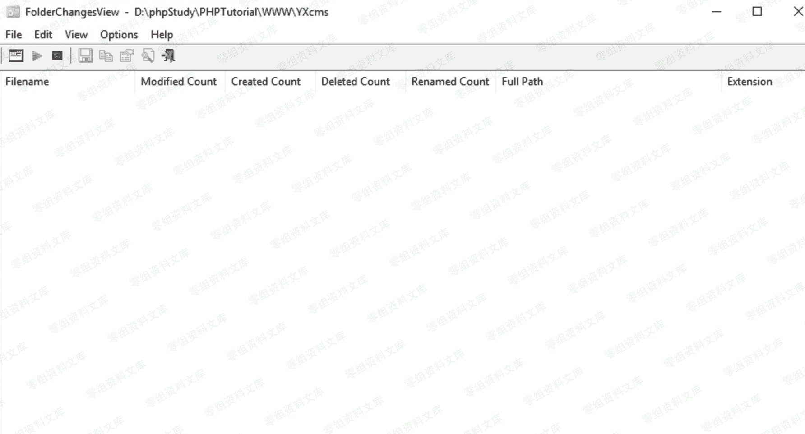

# YXcms 1.4.7 任意文件写入

> 原文：[http://book.iwonder.run/0day/YXcms/5.html](http://book.iwonder.run/0day/YXcms/5.html)

## 一、漏洞简介

## 二、漏洞影响

YXcms 1.4.7

## 三、复现过程

### 漏洞分析

漏洞文件 protected/apps/admin/controller/setController.php 的 140 行，$tpfile 接收到 GET 传过来的值，如果为空的话就会报非法操作。传过来的 URL 是 admin/set/tpadd&Mname=default，所以$tpfile 就是 default。

再来下是检测是否有 POST 的值，接受到 POST 过来的 filename,用 trim 去掉两边的空格。接收到 POST 过来的 code，用 stripcslashes 反转义。

$filepath=$templepath.$filename.'.php'这一句是路径和文件的拼接，然后下面检测路径是否存在。

最后没有过滤任何的危险函数就传给 file_put_contents 函数，写入网站的目录。

```
public function tpadd()
{
   $tpfile=$_GET['Mname'];
   if(empty($tpfile)) $this->error('非法操作~');
   $templepath=BASE_PATH . $this->tpath.$tpfile.'/';
   if($this->isPost()){
     $filename=trim($_POST['filename']);
     $code=stripcslashes($_POST['code']);
     if(empty($filename)||empty($code)) $this->error('文件名和内容不能为空');
     $filepath=$templepath.$filename.'.php';
     if($this->ifillegal($filepath)) {$this->error('非法的文件路径~');exit;}
     try{
        file_put_contents($filepath, $code);
      } catch(Exception $e) {
        $this->error('模板文件创建失败！');
      } 
      $this->success('模板文件创建成功！',url('set/tplist',array('Mname'=>$tpfile)));
   }else{
     $this->tpfile=$tpfile;
     $this->display();

   }
} 
```

### 复现

```
http://0-sec.org/index.php%3Fr%3Dadmin/set/tpadd%26Mname%3Ddefault 
```


打开我们的文件监控软件 FolderChangesView，输入我们的程序路径 D:\phpStudy\PHPTutorial\WWW\YXcms



然后写 shell.php 文件名，写入我们的代码。


然后会在\protected\apps\default\view\default 下面生成我们写入的文件。


