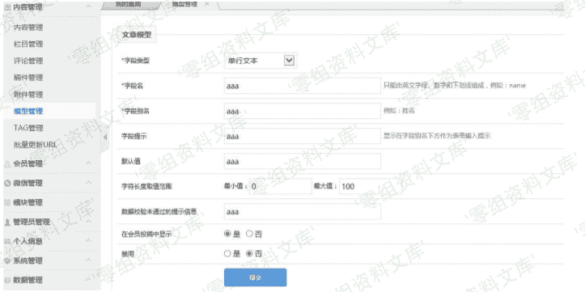
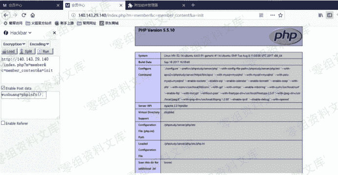

# （CVE-2018-8756）YzmCMS v3.7.1 Eval 注入漏洞

> 原文：[http://book.iwonder.run/0day/YzmCMS/CVE-2018-8756.html](http://book.iwonder.run/0day/YzmCMS/CVE-2018-8756.html)

## 一、漏洞简介

YzmCMS 是中国程序员袁志蒙开发的一套开源的 CMS（内容管理系统）。 YzmCMS 3.7.1 版本中的 yzmphp/core/function/global.func.php 文件存在安全漏洞。远程攻击者可借助 index.php?m=member&c=member_content&a=init 请求的 POST 数据中的 PHP 代码利用该漏洞执行任意代码。

## 二、漏洞影响

YzmCMS v3.7.1

## 三、复现过程

首先，从网站后台登陆，/index.php?m=admin&c=index&a=init，然后选择模型管理，选 择模型 ID 为 1 的那个字段管理，然后添加字段，像下面这张图一样填表。



接着需要拦截数据包，像图片一样，

```
修改 fieldtype 为 datetime，修改 datesest 为 array(1);@eval($_POST[wushuang]) 
```


接着我们需要一个用户可以触发这个漏洞，选择会员管理，选择会员管理，添加用户， 填表如下。


现 在 我 们 已 经 完 成 了 准 备 工 作 ， 接 着 以 用 户 身 份 登 陆 ， guici/123456,/index.php?m=member&c=index&a=login，点击在线投稿，接着你就可以执行任 意代码通过输入 post 数据 wushuang！/index.php?m=member&c=member_content&a=init



## 参考链接

> [https://github.com/guiciwushuang/yzmcms/blob/master/yzmcms_eval_injection_chinese.pdf](https://github.com/guiciwushuang/yzmcms/blob/master/yzmcms_eval_injection_chinese.pdf)

