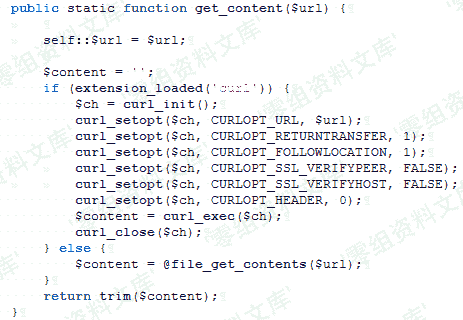
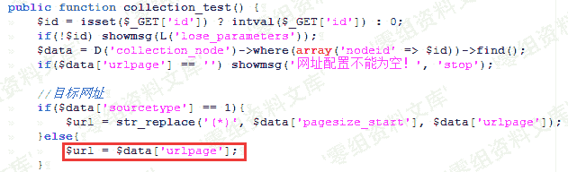
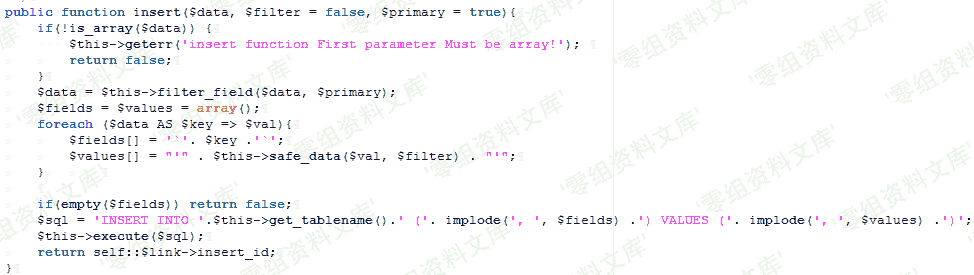
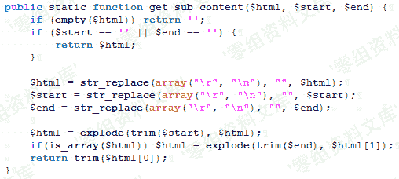
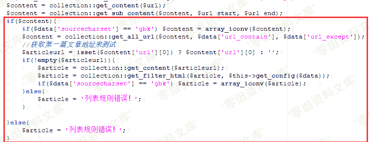

# YzmCMS V5.3 后台 ssrf

> 原文：[http://book.iwonder.run/0day/YzmCMS/YzmCMS V5.3 后台 ssrf .html](http://book.iwonder.run/0day/YzmCMS/YzmCMS V5.3 后台 ssrf .html)

## 一、漏洞简介

## 二、漏洞影响

YzmCMS V5.3

## 三、复现过程

### 漏洞分析

漏洞位于 application\collection\controller\collection_content.class.php 中的 collection_test 函数，此函数为获取一个网页中的 URL，并获取此 URL 的值输出。类似于爬虫，爬取网页中 URL 对应的文章。以下为主要功能函数：　


首先查看 get_content()函数：



可以看到传进来的 URL 不进过任何检测规则就带入 file_get_content()函数，那么倘若此 $url 为 file:// 伪协议的话，如此则产生任意文件读取漏洞。那么此时回头看 $url 的值是否可控。



可以看到，$url 的值来自于 collection_node 表中的 urlpage 字段的值。如果要 $url 可控，那么就要找到一个数据库写入操作，并且 urlpage 字段的值可控。再看


此函数则是将$_POST 的数据写入到表中。看 insert 函数如何写。



可以看到在写入过程中经过过滤函数 safe_data() ：


假设 payload 为：file://C:/Windows/System32/drivers/etc/hosts 可以看到此过滤函数对此 payload 并无任何影响，所以导致插入数据库中的 urlpage 字段的值可控，由此导致$url 的值可控。再往下查看 get_sub_content()函数：



可以看到此函数是将 $html 中的 $start 和 $end 之间的值取出来，而 $start 表示区间开始的 html 表示，$end 表示区间结束的 html 标识。并且这两个标识不能为空。于是可以构造 payload 为：<test123>file://C:/Windows/System32/drivers/etc/hosts</test123>，如此进过上述函数则会取出 payload 并返回。再往下：



进入 get_all_url()函数：

```
public static function get_all_url($html, $url_contain='', $url_except='') {

        $html = str_replace(array("\r", "\n"), '', $html);
        $html = str_replace(array("</a>", "</A>"), "</a>\n", $html);
        preg_match_all('/<a ([^>]*)>([^\/a>].*)<\/a>/i', $html, $out);
        $data = array();
        foreach ($out[1] as $k=>$v) {
            if (preg_match('/href=[\'"]?([^\'" ]*)[\'"]?/i', $v, $match_out)) {
                if ($url_contain) {
                    if (strpos($match_out[1], $url_contain) === false) {
                        continue;
                    } 
                }

                if ($url_except) {
                    if (strpos($match_out[1], $url_except) !== false) {
                        continue;
                    } 
                }
                $url2 = $match_out[1];
                $url2 = self::url_check($url2, self::$url);

                $title = strip_tags($out[2][$k]);

                if(empty($url2) || empty($title)) continue;

                $data['url'][$k] = $url2;
                $data['title'][$k] = $title;

            } else {
                continue;
            }
        } 
```

发现其中有一个正则过滤： preg_match_all('/*[\/a>](YzmCMS V5.3 后台 ssrf .html#fn_%5C/a%3E).*)<\/a>/i', $html, $out); ，此正则获取括号中的值，并将其合并为一个数组。再往下看，又出现一个正则过滤：

preg_match('/href=[\'"]?(<sup>[\'"](YzmCMS V5.3 后台 ssrf .html#fn_%5C%27)</sup> *)[\'"]?/i', $v, $match_out) ，此规则为 href="(value)"，并获取括号中 value 的值给$match_out，那么此时我们的 payload 需更改为：

```
<test123><a href="file://C:/Windows/System32/drivers/etc/hosts">test</a></test123> 
```

此时在往下看，有一个 url_check 函数：


可以看到会检测最后取出 payload 的值中是否有 :// ，巧的是我们的 payload 正好符合，所以该检测函数并未对 payload 造成影响。再往下回到最初的函数中：


至此，$articleurl 的值为我们最后的 payload： file://C:/Windows/System32/drivers/etc/hosts ，直至此时，$article 的值为读取到的本地任意文件的内容，再往下看 get_filter_html()函数：

```
$data``[``'content'``] = self::replace_item(self::get_sub_content(``$html``, ``$config``[``'content_rule'``][0], ``$config``[``'content_rule'``][1]), ``$config``[``'content_html_rule'``]); ``return` `$data``; 
```

由于篇幅限制，只拿出影响读取内容的代码，其实这段代码对结果并无影响，有兴趣自己下来阅读。在往下看到：


admin_tpl()函数为加载模板的函数，此模板位于：application\collection\view\collection_test.html


此处只截出影响此漏洞的代码。此处可以看到，将读取出的任意文件内容显示出来，到此则漏洞分析完毕。

### 漏洞复现

操作系统：windows 7

php 版本：5.5.38 + Apache

mysql 版本：5.5.53

首先登陆后台，进入 模块管理--->采集管理


添加节点


此处网站配置框中，可以在自己的 vps 服务器中搭建一个 html 网页，其内容为 payload：

```
<test123><a href="file://C:/Windows/System32/drivers/etc/hosts">123</a></test123> 
```

获取网站中的区域开始 html 为<test123>，区域结束的 HTML 为</test123>。点击保存。


再次点击测试采集，则读取 payload 中的 hosts 文件。


复现成功。

## 参考链接

> [https://www.cnblogs.com/Spec/p/11188198.html](https://www.cnblogs.com/Spec/p/11188198.html)

