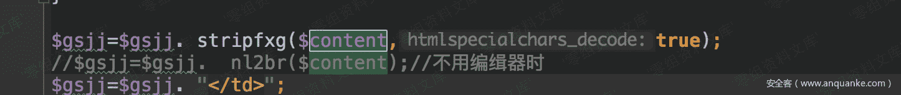

# （CVE-2018-14962）Zzcms 8.3 储存型 xss

> 原文：[http://book.iwonder.run/0day/Zzcms/CVE-2018-14962.html](http://book.iwonder.run/0day/Zzcms/CVE-2018-14962.html)

## 一、漏洞简介

## 二、漏洞影响

Zzcms 8.3

## 三、复现过程

一个存储型 xss，最底层的原因还是因为调用了`stripfxg`函数，消除了自己的过滤，然后在输出的时候，导致了 xss 漏洞。

先看一下输出位置，在/zt/show.php 的 211 行：

然后追踪这个变量的值，找到了是在用户在修改自己公司简介处添加的数据 然后我们来测试一下：

保存，然后访问一下/zt/show.php?id=1，就可以看到效果：

## 参考链接

> [https://www.anquanke.com/post/id/156660](https://www.anquanke.com/post/id/156660)

