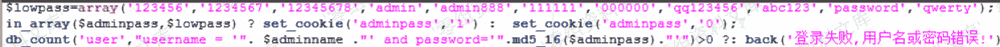
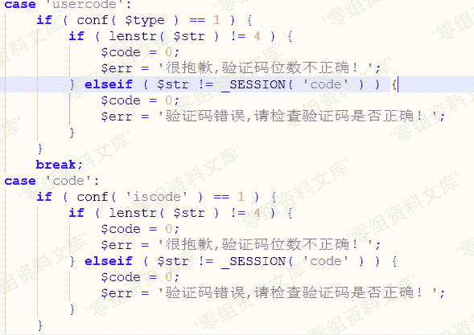

# Zzzcms 1.75 后台爆破+验证码问题

> 原文：[http://book.iwonder.run/0day/Zzzcms/1.html](http://book.iwonder.run/0day/Zzzcms/1.html)

## 一、漏洞简介

## 二、漏洞影响

Zzzcms 1.75

## 三、复现过程

### 后台寻找

后台寻找方法，该后台大部分 admin+三位数字，所以可以采用爆破的方式获取后台地址 该后台地址为 admin371

### 验证码问题

*   （一）管理员登录面验证码登录

在 admin371/login.php 19 行可以看出 get_cookie('adminname')不为空就可以绕过，如何获得 get_cookie('adminname')的值

在 24 行可以看出如果存在密码的话会返回 cookie 中 adminpass 值，根据返回的 adminpass 的形式可以推断出 adminname 的值

可以看到 adminpass 为 zzz920_adminpass，所以推断 adminname 为 zzz920_adminname

可以看到已经在无验证码的情况下已经登录成功了

*   （二）验证码不刷新不过期

在 inc/zzz_main.php 中 582 行可以看到从 SESSION 中取 code 的值，在 inc/imgcode.php 中只要不刷新就不会重新生成 code，导致验证码不过期

